# **Swiss Ephemeris**

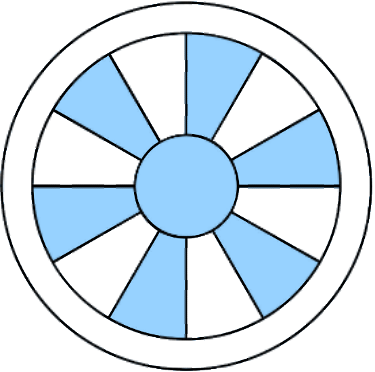

## **A Computer ephemeris for developers of astrological software**

© 1997 - 2021 by Astrodienst AG, Dammstr. 23,  CH-8702 Zollikon / Zürich, Switzerland

Email of developers: via mailing list <https://groups.io/g/swisseph/>

Authors: Dieter Koch and Dr. Alois Treindl

## Please note
This documentation is in an experimental stage, created out of .md markdown files.

#  1. Introduction

**Swiss Ephemeris** is a function package of astronomical calculations that serves the needs of astrologers, archeoastronomers, and, depending
on purpose, also the needs of astronomers. It includes long-term
ephemerides for the Sun, the Moon, the planets, more than 300.000
asteroids, historically relevant fixed stars and some "hypothetical"
objects.

The precision of the Swiss Ephemeris is at least as good as that of the
Astronomical Almanac, which follows current standards of ephemeris
calculation. Swiss Ephemeris will, as we hope, be able to keep abreast
to the scientific advances in ephemeris computation for the coming
decades.

The Swiss Ephemeris package consists of source code in C, a DLL, a
collection of ephemeris files and a few sample programs which
demonstrate the use of the DLL and the Swiss Ephemeris graphical label.
The ephemeris files contain compressed astronomical ephemerides.

Full C source code is included with the Swiss Ephemeris, so that
non-Windows programmers can create a linkable or shared library in their
environment and use it with their applications.

## 1.2. Licensing

The Swiss Ephemeris is not a product for end users. It is a toolset for
programmers to build into their astrological software.

The Swiss Ephemeris is made available by its authors under a dual
licensing system. The software developer, who uses any part of Swiss
Ephemeris in his or her software, must choose between one of the two
license models, which are:

To use Swiss Ephemeris, the licensing conditions imposed by Astrodienst for 
Swiss Ephemeris must be fulfilled. A copy of the license file is found in  file LICENSE. 

**Please note:**
Since Swiss Ephemeris release 2.10.01 the GPL license has been replaced with the AGPL license,
as one of the options in Astrodienst's dual licensing model.

# 2. Description of the ephemerides

## 2.1. Planetary and lunar ephemerides

### 2.1.1. Three ephemerides

The Swiss Ephemeris package allows planetary and lunar computations from
any of the following three astronomical ephemerides:

#### The Swiss Ephemeris

The core part of Swiss Ephemeris is a compression of the JPL-Ephemeris
DE431, which covers roughly the time range 13.000 BCE to 17.000 CE.
Using a sophisticated mechanism, we succeeded in reducing JPL\'s 2.8 GB
storage to only 99 MB. The compressed version agrees with the JPL
Ephemeris to 1 milli-arcsecond (0.001"). Since the inherent uncertainty
of the JPL ephemeris for most of its time range is a lot greater, the
Swiss Ephemeris should be completely satisfying even for computations
demanding very high accuracy.

(Before 2014, the Swiss Ephemeris was based on JPL Ephemeris DE406. Its
200 MB were compressed to 18 MB. The time range of the DE406 was 3000
BCE to 3000 CE or 6000 years. We had extended this time range to 10.800
years, from 2 Jan 5401 BCE to 31 Dec 5399 CE. The details of this
extension are described below in section 2.1.5. To make sure that you
work with current data, please check the date of the ephemeris files.
They must be 2014 or later.)

Each Swiss Ephemeris file covers a period of 600 years; there are 50
planetary files, 50 Moon files for the whole time range of almost 30.000
years and 18 main-asteroid files for the time range of 10.800 years.

The file names are as follows:

Planetary file|Moon file|Main asteroid file|Time range
--------------|---------|------------------|-------------------------------
Seplm132.se1|Semom132.se1||11 Aug 13000 BCE -- 12602 BCE
Seplm126.se1|Semom126.se1||12601 BCE -- 12002 BCE
Seplm120.se1|Semom120.se1||12001 BCE -- 11402 BCE
Seplm114.se1|Semom114.se1||11401 BCE -- 10802 BCE
Seplm108.se1|Semom108.se1||10801 BCE -- 10202 BCE
Seplm102.se1|Semom102.se1||10201 BCE -- 9602 BCE
Seplm96.se1|Semom96.se1||9601 BCE -- 9002 BCE
Seplm90.se1|Semom90.se1||9001 BCE -- 8402 BCE
Seplm84.se1|Semom84.se1||8401 BCE -- 7802 BCE
Seplm78.se1|Semom78.se1||7801 BCE -- 7202 BCE
Seplm72.se1|Semom72.se1||7201 BCE -- 6602 BCE
Seplm66.se1|Semom66.se1||6601 BCE -- 6002 BCE
Seplm60.se1|Semom60.se1||6001 BCE -- 5402 BCE
seplm54.se1|semom54.se1|seasm54.se1|5401 BCE -- 4802 BCE
seplm48.se1|semom48.se1|seasm48.se1|4801 BCE -- 4202 BCE
seplm42.se1|semom42.se1|seasm42.se1|4201 BCE -- 3602 BCE
seplm36.se1|semom36.se1|seasm36.se1|3601 BCE -- 3002 BCE
seplm30.se1|semom30.se1|seasm30.se1|3001 BCE -- 2402 BCE
seplm24.se1|semom24.se1|seasm24.se1|2401 BCE -- 1802 BCE
seplm18.se1|semom18.se1|seasm18.se1|1801 BCE -- 1202 BCE
seplm12.se1|semom12.se1|seasm12.se1|1201 BCE -- 602 BCE
seplm06.se1|semom06.se1|seasm06.se1|601 BCE -- 2 BCE
sepl_00.se1|semo_00.se1|seas_00.se1|1 BCE -- 599 CE
sepl_06.se1|semo_06.se1|seas_06.se1|600 CE -- 1199 CE
sepl_12.se1|semo_12.se1|seas_12.se1|1200 CE -- 1799 CE
sepl_18.se1|semo_18.se1|seas_18.se1|1800 CE -- 2399 CE
sepl_24.se1|semo_24.se1|seas_24.se1|2400 CE -- 2999 CE
sepl_30.se1|semo_30.se1|seas_30.se1|3000 CE -- 3599 CE
sepl_36.se1|semo_36.se1|seas_36.se1|3600 CE -- 4199 CE
sepl_42.se1|semo_42.se1|seas_42.se1|4200 CE -- 4799 CE
sepl_48.se1|semo_48.se1|seas_48.se1|4800 CE -- 5399 CE
sepl_54.se1|semo_54.se1||5400 CE -- 5999 CE
sepl_60.se1|semo_60.se1||6000 CE -- 6599 CE
sepl_66.se1|semo_66.se1||6600 CE -- 7199 CE
sepl_72.se1|semo_72.se1||7200 CE -- 7799 CE
sepl_78.se1|semo_78.se1||7800 CE -- 8399 CE
sepl_84.se1|semo_84.se1||8400 CE -- 8999 CE
sepl_90.se1|semo_90.se1||9000 CE -- 9599 CE
sepl_96.se1|semo_96.se1||9600 CE -- 10199 CE
sepl_102.se1|semo_102.se1||10200 CE -- 10799 CE
sepl_108.se1|semo_108.se1||10800 CE -- 11399 CE
sepl_114.se1|semo_114.se1||11400 CE -- 11999 CE
sepl_120.se1|semo_120.se1||12000 CE -- 12599 CE
sepl_126.se1|semo_126.se1||12600 CE -- 13199 CE
sepl_132.se1|semo_132.se1||13200 CE -- 13799 CE
sepl_138.se1|semo_138.se1||13800 CE -- 14399 CE
sepl_144.se1|semo_144.se1||14400 CE -- 14999 CE
sepl_150.se1|semo_150.se1||15000 CE -- 15599 CE
sepl_156.se1|semo_156.se1||15600 CE -- 16199 CE
sepl_162.se1|semo_162.se1||16200 CE -- 7 Jan 16800 CE

All Swiss Ephemeris files have the file suffix .se1. A planetary file is
about 500 kb, a lunar file 1300 kb. Swiss Ephemeris files are available
for download from Astrodienst\'s web server.

##### The time range of the Swiss Ephemeris

Versions until 1.80, which were based on JPL Ephemeris DE406 and some
extension created by Astrodienst, work for the following time range:

- Start date:	 2 Jan 5401 BCE (-5400) Jul. 	= JD -251291.5
- End date:	 31 Dec 5399 CE (Greg. Cal.) 	= JD 3693368.5

Versions since 2.00, which are based on JPL Ephemeris DE431, work for
the following time range:

- Start date:	 11 Aug 13000 BCE (-12999) Jul. 	= JD -3026604.5
- End date:	 7 Jan 16800 CE Greg. 	= JD 7857139.5

Please note that versions prior to 2.00 are not able to correctly handle
the JPL ephemeris DE431.

##### A note on year numbering

There are two numbering systems for years before the year 1 CE. The
historical numbering system (indicated with BCE) has no year zero. Year
1 BCE is followed directly by year 1 CE.

The astronomical year numbering system does have a year zero; years
before the common era are indicated by negative year numbers. The
sequence is year -1, year 0, year 1 CE.

The historical year 1 BCE corresponds to astronomical year 0,

the historical year 2 BCE corresponds to astronomical year -1, etc.

In this and other documents related to the Swiss Ephemeris we use both
systems of year numbering. When we write a negative year number, it is
astronomical style; when we write BCE, it is historical style.

#### The Moshier Ephemeris

This is a semi-analytical approximation of the JPL planetary and lunar
ephemerides DE404, developed by Steve Moshier. Its deviation from JPL is
below 1 arc second with the planets and a few arc seconds with the Moon.
No data files are required for this ephemeris, as all data are linked
into the program code already.

This may be sufficient accuracy for most purposes, since the Moon moves
1 arc second in 2 time seconds and the Sun 2.5 arc seconds in one
minute.

The advantage of the Moshier mode of the Swiss Ephemeris is that it
needs no disk storage. Its disadvantage, besides the limited precision,
is reduced speed: it is about 10 times slower than JPL mode and the
compressed JPL mode (described above).

The Moshier Ephemeris covers the interval from 3000 BCE to 3000 CE.
However, Moshier notes that "the adjustment for the inner planets is
strictly valid only from 1350 B.C. to 3000 A.D., but may be used to 3000
B.C. with some loss of precision". And: "The Moon\'s position is
calculated by a modified version of the lunar theory of Chapront-Touze\'
and Chapront. This has a precision of 0.5 arc second relative to DE404
for all dates between 1369 B.C. and 3000 A.D." (Moshier,
http://www.moshier.net/aadoc.html).

Note: The Moshier ephemeris is deprecated as part of Swiss Ephemeris. It wil be removed in the the next major release.

#### The full JPL Ephemeris

This is the full precision state-of-the-art ephemeris. It provides the
highest precision and is the basis of the Astronomical Almanac. Time
range:

Start date:	 9 Dec 13002 BCE (-13001) Jul. 	= JD -3027215.5
End date:	 11 Jan 17000 CE Greg. 	= JD 7930192.5

JPL is the Jet Propulsion Laboratory of NASA in Pasadena, CA, USA (see
http://www.jpl.nasa.gov ). Since many years this institute, which is in
charge of the planetary missions of NASA, has been the source of the
highest precision planetary ephemerides. The currently newest version of
JPL ephemeris is the DE430/DE431.

There are several versions of the JPL Ephemeris. The version is
indicated by the DE-number. A higher number indicates a more recent
version. SWISSEPH should be able to read any JPL file from DE200
upwards.

##### Accuracy of JPL ephemerides DE403/404 (1996) and DE405/406 (1998)

According to a paper (see below) by Standish and others on DE403 (of which DE406 is only a slight refinement), the accuracy of this ephemeris can be partly estimated from its difference from DE200:

With the inner planets, Standish shows that within the period 1600 --
2160 there is a maximum difference of 0.1 -- 0.2" which is mainly due to
a mean motion error of DE200. This means that the absolute precision of
DE406 is estimated significantly better than 0.1" over that period.
However, for the period 1980 -- 2000 the deviations between DE200 and
DE406 are below 0.01" for all planets, and for this period the JPL
integration has been fit to measurements by radar and laser
interferometry, which are extremely precise.

With the outer planets, Standish\'s diagrams show that there are large
differences of several " around 1600, and he says that these deviations
are due to the inherent uncertainty of extrapolating the orbits beyond
the period of accurate observational data. The uncertainty of Pluto
exceeds 1" before 1910 and after 2010, and increases rapidly in more
remote past or future.

With the Moon, there is an increasing difference of 0.9"/cty2 between
1750 and 2169. It is mainly caused by errors in LE200 (Lunar Ephemeris).

The differences between DE200 and DE403 (DE406) can be summarized as
follows:

| year range   | planet            | difference |
| ------------ | ----------------- | ---------- |
| 1980 -- 2000 | all planets       | \< 0.01",  |
| 1600 -- 1980 | Sun -- Jupiter    | a few 0.1" |
| 1900 -- 1980 | Saturn -- Neptune | a few 0.1" |
| 1600 -- 1900 | Saturn -- Neptune | a few "    |
| 1750 -- 2169 | Moon              | a few ".   |

(see: E.M. Standish, X.X. Newhall, J.G. Williams, and W.M. Folkner, JPL
Planetary and Lunar Ephemerides, DE403/LE403, JPL Interoffice Memorandum
IOM 314.10-127, May 22, 1995, pp. 7f.)

##### Comparison of JPL ephemerides DE406 (1998) with DE431 (2013)

##### Differences DE431-DE406 for 3000 BCE to 3000 CE:

| planet              | difference               |
| ------------------- | ------------------------ |
| Moon                | \< 7\" (TT), \< 2\" (UT) |
| Sun, Mercury, Venus | \< 0.4\"                 |
| Mars                | \< 2\"                   |
| Jupiter             | \< 6\"                   |
| Saturn              | \< 0.1\"                 |
| Uranus              | \< 28\"                  |
| Neptune             | \< 53\"                  |
| Pluto               | \< 129\"                 |

**Moon, position (DE431) -- position (DE406) in TT and UT**

(Delta T adjusted to tidal acceleration of lunar ephemeris)

  **Year**    |**dL(TT)**    |**dL(UT)**    |**dB(TT)**    |**dB(UT)**
  ------------|--------------|--------------|--------------|---------------
  -2999	|6.33\"	|-0.30\"	|-0.01\"	|0.05\"
  -2500	|5.91\"	|-0.62\"	|-0.85\"	|-0.32\"
  -2000	|3.39\"	|-1.21\"	|-0.59\"	|-0.20\"
  -1500	|1.74\"	|-1.49\"	|-0.06\"	|-0.01\"
  -1000	|1.06\"	|-1.50\"	|0.30\"	|0.12\"
  -500	|0.63\"	|-1.40\"	|0.28\"	|0.09\"
  0	|0.13\"	|-0.99\"	|0.11\"	|0.05\"
  500	|-0.08\"	|-0.99\"	|-0.03\"	|0.05\"
  1000	|-0.12\"	|-0.38\"	|-0.08\"	|-0.06\"
  1500	|-0.08\"	|-0.15\"	|-0.03\"	|-0.02\"
  2000	|0.00\"	|0.00\"	|0.00\"	|0.00\"
  2500	|0.06\"	|0.06\"	|-0.02\"	|-0.02\"
  3000	|0.10\"	|0.10\"	|-0.09\"	|-0.09\"
-------------------------------------------------------------------------

**Sun, position (DE431) -- position (DE406) in TT and UT**

| **Year** | **dL(TT)** | **dL(UT)** |
| -------- | ---------- | ---------- |
| -2999    | 0.21\"     | -0.34\"    |
| -2500    | 0.11\"     | -0.33\"    |
| -2000    | 0.09\"     | -0.26\"    |
| -1500    | 0.04\"     | -0.22\"    |
| -1000    | 0.06\"     | -0.14\"    |
| -500     | 0.02\"     | -0.11\"    |
| 0        | 0.02\"     | -0.06\"    |
| 500      | 0.00\"     | -0.04\"    |
| 1000     | 0.00\"     | -0.01\"    |
| 1500     | -0.00\"    | -0.01\"    |
| 2000     | -0.00\"    | -0.00\"    |
| 2500     | -0.00\"    | -0.00\"    |
| 3000     | -0.01\"    | -0.01\"    |

**Pluto, position (DE431) -- position (DE406) in TT**

  **Year**	|**dL(TT)**
  -------------	|--------------------------------------
  -2999	|66.31\"
  -2500	|82.93\"
  -2000	|100.17\"
  -1500	|115.19\"
  -1000	|126.50\"
  -500	|127.46\"
  0	|115.31\"
  500	|92.43\"
  1000	|63.06\"
  1500	|31.17\"
  2000	|-0.02\"
  2500	|-28.38\"
  3000	|-53.38\"

The Swiss Ephemeris is based on the latest JPL file, and reproduces the
full JPL precision with better than 1/1000 of an arc second, while
requiring only a tenth storage. Therefore for most applications it makes
little sense to get the full JPL file. Precision comparison can be done
at the Astrodienst web server. The Swiss Ephemeris test page
http://www.astro.com/swisseph/swetest.htm allows to compute planetary
positions for any date using the full JPL ephemerides DE200, DE406,
DE421, DE431, or the compressed Swiss Ephemeris or the Moshier
ephemeris.

### 2.1.2. The Swiss Ephemeris Compared with Astronomical Almanac and JPL Horizons

#### Swiss Ephemeris and the Astronomical Almanac

The original JPL ephemeris provides barycentric equatorial Cartesian
positions relative to the equinox 2000/ICRS. Moshier provides
heliocentric positions. The conversions to apparent geocentric
ecliptical positions were done using the algorithms and constants of the
Astronomical Almanac as described in the "Explanatory Supplement to the
Astronomical Almanac". Using the DE200 data file, it is possible to
reproduce the positions given by the Astronomical Almanac 1984, 1995,
1996, and 1997 (on p. B37-38 in all editions) to the last digit.
Editions of other years have not been checked. DE200 was used by
Astronomical Almanac from 1984 to 2002. The sample positions given in
the mentioned editions of Astronomical Almanac can also be reproduced
using a recent version of the Swiss Ephemeris and a recent JPL
ephemeris. The number of digits given in AA do not allow to see a
difference. The Swiss Ephemeris has used DE405/DE406 since its beginning
in 1997.

From 2003 to 2015, the Astronomical Almanac has been using JPL ephemeris
DE405, and since Astronomical Almanac 2006 all relevant resolutions of
the International Astronomical Union (IAU) have been implemented.
Versions 1.70 and higher of the Swiss Ephemeris also follow these
resolutions and reproduce the sample calculation given by AA2006 (p.
B61-B63), AA2011 and AA2013 (both p. B68-B70) to the last digit, i.e. to
better than 0.001 arc second. (To avoid confusion when checking AA2006,
it may be useful to know that the JD given on page B62 does not have
enough digits in order to produce the correct final result. With later
AA2011 and AA2013, there is no such problem.)

The Swiss Ephemeris uses JPL Ephemeris DE431 since version 2.0 (2014).
The Astronomical Almanac uses JPL Ephemeris DE430 since 2016. The Swiss
Ephemeris and the Astronomical Almanac still perfectly agree.

Detailed instructions how to compare planetary positions as given by the
Swiss Ephemeris with those of Astronomical Almanac are given in Appendix
D at the end of this documentation.

#### Swiss Ephemeris and JPL Horizons System of NASA

The Swiss Ephemeris, from version 1.70 on, reproduces astrometric
planetary positions of the JPL Horizons System precisely. However, there
have been small differences of about 53 mas (milli-arcseconds) with
apparent positions. The same deviations also occur if Horizons is
compared with the example calculations given in the Astronomical
Almanac.

With ephemerides relative to the equinox of date, Horizons uses a
different reference ecliptic than Astronomical Almanac and Swiss
Ephemeris. It follows IERS Conventions 1996 (p. 22), which is based on
the old precession models IAU 1976 (Lieske) and nutation IAU 1980
(Wahr). On the other hand, the Astronomical Almanac and the Swiss
Ephemeris follow IERS Conventions 2003 and 2010 with more recent
precession and nutation models. As a result of the different reference
ecliptics used, there is a constant offset of 53 mas in RA between
Horizons and the Swiss Ephemeris.

It should be understood that these differences in apparent ephemerides
are not the result of an error on the side of the Swiss Ephemeris and
much less on the side of Horizons. Both systems are valid. According to
private communication with Jon Giorgini (5 April 2021), there are also
(low-priority) plans to implement the more recent conventions in
Horizons as an option. With this option, the 53 mas-difference should
disappear and the remaining error of about 1 mas will be due to free
core nutation, which is considered by Horizons, but not by the Swiss
Ephemeris.

Swiss Ephemeris versions 2.00 and higher contain code to reproduce
positions of Horizons with a precision of about 1 mas for 1799 CE --
today. From version 2.07 on, Horizons can be reproduced with a similar
precision for its whole time range.

For best agreement with Horizons, current data files with Earth
orientation parameters (EOP) must be downloaded from the IERS website
and put into the ephemeris path. If they are not available, the Swiss
Ephemeris uses an approximation which reproduces Horizons still with an
accuracy of about 2 mas between 1962 and present.

It must be noted that correct values for Earth orientation delta_psi and
delta_epsilon are only available between 1962 and present. For all
calculations before that, Horizons uses the *first* values of the EOP
data, and for all calculations in the future, it uses the *last* values
of the existing data. The resulting positions before 1962 thus do not
have the same precision, but the ephemeris is at least continuous.

More information on this and technical details are found in the
programmer's documentation and in the source code, file swephlib.h.

IERS Conventions 1996, 2003, and 2010 can be read or downloaded from here: 

[http://www.iers.org/IERS/EN/DataProducts/Conventions/conventions.html](http://www.iers.org/IERS/EN/DataProducts/Conventions/conventions.html)
- 
Detailed instructions how to compare planetary positions as given by the
Swiss Ephemeris with those of JPL are given in Appendix C at the end of
this documentation.

Many thanks to Jon Giorgini, developer of the Horizons System, for
explaining us the methods used at JPL.


### 2.1.3. The details of coordinate transformation

The following conversions are applied to the coordinates after reading
the raw positions from the ephemeris files:

**Correction for light-time**

Since the planet\'s light needs time to reach the Earth, it is never
seen where it actually is, but where it was some time before. Light-time
amounts to a few minutes with the inner planets and a few hours with
distant planets like Uranus, Neptune and Pluto. For the Moon, the
light-time correction is about one second. With planets, light-time
correction may be of the order of 20" in position, with the Moon 0.5"

**Conversion from the solar system barycenter to the geocenter**

Original JPL data are referred to the center of the gravity of the solar
system. Apparent planetary positions are referred to an imaginary
observer in the center of the Earth.

**Light deflection by the gravity of the Sun**

In the gravitational fields of the Sun and the planets light rays are
bent. However, within the solar system only the Sun has enough mass to
deflect light significantly. Gravity deflection is greatest for distant
planets and stars, but never greater than 1.8". When a planet disappears
behind the Sun, the Explanatory Supplement recommends to set the
deflection = 0. To avoid discontinuities, we chose a different
procedure. See Appendix A.

**"Annual" aberration of light**

The velocity of light is finite, and therefore the apparent direction of
a moving body from a moving observer is never the same as it would be if
both the planet and the observer stood still. For comparison: if you run
through the rain, the rain seems to come from ahead even though it
actually comes from above. Aberration may reach 20".

**Frame Bias (ICRS to J2000)**

JPL ephemerides since DE403/DE404 are referred to the International
Celestial Reference System, a time-independent, non-rotating reference
system which was introduced by the IAU in 1997. The planetary positions
and speed vectors are rotated to the J2000 system. This transformation
makes a difference of only about 0.0068 arc seconds in right ascension.
(Implemented from Swiss Ephemeris 1.70 on)

**Precession**

Precession is the motion of the vernal equinox on the ecliptic. It
results from the gravitational pull of the Sun, the Moon, and the
planets on the equatorial bulge of the Earth. Original JPL data are
referred to the mean equinox of the year 2000. Apparent planetary
positions are referred to the equinox of date. (From Swiss Ephemeris
1.78 on, we use the precession model Vondrák/Capitaine/Wallace 2011.)

**Nutation (true equinox of date)**

A short-period oscillation of the vernal equinox. It results from the
Moon's gravity which acts on the equatorial bulge of the Earth. The
period of nutation is identical to the period of a cycle of the lunar
node, i.e. 18.6 years. The difference between the true vernal point and
the mean one is always below 17". (From Swiss Ephemeris 2.00, we use the
nutation model IAU 2006. Since 1.70, we used nutation model IAU 2000.
Older versions used the nutation model IAU 1980 (Wahr).)

**Transformation from equatorial to ecliptic coordinates**

For *precise speed* of the planets and the Moon, we had to make a
special effort, because the *Explanatory Supplement* does not give
algorithms that apply the above-mentioned transformations to speed.
Since this is not a trivial job, the easiest way would have been to
compute three positions in a small interval and determine the speed from
the derivation of the parabola going through them. However, double float
calculation does not guarantee a precision better than 0.1"/day.
Depending on the time difference between the positions, speed is either
good near station or during fast motion. Derivation from more positions
and higher order polynomials would not help either.

Therefore we worked out a way to apply directly all the transformations
to the barycentric speeds that can be derived from JPL or Swiss
Ephemeris. The precision of daily motion is now better than 0.002" for
all planets, and the computation is even a lot faster than it would have
been from three positions. A position with speed takes in average only
1.66 times longer than one without speed, if a JPL or a Swiss Ephemeris
position is computed. With Moshier, however, a computation with speed
takes 2.5 times longer.

### 2.1.4. The Swiss Ephemeris compression mechanism

The idea behind our mechanism of ephemeris compression was developed by
Dr. Peter Kammeyer of the U.S. Naval Observatory in 1987.

This is how it works: The ephemerides of the Moon and the inner planets
require by far the greatest part of the storage. A more sophisticated
mechanism is required for these than for the outer planets. Instead of
the positions we store the differences between JPL and the mean orbits
of the analytical theory VSOP87. These differences are a lot smaller
than the position values, wherefore they require less storage. They are
stored in Chebyshew polynomials covering a period of an anomalistic
cycle each. (By the way, this is the reason, why the Swiss Ephemeris
does not cover the time range of the full JPL ephemeris. The first
ephemeris file begins on the date on which the last of the inner planets
(including Mars) passes its first perihelion after the start date of the
JPL ephemeris.)

With the outer planets from Jupiter through Pluto we use a simpler
mechanism. We rotate the positions provided by the JPL ephemeris to the
mean plane of the planet. This has the advantage that only two
coordinates have high values, whereas the third one becomes very small.
The data are stored in Chebyshew polynomials that cover a period of 4000
days each. (This is the reason, why Swiss Ephemeris stops before the end
date of the JPL ephemeris.)

### 2.1.5. The extension of DE406-based ephemerides to 10.800 years

This Chapter is only relevant to those who use pre-2014, DE406-based
ephemeris files of the Swiss Ephemeris.

The JPL ephemeris DE406 covers the time range from 3000 BCE to 3000 CE.
While this is an excellent range covering all precisely known historical
events, there are some types of ancient astrology and archeoastronomical
research which would require a longer time range.

In December 1998 we have made an effort to extend the time range using
our own numerical integration. The exact physical model used by Standish
et. al. for the numerical integration of the DE406 ephemeris is not
fully documented (at least we do not understand some details), so that
we cannot use the same integration program as had been used at JPL for
the creation of the original ephemeris.

The previous JPL ephemeris DE200, however, has been reproduced by Steve
Moshier over a very long-time range with his numerical integrator, which
was available to us. We used this software with start vectors taken at
the end points of the DE406 time range. To test our numerical
integrator, we ran it upwards from 3000 BCE to 600 BCE for a period of
2400 years and compared its results with the DE406 ephemeris itself. The
agreement is excellent for all planets except the Moon (see table
below). The lunar orbit creates a problem because the physical model for
the Moon\'s libration and the effect of the tides on lunar motion is
quite different in the DE406 from the model in the DE200. We varied the
tidal coupling parameter (love number) and the longitudinal libration
phase at the start epoch until we found the best agreement over a
2400-year test range between our integration and the JPL data. We could
reproduce the Moon\'s motion over a 2400-time range with a maximum error
of 12 arcseconds. For most of this time range the agreement is better
than 5 arcsec.

With these modified parameters we ran the integration backward in time
from 3000 BCE to 5400 BCE. It is reasonable to assume that the
integration errors in the backward integration are not significantly
different from the integration errors in the upward integration.

**Planet**| **max. error arcsec**| **avg. error arcsec**
---------------------|-------------------------|-----------------------
Mercury| 1.67| 0.61
Venus| 0.14| 0.03
Earth| 1.00| 0.42
Mars| 0.21| 0.06
Jupiter| 0.85| 0.38
Saturn| 0.59| 0.24
Uranus| 0.20| 0.09
Neptune| 0.12| 0.06
Pluto| 0.12| 0.04
Moon| 12.2| 2.53
Sun| bary.| 6.3| 0.39

The same procedure was applied at the upper end of the DE406 range, to
cover an extension period from 3000 CE to 5400 CE. The maximum
integration errors as determined in the test run 3000 CE down to 600 CE
are given in the table below.

**Planet**| **max. error arcsec**| **avg. error arcsec**
---------------------|-------------------------|-----------------------
Mercury| 2.01| 0.69
Venus| 0.06| 0.02
Earth| 0.33| 0.14
Mars| 1.69| 0.82
Jupiter| 0.09| 0.05
Saturn| 0.05| 0.02
Uranus| 0.16| 0.07
Neptune| 0.06| 0.03
Pluto| 0.11| 0.04
Moon| 8.89| 3.43
Sun| bary.| 0.61| 0.05

Deviations in heliocentric longitude from new JPL ephemeris DE431
(2013), time range 5400 BCE to 3000 BCE

planet|difference
------|----------
Moon (geocentric) | \< 40"
Earth, Mercury, Venus | \< 1.4"
Mars | \< 4"
Jupiter | \< 9"
Saturn | \< 1.2"
Uranus | \< 36"
Neptune | \< 76"
Pluto | \< 120"

### 2.1.6 Solar Ephemeris in the remote past

Since SE 2.00 and the introduction of JPL ephemerid DE431, there has
been a small inaccuracy with solar ephemerides in the remote past. In
10.000 BCE, the ecliptic latitude of the Sun seems to oscillate between
-36 and +36 arcsec. In reality, the solar latitude should be below 1
arcsec.

This phenomenon is caused by the precession theory Vondrak 2011 (A&A
534, A22 (2011)), whose precision is limited. On p. 2 the paper states:

"The goal of the present study is to find relatively simple expressions
for all precession parameters (listed, e.g., by Hilton et al. 2006), the
primary ones being the orientation parameters of the secularly-moving
ecliptic and equator poles with respect to a fixed celestial frame. We
require that the accuracy of these expressions is comparable to the IAU
2006 model near the epoch J2000.0, while lower accuracy is allowed
outside the interval ±1000 years, gradually increasing up to several
arcminutes at the extreme epochs ±200 millennia."

This means that this theory is probably the best one available for
current centuries but not necessarily perfect for the remote past.

The problem could be avoided if we used the precession theory Laskar
1986 or Owen 1990. However, precession Vondrak 2011 is better for recent
centuries. This seems more relevant to us.


## 2.2. Lunar and Planetary Nodes and Apsides

### 2.2.1. Mean Lunar Node and Mean Lunar Apogee (Lilith, Black Moon in astrology)

JPL ephemerides do not include a mean lunar node or mean lunar apsis
(perigee/apogee). We therefore have to derive them from different
sources.

Our mean node and mean apogee are computed from Moshier\'s lunar
routine, which is an adjustment of the ELP2000-85 lunar theory to the
JPL ephemeris on the interval from 3000 BCE to 3000 CE. Its deviation
from the mean node of ELP2000-85 is 0 for J2000 and remains below 20 arc
seconds for the whole period. With the apogee, the deviation reaches 3
arc minutes at 3000 BCE.

In order to cover the whole time range of DE431, we had to add some
corrections to Moshier's mean node and apsis, which we derived from the
true node and apsis that result from the DE431 lunar ephemeris.
Estimated precision is 1 arcsec, relative to DE431.

**Notes for astrologers**

Astrological Lilith or the Dark Moon is either the apogee ("aphelion")
of the lunar orbital ellipse or, according to some, its empty focal
point. As seen from the geocenter, this makes no difference. Both of
them are located in exactly the same direction. But the definition makes
a difference for topocentric ephemerides.

The opposite point, the lunar perigee or orbital point closest to the
Earth, is also known as Priapus. However, if Lilith is understood as the
second focal point, an opposite point makes no sense, of course.

Originally, the term "Dark Moon" stood for a hypothetical second body
that was believed to move around the Earth. There are still ephemerides
circulating for such a body, but modern celestial mechanics clearly
exclude the possibility of such an object. Later the term "Dark Moon"
was used for the lunar apogee.

The Swiss Ephemeris apogee differs from the ephemeris given by Joëlle de
Gravelaine in her book "Lilith, der schwarze Mond" (Astrodata 1990). The
difference reaches several arc minutes. The mean apogee (or perigee)
moves along the mean lunar orbit which has an inclination of 5 degrees.
Therefore it has to be projected on the ecliptic. With de Gravelaine\'s
ephemeris, this was not taken into account. As a result of this
projection, we also provide an ecliptic latitude of the apogee, which
will be of importance if declinations are used.

There may be still another problem. The \'first\' focal point does not
coincide with the geocenter but with the barycenter of the
Earth-Moon-system. The difference is about 4700 km. If one took this
into account, it would result in a monthly oscillation of the Black
Moon. If one defines the Black Moon as the apogee, this oscillation
would be about +/- 40 arc minutes. If one defines it as the second
focus, the effect is a lot greater: +/- 6 degrees. However, we have
neglected this effect.

\[added by Alois 7-feb-2005, arising out of a discussion with Juan
Revilla\] The concept of \'mean lunar orbit\' means that short term.
e.g. monthly, fluctuations must not be taken into account. In the
temporal average, the EMB coincides with the geocenter. Therefore, when
mean elements are computed, it is correct only to consider the
geocenter, not the Earth-Moon Barycenter.

Computing topocentric positions of mean elements is also meaningless and
should not be done.

### 2.2.2. The True Node

The \'true\' lunar node is usually considered the osculating node
element of the momentary lunar orbit. I.e., the axis of the lunar nodes
is the intersection line of the momentary orbital plane of the Moon and
the plane of the ecliptic. Or in other words, the nodes are the
intersections of the two great circles representing the momentary
apparent orbit of the Moon and the ecliptic.

The nodes are considered important because they are connected with
eclipses. They are the meeting points of the Sun and the Moon. From this
point of view, a more correct definition might be: The axis of the lunar
nodes is the intersection line of the momentary orbital plane of the
Moon and the momentary orbital plane of the Sun.

This makes a difference, although a small one. Because of the monthly
motion of the Earth around the Earth-Moon barycenter, the Sun is not
exactly on the ecliptic but has a latitude, which, however, is always
below an arc second. Therefore the momentary plane of the Sun\'s motion
is not identical with the ecliptic. For the true node, this would result
in a difference in longitude of several arc seconds. However, Swiss
Ephemeris computes the traditional version.

The advantage of the \'true\' nodes against the mean ones is that when
the Moon is in exact conjunction with them, it has indeed a zero
latitude. This is not so with the mean nodes.

In the strict sense of the word, even the "true" nodes are true only
twice a month, viz. at the times when the Moon crosses the ecliptic.
Positions given for the times in between those two points are based on
the idea that celestial orbits can be approximated by elliptical
elements or great circles. The monthly oscillation of the node is
explained by the strong perturbation of the lunar orbit by the Sun. A
different approach for the "true" node that would make sense, would be
to interpolate between the true node passages. The monthly oscillation
of the node would be suppressed, and the maximum deviation from the
conventional "true" node would be about 20 arc minutes.

**Precision of the true node**

The true node can be computed from all of our three ephemerides. If you
want a precision of the order of at least one arc second, you have to
choose either the JPL or the Swiss Ephemeris.

**Maximum differences**

JPL-derived node -- Swiss-Ephemeris-derived node \~ 0.1 arc second

JPL-derived node -- Moshier-derived node \~ 70 arc seconds

(PLACALC was not better either. Its error was often \> 1 arc minute.)

Distance of the true lunar node:

The distance of the true node is calculated on the basis of the
osculating ellipse of date.

**Small discontinuities in ephemeris of true node and apogee based on**
**compressed file**

If our compressed lunar ephemeris files semo\*.se1 are used, then small
discontinuities occur every 27.55 days at the segment boundaries of the
compressed lunar orbit. The errors are small, but can be inconvenient if
a smooth function is required for the osculating node and apogee. This
problem does not occur if an original JPL ephemeris or the Moshier
ephemeris is used.

### 2.2.3. The Osculating Apogee (astrological True Lilith or True Dark Moon)

The position of \'true Lilith\' is given in the New International
Ephemerides (NIE, Editions St. Michel) and in Francis Santoni
\'Ephemerides de la lune noire vraie 1910-2010\' (Editions St. Michel,
1993). Both Ephemerides coincide precisely.

The relation of this point to the mean apogee is not exactly of the same
kind as the relation between the true node and the mean node. Like the
\'true\' node, it can be considered as an osculating orbital element of
the lunar motion. But there is an important difference: The apogee
contains the concept of the ellipse, whereas the node can be defined
without thinking of an ellipse. As has been shown above, the node can be
derived from orbital planes or great circles, which is not possible with
the apogee. Now ellipses are good as a description of planetary orbits
because planetary orbits are close to a two-body problem. But they are
not good for the lunar orbit which is strongly perturbed by the gravity
of the Sun (three-body problem). *The lunar orbit is far from being an
ellipse!*

The osculating apogee is \'true\' twice a month: when it is in exact
conjunction with the Moon, the Moon is most distant from the Earth; and
when it is in exact opposition to the Moon, the Moon is closest to the
Earth. The motion in between those two points, is an oscillation with
the period of a month. This oscillation is largely an artifact caused by
the reduction of the Moon's orbit to a two-body problem. The amplitude
of the oscillation of the *osculating* apogee around the mean apogee is
+/- 30 degrees, while the *actual* apogee\'s deviation from the mean one
never exceeds 5 degrees.

There is a small difference between the NIE\'s \'true Lilith\' and our
osculating apogee, which results from an inaccuracy in NIE. The error
reaches 20 arc minutes. According to Santoni, the point was calculated
using \'les 58 premiers termes correctifs au perigée moyen\' published
by Chapront and Chapront-Touzé. And he adds: "Nous constatons que même
en utilisant ces 58 termes correctifs, l\'erreur peut atteindre 0,5d!"
(p. 13) We avoid this error, computing the orbital elements from the
position and the speed vectors of the Moon. (By the way, there is also
an error of +/- 1 arc minute in NIE\'s true node. The reason is probably
the same.)

**Precision**

The osculating apogee can be computed from any one of the three
ephemerides. If a precision of at least one arc second is required, one
has to choose either the JPL or the Swiss Ephemeris.

**Maximum differences**

JPL-derived apogee -- Swiss-Ephemeris-derived apogee \~ 0.9 arc second

JPL-derived apogee -- Moshier-derived apogee \~ 360 arc seconds = 6 arc
minutes!

There have been several other attempts to solve the problem of a
\'true\' apogee. They are not included in the SWISSEPH package. All of
them work with a correction table.

They are listed in Santoni\'s \'Ephemerides de la lune noire vraie\'
mentioned above. With all of them, a value is added to the mean apogee
depending on the angular distance of the Sun from the mean apogee. There
is something to this idea. The actual apogees that take place once a
month differ from the mean apogee by never more than 5 degrees and seem
to move along a regular curve that is a function of the elongation of
the mean apogee.

However, this curve does not have exactly the shape of a sine, as is
assumed by all of those correction tables. And most of them have an
amplitude of more than 10 degrees, which is a lot too high. The most
realistic solution so far was the one proposed by Henry Gouchon in
"Dictionnaire Astrologique", Paris 1992, which is based on an amplitude
of 5 degrees.

In "Meridian" 1/95, Dieter Koch has published another table that pays
regard to the fact that the motion does not precisely have the shape of
a sine. (Unfortunately, "Meridian" confused the labels of the columns of
the apogee and the perigee.)

**Small discontinuities in ephemeris of true node and apogee based on**
**compressed file**

See remarks in Chapter 2.2.2 on The True Node.

### 2.2.4. The Interpolated or Natural Apogee and Perigee (astrological Lilith and Priapus)

As has been said above, the osculating lunar apogee (so-called 'true
Lilith') is a mathematical construct which assumes that the motion of
the Moon is a two-body problem. This solution is obviously too
simplistic. Although Kepler ellipses are a good means to describe
planetary orbits, they fail with the orbit of the Moon, which is
strongly perturbed by the gravitational pull of the Sun. This solar
perturbation results in gigantic monthly oscillations in the ephemeris
of the osculating apsides (the amplitude is 30 degrees). These
oscillations have to be considered an *artifact* of the insufficient
model, they do not really show a motion of the apsides.

A more sensible solution seems to be an interpolation between the real
passages of the Moon through its apogees and perigees. It turns out that
the motions of the lunar perigee and apogee form curves of different
quality and the two points are usually not in opposition to each other.
They are more or less opposite points only at times when the Sun is in
conjunction with one of them or at an angle of 90° from them. The
amplitude of their oscillation about the mean position is 5 degrees for
the apogee and 25 degrees for the perigee.

This solution has been called the \"*interpolated*\" or \"realistic\"
apogee and perigee by Dieter Koch in his publications. Juan Revilla
prefers to call them the \"*natural*\" apogee and perigee. Today, Dieter
Koch would prefer the designation \"natural\". The designation
\"interpolated\" is a bit misleading, because it associates something
that astrologers used to do every day in old days, when they still used
to work with printed ephemerides and house tables.

**Note on implementation (from Swiss Ephemeris Version 1.70 on)**

Conventional interpolation algorithms do not work well in the case of
the lunar apsides. The supporting points are too far away from each
other in order to provide a good interpolation, the error estimation is
greater than 1 degree for the perigee. Therefore, Dieter chose a
different solution. He derived an \"interpolation method\" from the
analytical lunar theory which we have in the form of Moshier\'s lunar
ephemeris. This \"interpolation method\" has not only the advantage that
it probably makes more sense, but also that the curve and its derivation
are both continuous.

Literature (in German):

-   Dieter Koch, \"Was ist Lilith und welche Ephemeride ist richtig\",
    Meridian 1/95

-   Dieter Koch and Bernhard Rindgen, \"Lilith und Priapus\",
    Frankfurt/Main, 2000.

-   (http://www.vdhb.de/Lilith_und_Priapus/lilith_und_priapus.html)

-   Juan Revilla, \"The Astronomical Variants of the Lunar Apogee -
    Black Moon\".

-   http://www.expreso.co.cr/centaurs/blackMoon/barycentric.html

### 2.2.5. Planetary Nodes and Apsides

Differences between the Swiss Ephemeris and other ephemerides of the
osculation nodes and apsides are probably due to different planetary
ephemerides being used for their calculation. Small differences in the
planetary ephemerides lead to greater differences in nodes and apsides.

**Definitions of the nodes**

Methods described in small font are not supported by the Swiss Ephemeris
software.

The lunar nodes are defined by the intersection axis of the lunar
orbital plane with the plane of the ecliptic. At the lunar nodes, the
Moon crosses the plane of the ecliptic and its ecliptic latitude changes
sign. There are similar nodes for the planets, but their definition is
more complicated. Planetary nodes can be defined in the following ways:

-   They can be understood as an axis defined by the intersection line
    of two orbital planes. E.g., the nodes of Mars are defined by the
    intersection line of the orbital plane of Mars with the plane of the
    ecliptic (or the orbital plane of the Earth).

**Note**: However, as Michael Erlewine points out in his elaborate web
page on this topic\
(http://thenewage.com/resources/articles/interface.html), planetary
nodes could be defined for any couple of planets. E.g. there is also an
intersection line for the two orbital planes of Mars and Saturn. Such
non-ecliptic nodes have not been implemented in the Swiss Ephemeris.

Because such lines are, in principle, infinite, the heliocentric and the
geocentric positions of the planetary nodes will be the same. There are
astrologers that use such heliocentric planetary nodes in geocentric
charts.

The ascending and the descending node will, in this case, be in precise
opposition.

-   There is a second definition that leads to different geocentric
    ephemerides. The planetary nodes can be understood, not as an
    infinite axis, but as the two points at which a planetary orbit
    intersects with the ecliptic plane.

For the lunar nodes and heliocentric planetary nodes, this definition
makes no difference from the definition 1). However, it does make a
difference for geocentric planetary nodes, where, the nodal points on
the planets orbit are transformed to the geocenter. The two points will
not be in opposition anymore, or they will roughly be so with the outer
planets. The advantage of these nodes is that when a planet is in
conjunction with its node, then its ecliptic latitude will be zero. This
is not true when a planet is in geocentric conjunction with its
heliocentric node. (And neither is it always true for inner the planets,
for Mercury and Venus.)

**Note**: There is another possibility, not implemented in the Swiss
ephemeris: E.g., instead of considering the points of the Mars orbit
that are located in the ecliptic plane, one might consider the points of
the Earth's orbit that are located in the orbital plane of Mars. If one
takes these points geocentrically, the ascending and the descending node
will always form an approximate square. This possibility has not been
implemented in the Swiss Ephemeris.

-   Third, the planetary nodes could be defined as the intersection
    points of the plane defined by their momentary geocentric position
    and motion with the plane of the ecliptic. Here again, the ecliptic
    latitude would change sign at the moment when the planet were in
    conjunction with one of its nodes. This possibility has not been
    implemented in the Swiss Ephemeris.

**Possible definitions for apsides and focal points**

The lunar apsides - the lunar apogee and lunar perigee - have already
been discussed further above. Similar points exist for the planets, as
well, and they have been considered by astrologers. Also, as with the
lunar apsides, there is a similar disagreement:

One may consider either the planetary *apsides*, i.e. the two points on
a planetary orbit that are closest to the Sun and most distant from the
Sun, resp. The former point is called the "*perihelion*" and the latter
one the "*aphelion*". For a geocentric chart, these points could be
transformed from the heliocenter to the geocenter.

However, Bernard Fitzwalter and Raymond Henry prefer to use the second
focal points of the planetary orbits. And they call them the "black
stars" or the "black Suns of the planets". The heliocentric positions of
these points are identical to the heliocentric positions of the aphelia,
but geocentric positions are not identical, because the focal points are
much closer to the Sun than the aphelia. Most of them are even inside
the Earth orbit.

The Swiss Ephemeris supports both points of view.

**Special case: the Earth**

The Earth is a special case. Instead of the motion of the Earth herself,
the heliocentric motion of the Earth-Moon-Barycenter (EMB) is used to
determine the osculating perihelion.

There is no node of the Earth orbit itself.

There is an axis around which the Earth\'s orbital plane slowly rotates
due to planetary precession. The position points of this axis are not
calculated by the Swiss Ephemeris.

**Special case: the Sun**

In addition to the Earth (EMB) apsides, our software computes so-to-say
\"apsides\" of the solar orbit around the Earth, i.e. points on the
orbit of the Sun where it is closest to and where it is farthest from
the Earth. These points form an opposition and are used by some
astrologers, e.g. by the Dutch astrologer George Bode or the Swiss
astrologer Liduina Schmed. The "perigee", located at about 13 Capricorn,
is called the \"Black Sun\", the other one, in Cancer, is called the
"Diamond".

So, for a complete set of apsides, one might want to calculate them for
the Sun and the Earth and all other planets.

**Mean and osculating positions**

There are serious problems about the ephemerides of planetary nodes and
apsides. There are mean ones and osculating ones. Both are well-defined
points in astronomy, but this does not necessarily mean that these
definitions make sense for astrology. Mean points, on the one hand, are
not true, i.e. if a planet is in precise conjunction with its mean node,
this does not mean it be crossing the ecliptic plane exactly that
moment. Osculating points, on the other hand, are based on the
idealization of the planetary motions as two-body problems, where the
gravity of the Sun and a single planet is considered and all other
influences neglected. There are no planetary nodes or apsides, at least
today, that really deserve the label "true".

**Mean positions**

Mean nodes and apsides can be computed for the Moon, the Earth and the
planets Mercury -- Neptune. They are taken from the planetary theory
VSOP87. Mean points **cannot** be calculated for Pluto and the
asteroids, because there is no planetary theory for them.

Although the Nasa has published mean elements for the planets Mercury --
Pluto based on the JPL ephemeris DE200, we do not use them (so far),
because their validity is limited to a 250 year period, because only
linear rates are given, and because they are not based on a planetary
theory.

(http://ssd.jpl.nasa.gov/elem_planets.html, "mean orbit solutions from a
250 yr. least squares fit of the DE 200 planetary ephemeris to a
Keplerian orbit where each element is allowed to vary linearly with
time")

The differences between the DE200 and the VSOP87 mean elements are
considerable, though:

|planet|**Node**|**Perihelion**
|------|--------|-------------
|Mercury|3"|4"
|Venus|3"|107"
|Earth|\-|35"
|Mars|74"|4"
|Jupiter|330"|1850"
|Saturn|178"|1530"
|Uranus|806"|6540"
|Neptune|225"|11600" (>3°!)


**Osculating nodes and apsides**

Nodes and apsides can also be derived from the osculating orbital
elements of a body, the parameters that define an ideal unperturbed
elliptic (two-body) orbit for a given time. Celestial bodies would
follow such orbits *if perturbations were to cease suddenly or if there
were only two bodies (the Sun and the planet) involved in the motion and
the motion were an ideal ellipse*. This ideal assumption makes it
obvious that it would be misleading to call such nodes or apsides
\"true\". It is more appropriate to call them \"osculating\". Osculating
nodes and apsides are \"true\" only at the precise moments, when the
body passes through them, but for the times in between, they are a mere
mathematical construct, nothing to do with the nature of an orbit.

We tried to solve the problem by *interpolating* between actual passages
of the planets through their nodes and apsides. However, this method
works only well with Mercury. With all other planets, the supporting
points are too far apart as to allow a sensible interpolation.

There is another problem about heliocentric ellipses. E.g. Neptune\'s
orbit has often two perihelia and two aphelia (i. e. minima and maxima
in heliocentric distance) within one revolution. As a result, there is a
wild oscillation of the osculating or \"true\" perihelion (and
aphelion), which is not due to a transformation of the orbital ellipse
but rather due to the deviation of the heliocentric orbit from an
elliptic shape. Neptune's orbit cannot be adequately represented by a
heliocentric ellipse.

In actuality, Neptune's orbit is not heliocentric at all. The double
perihelia and aphelia are an effect of the motion of the Sun about the
solar system barycenter. This motion is a lot faster than the motion of
Neptune, and Neptune cannot react to such fast displacements of the Sun.
As a result, Neptune seems to move around the barycenter (or a mean Sun)
rather than around the real Sun. In fact, Neptune\'s orbit around the
barycenter is therefore closer to an ellipse than his orbit around the
Sun. The same is also true, though less obvious, for Saturn, Uranus and
Pluto, but not for Jupiter and the inner planets.

This fundamental problem about osculating ellipses of planetary orbits
does of course not only affect the apsides but also the nodes.

As a solution, it seems reasonable to compute the osculating elements of
slow planets from their barycentric motions rather than from their
heliocentric motions. This procedure makes sense especially for Neptune,
but also for all planets beyond Jupiter. It comes closer to the mean
apsides and nodes for planets that have such points defined. For Pluto
and all trans-Saturnian asteroids, this solution may be used as a
substitute for \"mean\" nodes and apsides. Note, however, that there are
considerable differences between barycentric osculating and mean nodes
and apsides for Saturn, Uranus, and Neptune. (A few degrees! But
heliocentric ones are worse.)

Anyway, neither the heliocentric nor the barycentric ellipse is a
perfect representation of the nature of a planetary orbit. So,
astrologers should not expect anything very reliable here either!

The best choice of method will probably be:

-   For Mercury -- Neptune: mean nodes and apsides.

-   For asteroids that belong to the inner asteroid belt: osculating
    nodes/apsides from a heliocentric ellipse.

-   For Pluto and transjovian asteroids: osculating nodes/apsides from a
    barycentric ellipse.


**The modes of the Swiss Ephemeris function swe_nod_aps()**

The function ```  swe_nod_aps() ``` can be run in the following modes:

1. Mean positions are given for nodes and apsides of Sun, Moon, Earth,
   and the planets up to Neptune. Osculating positions are given with
   Pluto and all asteroids. This is the default mode.

2. Osculating positions are returned for nodes and apsides of all
   planets.

3. Same as 2), but for planets and asteroids beyond Jupiter, a
   barycentric ellipse is used.

4. Same as 1), but for Pluto and asteroids beyond Jupiter, a
   barycentric ellipse is used.

For the reasons given above, method 4) seems to make best sense.

In all of these modes, the second focal point of the ellipse can be
computed instead of the aphelion.


## 2.3. Asteroids

### 2.3.1. Asteroid ephemeris files

The standard distribution of SWISSEPH includes the main asteroids Ceres,
Pallas, Juno, Vesta, as well as 2060 Chiron, and 5145 Pholus. To compute
them, one must have the main-asteroid ephemeris files in the ephemeris
directory.

The names of these files are of the following form:

seas_18.se1 	main asteroids for 600 years from 1800 - 2400

The size of such a file is about 200 kb.

All other asteroids are available in separate files. The names of
additional asteroid files look like:

se00433.se1 	the file of asteroid no. 433 (= Eros)

These files cover the period 3000 BCE - 3000 CE.

A short version for the years 1500 -- 2100 CE has the file name with an
\'s\' imbedded, se00433s.se1.

The numerical integration of the all numbered asteroids is an ongoing
effort. In December 1998, 8000 asteroids were numbered, and their orbits
computed by the developers of Swiss Ephemeris. In January 2001, the list
of numbered asteroids reached 20957, in January 2014 more than 380'000,
in August 2021 there are 567'000.

Any asteroid can be called either with the JPL, the Swiss, or the
Moshier ephemeris flag, and the results will be slightly different. The
reason is that the solar position (which is needed for geocentric
positions) will be taken from the ephemeris that has been specified.

Availability of asteroid files

-   all short files (over 550'000) are available for free download at our
    ftp server ftp.astro.ch/pub/swisseph.

The purpose of providing this large number of files for download is that
the user can pick those few asteroids he/she is interested in.

-   for all named asteroids also a long (6000 years) file is available
    in the download area.

### 2.3.2. How the asteroids were computed

To generate our asteroid ephemerides, we have modified the numerical
integrator of Steve Moshier, which was capable to rebuild the DE200 JPL
ephemeris.

Orbital elements, with a few exceptions, were taken from the asteroid
database computed by E. Bowell, Lowell Observatory, Flagstaff, Arizona
(astorb.dat). After the introduction of the JPL database mpcorb.dat, we
still keep working with the Lowell data because Lowell elements are
given with one more digit, which can be relevant for long-term
integrations.

For a few close-Sun-approaching asteroids like 1566 Icarus, we use the
elements of JPL's DASTCOM database. Here, the Bowell elements are not
good for long term integration because they do not account for
relativity.

Our asteroid ephemerides take into account the gravitational
perturbations of all planets, including the major asteroids Ceres,
Pallas, and Vesta and also the Moon.

The mutual perturbations of Ceres, Pallas, and Vesta were included by
iterative integration. The first run was done without mutual
perturbations, the second one with the perturbing forces from the
positions computed in the first run.

The precision of our integrator is very high. A test integration of the
orbit of Mars with start date 2000 has shown a difference of only 0.0007
arc second from DE200 for the year 1600. We also compared our asteroid
ephemerides with data from JPL's on-line ephemeris system "Horizons"
which provides asteroid positions from 1600 on. Taking into account that
Horizons does not consider the mutual perturbations of the major
asteroids Ceres, Pallas and Vesta, the difference is never greater than
a few 0.1 arcsec.

(However, the Swisseph asteroid ephemerides do consider those
perturbations, which makes a difference of 10 arcsec for Ceres and 80
arcsec for Pallas. This means that our asteroid ephemerides are even
better than the ones that JPL offers on the web.)

The accuracy limits are therefore not set by the algorithms of our
program but by the inherent uncertainties in the orbital elements of the
asteroids from which our integrator has to start.

Sources of errors are:

-   Only some of the minor planets are known to better than an arc
    second for recent decades. (See also information below on Ceres,
    Chiron, and Pholus.)

-   Bowells elements do not consider relativistic effects, which leads
    to significant errors with long-term integrations of a few
    close-Sun-approaching orbits (except 1566, 2212, 3200, 5786, and
    16960, for which we use JPL elements that do take into account
    relativity).

The orbits of some asteroids are extremely sensitive to perturbations by
major planets. E.g. 1862 Apollo becomes chaotic before the year 1870 CE
when he passes Venus within a distance which is only one and a half the
distance from the Moon to the Earth. In this moment, the small
uncertainty of the initial elements provided by the Bowell database
grows, so to speak, "into infinity", so that it is impossible to
determine the precise orbit prior to that date. Our integrator is able
to detect such happenings and end the ephemeris generation to prevent
our users working with meaningless data.

### 2.3.3. Ceres, Pallas, Juno, Vesta

The orbital elements of the four main asteroids Ceres, Pallas, Juno, and
Vesta are known very precisely, because these planets have been
discovered almost 200 years ago and observed very often since. On the
other hand, their orbits are not as well-determined as the ones of the
main planets. We estimate that the precision of the main asteroid
ephemerides is better than 1 arc second for the whole 20th century. The
deviations from the Astronomical Almanac positions can reach 0.5" (AA
1985 -- 1997). But the tables in AA are based on older computations,
whereas we used recent orbital elements. (s. AA 1997, page L14)

MPC elements have a precision of five digits with mean anomaly,
perihelion, node, and inclination and seven digits with eccentricity and
semi-axis. For the four main asteroids, this implies an uncertainty of a
few arc seconds in 1600 CE and a few arc minutes in 3000 BCE.

### 2.3.4. Chiron

Positions of Chiron can be well computed for the time between 700 CE and
4650 CE. As a result of close encounters with Saturn in Sept. 720 CE and
in 4606 CE we cannot trace its orbit beyond this time range. Small
uncertainties in today\'s orbital elements have chaotic effects before
the year 700.

Do not rely on earlier Chiron ephemerides supplying a Chiron for
Cesar\'s, Jesus\', or Buddha\'s birth chart. They are meaningless.

### 2.3.5. Pholus

Pholus is a minor planet with orbital characteristics that are similar
to Chiron\'s. It was discovered in 1992. Pholus\' orbital elements are
not yet as well-established as Chiron\'s. Our ephemeris is reliable from
1500 CE through now. Outside the 20th century it will probably have to
be corrected by several arc minutes during the coming years.

### 2.3.6. Asteroid 99942 Apophis

99942 Apophis is a near-Earth asteroid which sometime in the future
impact Earth. The ephemeris of this object is particularly uncertain
after 13 April 2029 when it will have a very close encounter with the
earth. Our ephemeris was created from data from JPL Horizons.

Horizons's ephemeris of Apophis after 2029 varies considerable depending
on the start date and step width one uses in the Horizons web interface.
(If you don't believe it, please try it out!) However, as pointed out by
Jon Giorgini in a Mail to Dieter Koch of 1 April 2020, this variation is
smaller than the uncertainty of the orbit.

We will have to update our ephemeris of Apophis after his close
encounter with Earth in April 2029 in order to make it accurate at least
until the year 2036.

### 2.3.7. Ceres - an application program for asteroid astrology

Dieter Koch has written the application program **Ceres** which allows
to compute all kinds of lists for asteroid astrology. E.g. you can
generate a list of all your natal asteroids ordered by position in the
zodiac. But the program does much more:

-   natal positions, synastries/transits, composite charts,
    progressions, primary directions etc.;

-   geocentric, heliocentric, topocentric, house horoscopes;

-   lists sorted by position in zodiac, by asteroid name, by declination
    etc.

The program is found in the Swiss Ephermeris download area in the folder
"programs".

## 2.4. Planetary Centers of Body (COB) and Planetary Moons

Although nobody ever finds it worth mentioning and hardly anybody is
aware of it, all hitherto ephemerides and astrology softwares provide
only the **barycenter** of the Jupiter system, i.e. the center of mass
of Jupiter together with all his moons, not the center of Jupiter's body
or the real planet. And the same holds for all the other planets that
have moons, except the earth. We call the center of the real planets the
**centers of body (COB)**.

The difference between the barycenters and the COBs are small. The
maximum geocentric angular distances are as follows:

planet|angular distance
------|----------------
Mars |(0.2 m, irrelevant to us)
Jupiter |0.075 arcsec (jd 2468233.5)
Saturn |0.053 arcsec (jd 2463601.5)
Uranus |0.0032 arcsec (jd 2446650.5)
Neptune |0.0036 arcsec (jd 2449131.5)
Pluto |0.088 arcsec (jd 2437372.5)

(from one-day-step calculations over 150 years)

Swiss Ephemeris versions 2.10 and higher can provide positions of the
**centers of body of the planets** as well as some **planetary moons**,
thanks to a joint effort by Walter Pullen and Dieter Koch.

The ephemerides were downloaded from JPL Horizons and then compressed
using the Astrodienst software *chopt*, the same software that is also
used to generate asteroid ephemeris files.

Currently, not all planetary moons are available to Swiss Ephemeris
users.

*Software developers who want to implement COB have to know that the
performance of this calculation is not as good as with the barycenters.
Moreover, the time range is currently limited to the years 1900 to
2047.*

## 2.5. Comets and Interstellar Objects

The Swiss Ephemeris provides ephemerides of a few selected comets under
the following pseudo-MPC numbers:

file|pseudo number|comet
----|-------------|------
s999032s.se1|999032 Churyumov-Ger | Comet 67P/Churyumov-Gerasimenko
s999043s.se1|999043 Neowise | Comet C/2020 F3 (NEOWISE)
s999044.se1|999044 Halley | Comet 1P/Halley
s999046.se1|999046 Hale-Bopp | Comet Hale-Bopp (C/1995 O1)
s999047.se1|999047 West | Comet West (C/1975 V1-A)
s999045.se1|999045 Oumuamua | 1I/\'Oumuamua (A/2017 U1)

The ephemerides of these objects were downloaded from JPL Horizons and
compressed in the format of Swiss Ephemeris data files.

## 2.6. Fixed stars and Galactic Center

A database of fixed stars is included with Swiss Ephemeris. It contains
about 800 stars, which can be computed with the **swe_fixstar()**
function. The precision is about 0.001".

This database was originally based on the star catalogue of Steve
Moshier. It was improved in 1999 by Valentin Abramov, Tartu, Estonia. He
reordered the stars by constellation, added some stars, many names and
alternative spellings of names.

In Feb. 2006 (Version 1.70) the fixed stars file was updated with data
from the SIMBAD database.

(http://simbad.u-strasbg.fr/Simbad)

In Jan. 2011 (Version 1.77) a new fixed stars file sefstars.txt was
created from the SIMBAD database with a data format that is compatible
with the SIMBAD database. The file continues to be updated every few
years.

## 2.7. Hypothetical bodies

We include some astrological factors in the ephemeris which have no
astronomical basis -- they have never been observed physically. As the
purpose of the Swiss Ephemeris is astrology, we decided to drop our
scientific view in this area and to be of service to those astrologers
who use these 'hypothetical' planets and factors. Of course neither of
our scientific sources, JPL or Steve Moshier, have anything to do with
this part of the Swiss Ephemeris.

### 2.7.1. Uranian planets (Hamburg planets: Cupido, Hades, Zeus, Kronos, Apollon, Admetos, Vulkanus, Poseidon)

There have been discussions whether these factors are to be called
\'planets\' or \'Transneptunian points\'. However, their inventors, the
German astrologers Witte and Sieggrün, considered them to be planets.
And moreover they behave like planets in as far as they circle around
the Sun and obey its gravity.

On the other hand, if one looks at their orbital elements, it is obvious
that these orbits are highly unrealistic. Some of them are perfect
circles -- something that does not exist in physical reality. The
inclination of the orbits is zero, which is very improbable as well. The
revised elements published by James Neely in Matrix Journal VII (1980)
show small eccentricities for the four Witte planets, but they are still
smaller than the eccentricity of Venus which has an almost circular
orbit. This is again very improbable.

There are even more problems. An ephemeris computed with such elements
describes an unperturbed motion, i.e. it takes into account only the
Sun\'s gravity, not the gravitational influences of the other planets.
This may result in an error of a degree within the 20th century, and
greater errors for earlier centuries.

Also, note that none of the real transneptunian objects that have been
discovered since 1992 can be identified with any of the Uranian planets.

SWISSEPH uses James Neely\'s revised orbital elements, because they
agree better with the original position tables of Witte and Sieggrün.

The hypothetical planets can again be called with any of the three
ephemeris flags. The solar position needed for geocentric positions will
then be taken from the ephemeris specified.

### 2.7.2. Transpluto (Isis)

This hypothetical planet was postulated 1946 by the French astronomer
M.E. Sevin because of otherwise unexplainable gravitational
perturbations in the orbits of Uranus and Neptune.

However, this theory has been superseded by other attempts during the
following decades, which proceeded from better observational data. They
resulted in bodies and orbits completely different from what astrologers
know as \'Isis-Transpluto\'. More recent studies have shown that the
perturbation residuals in the orbits of Uranus and Neptune are too small
to allow postulation of a new planet. They can, to a great extent, be
explained by observational errors or by systematic errors in sky maps.

In telescope observations, no hint could be discovered that this planet
actually existed. Rumors that claim the opposite are wrong. Moreover,
all of the transneptunian bodies that have been discovered since 1992
are very different from Isis-Transpluto.

Even if Sevin\'s computation were correct, it could only provide a rough
position. To rely on arc minutes would be illusory. Neptune was more
than a degree away from its theoretical position predicted by Leverrier
and Adams.

Moreover, Transpluto\'s position is computed from a simple Kepler
ellipse, disregarding the perturbations by other planets\' gravities.
Moreover, Sevin gives no orbital inclination.

Though Sevin gives no inclination for his Transpluto, you will realize
that there is a small ecliptic latitude in positions computed by
SWISSEPH. This mainly results from the fact that its orbital elements
are referred to epoch 5.10.1772 whereas the ecliptic changes position
with time.

The elements used by SWISSEPH are taken from "Die Sterne" 3/1952, p. 70.
The article does not say which equinox they are referred to. Therefore,
we fitted it to the Astron ephemeris which apparently uses the equinox
of 1945 (which, however, is rather unusual!).

### 2.7.3. Harrington

This is another attempt to predict Planet X\'s orbit and position from
perturbations in the orbits of Uranus and Neptune. It was published in
The Astronomical Journal 96(4), October 1988, p. 1476ff. Its precision
is meant to be of the order of +/- 30 degrees. According to Harrington
there is also the possibility that it is actually located in the
opposite constellation, i.e. Taurus instead of Scorpio. The planet has a
mean solar distance of about 100 AU and a period of about 1000 years.

### 2.7.4. Nibiru

A highly speculative planet derived from the theory of Zecharia Sitchin,
who is an expert in ancient Mesopotamian history and a
"paleoastronomer". The elements have been supplied by Christian Woeltge,
Hannover. This planet is interesting because of its bizarre orbit. It
moves in clockwise direction and has a period of 3600 years. Its orbit
is extremely eccentric. It has its perihelion within the asteroid belt,
whereas its aphelion lies at about 12 times the mean distance of Pluto.
In spite of its retrograde motion, it seems to move counterclockwise in
recent centuries. The reason is that it is so slow that it does not even
compensate the precession of the equinoxes.

### 2.7.5. Vulcan

This is a 'hypothetical' planet inside the orbit of Mercury (not
identical to the "Uranian" planet Vulkanus). Orbital elements according
to L.H. Weston. Note that the speed of this "planet" does not agree with
the Kepler laws. It is too fast by 10 degrees per year.

### 2.7.6. Selena/White Moon

This is a 'hypothetical' second Moon of the Earth (or a third one, after
the "Black Moon") of obscure provenance. Many Russian astrologers use
it. Its distance from the Earth is more than 20 times the distance of
the Moon and it moves about the Earth in 7 years. Its orbit is a
perfect, unperturbed circle. Of course, the physical existence of such a
body is not possible. The gravities of Sun, Earth, and Moon would
strongly influence its orbit.

### 2.7.7. Dr. Waldemath's Black Moon

This is another hypothetical second Moon of the Earth, postulated by a
Dr. Waldemath in the Monthly Wheather Review 1/1898. Its distance from
the Earth is 2.67 times the distance of the Moon, its daily motion about
3 degrees. The orbital elements have been derived from Waldemath's
original data. There are significant differences from elements used in
earlier versions of Solar Fire, due to different interpretations of the
values given by Waldemath. After a discussion between Graham Dawson and
Dieter Koch it has been agreed that the new solution is more likely to
be correct. The new ephemeris does not agree with Delphine Jay's
ephemeris either, which is obviously inconsistent with Waldemath's data.

This body has never been confirmed. With its 700-km diameter and an
apparent diameter of 2.5 arc min, this should have been possible very
soon after Waldemath's publication.

### 2.7.8. The Planets X of Leverrier, Adams, Lowell and Pickering

These are the hypothetical planets that have led to the discovery of
Neptune and Pluto or at least have been brought into connection with
them. Their enormous deviations from true Neptune and Pluto may be
interesting for astrologers who work with hypothetical bodies. E.g.
Leverrier and Adams are good only around the 1840ies, the discovery
epoch of Neptune. To check this, call the program swetest as follows:

\$ swetest -p8 -dU -b1.1.1770 -n8 -s7305 -hel -fPTLBR -head

(i.e.: compute planet 8 (Neptune) - planet \'U\' (Leverrier), from
1.1.1770, 8 times, in 7305-day-steps, heliocentrically. You can do this
from the Internet web page
[swetest.htm](https://www.astro.com/swisseph/swetest.htm). The output
will be:)

|           | date      | **diff. in longitude** | **diff. in latitude** | **diff. in solar distance** |
| ----------|-----------|-------------------|------------------|---------------------|
| Nep-Lev  | 01.01.1770 | -18°0\'52.3811  | 0°55\'0.0332  | -6.610753489  |
| Nep-Lev  | 01.01.1790 | -8°42\'9.1113  | 1°42\'55.7192  | -4.257690148  |
| Nep-Lev  | 02.01.1810 | -3°49\'45.2014  | 1°35\'12.0858  | -2.488363869  |
| Nep-Lev  | 02.01.1830 | -1°38\'2.8076  | 0°35\'57.0580  | -2.112570665  |
| Nep-Lev  | 02.01.1850 | 1°44\'23.0943  | -0°43\'38.5357  | -3.340858070  |
| Nep-Lev  | 02.01.1870 | 9°17\'34.4981  | -1°39\'24.1004  | -5.513270186  |
| Nep-Lev  | 02.01.1890 | 21°20\'56.6250  | -1°38\'43.1479  | -7.720578177  |
| Nep-Lev  | 03.01.1910 | 36°27\'56.1314  | -0°41\'59.4866  | -9.265417529  |

One can see that the error is in the range of 2 degrees between 1830 and
1850 and grows very fast beyond that period.

## 2.8. Sidereal Ephemerides for Astrology

### 2.8.1. The problem of defining the zodiac

Western astrology mostly uses the *tropical* zodiac, in which 0° Aries
is fixed at the vernal point. The vernal point is the point where the
Sun is located at the spring equinox. By contrast, *sidereal* astrology
uses a *sidereal* zodiac whose initial point is defined relative to the
fixed stars. Sidereal astrology has a western as well as an eastern
tradition.

Since the vernal point makes a slow motion relative to the fixed stars,
the so-called precession of the equinox (1° in 71.6 years), the tropical
and the sidereal zodiacs slowly drift apart. About 1500 - 2000 years
ago, both zodiacs almost perfectly agreed with each other. However, in
our time, the difference between them amounts to more than 20° and
continues increasing.

While the definition of the tropical zodiac is very obvious and never
questioned by astrologers, sidereal astrologers unfortunately disagree
about where exactly in the sky the initial point of the sidereal zodiac
should be located. There are numerous divergent ideas about it and,
consequently, a considerable number of different ayanamshas. New
ayanamshas are invented almost every year. Beginners in sidereal
astrology are confronted with the difficult problem of deciding which
ayanamsha to use, unless they choose to follow the recommendation of
their teacher. Hindu astrologers and their western disciples mostly use
the so-called Lahiri ayanamsha, whereas the western sidereal tradition
mostly uses the Fagan/Bradley Ayanamsha.

Nowadays, sidereal ephemerides are derived from tropical ephemerides by
subtracting a certain difference value from the tropical positions of
the planets. This difference value is called *ayanamsha*. The Sanskrit
term *ayanāṃśaḥ* is composed of the words *ayanam*, \"course (of the
Sun), half-year\" and *aṃśaḥ*, \"part\", thus literally means \"part of
the course\". It refers to the distance of a solstice from the initial
point of the cardinal zodiac sign that is associated with it. This
distance equals the distance of the vernal point from the sidereal Aries
point. (The correct pronunciation of *ayanāṃśaḥ* is with "sh", although
many write and pronounce it with an "s".)

Thus, sidereal planetary positions are usually computed from tropical
positions using the equation:

​    *sidereal_position = tropical_position -- ayanamsha(t)*

where *ayanamsha* is the difference between the two zodiacs at a given
epoch.

The value of the ayanamsha of date is usually computed from the
ayanamsha value at a particular start date and the speed of the vernal
point, the so-called *precession rate,* in ecliptic longitude.

The zero point of the sidereal zodiac is therefore traditionally defined
by the equation:

   *sidereal_0\_Aries = tropical_0\_Aries + ayanamsha(t).*

As has been stated, the number of existing ayanamshas is considerable.
The Swiss Ephemeris offers more than forty of them. At first glance,
they all look arbitrary in their definitions, and there is no striking
evidence -- from a mere astronomical point of view -- for anyone of
them. However, a historical study shows at least that many of them are
related to each other and the basic approaches are not so many.

### 2.8.2. The Babylonian tradition and the Fagan/Bradley ayanamsha

There have been several attempts to calculate the zero point of the
Babylonian ecliptic from cuneiform lunar and planetary tablets.
Positions were given relative to some siderealy fixed reference point.
The main problem in fixing the zero point is the inaccuracy of ancient
observations. Around 1900 F.X. Kugler found that the Babylonian star
positions fell into three groups:

**Kugler ayanamshas:**

9)[^1] ayanamsha = -5°40´, t0 = -100

10\) ayanamsha = -4°16´, t0 = -100 Spica at 29 vi 26

11\) ayanamsha = -3°25´, t0 = -100

In 1958, Peter Huber reviewed the topic in the light of new material and
found:

**12\) Huber ayanamsha:**

ayanamsha = -4°28´ +/- 20´, t0 = --100 Spica at 29 vi 07'59"

The standard deviation was 1°08'.

(**Note**, this ayanamsha was corrected with SE version 2.05. A wrong
value of -4°34' had been taken over from Mercier, "Studies on the
Transmission of Medieval Mathematical Astronomy", IIb, p. 49.)

In 1977 Raymond Mercier noted that the zero point might have been
defined as the ecliptic point that culminated simultaneously with the
star eta Piscium (Al Pherg). For this possibility, we compute:

**13\) Eta Piscium ayanamsha:**

ayanamsha = -5°04'46", t0 = --129 Spica at 29 vi 21

Around 1950, Cyril Fagan, the founder of the modern western sidereal
astrology, reintroduced the old Babylonian zodiac into astrology,
placing the fixed star Spica near 29°00 Virgo. As a result of "rigorous
statistical investigation" (astrological!) of solar and lunar ingress
charts, Donald Bradley decided that the sidereal longitude of the vernal
point must be computed from Spica at 29 vi 06\'05\" disregarding its
proper motion. Fagan and Bradley defined their "synetic vernal point"
as:

**0\) Fagan/Bradley ayanamsha:**

ayanamsha = 24°02'31.36" for 1 Jan. 1950 with Spica at 29 vi 06\'05\"
(without aberration)

(For the year --100, this ayanamsha places Spica at 29 vi 07'32".)

The difference between P. Huber's zodiac and the Fagan/Bradley ayanamsha
is smaller than 1'.

According to a text by Fagan (found on the internet), Bradley "once
opined in print prior to \"New Tool\" that it made more sense to
consider Aldebaran and Antares, at 15 degrees of their respective signs,
as prime fiducials than it did to use Spica at 29 Virgo". Such
statements raise the question if the sidereal zodiac ought to be tied up
to one of those stars.

For this possibility, Swiss Ephemeris gives an Aldebaran ayanamsha:

**14\) Aldebaran-Antares ayanamsha:**

ayanamsha with Aldebaran at 15 ta 00'00" and Antares at 15 sc 00'17"
around the year --100.

The difference between this ayanamsha and the Fagan/Bradley one is
1'06".

In 2010, the astronomy historian John P. Britton made another
investigation in cuneiform astronomical tablets and corrected Huber's by
a 7 arc minutes.

**38\) Britton ayanamsha:**

ayanamsha = -3.2° +- 0.09°[^2]; t0 = 1 Jan. 0 Spica at 29 vi 14'58".

(For the year -100, this ayanamsha places Spica at 29 vi 15'02".)

This ayanamsha deviates from the Fagan/Bradley aynamsa by 7 arc min.

Sources:

-   Raymond Mercier, "Studies in the Medieval Conception of Precession",
    in \'Archives Internationales d\'Histoire des Sciences\', (1976)
    26:197-220 (part I), and (1977) 27:33-71 (part II);

-   Cyril Fagan and Brigadier R.C. Firebrace, -Primer of Sidereal
    Astrology, Isabella, MO, USA 1971;

-   P. Huber, „Über den Nullpunkt der babylonischen Ekliptik", in:
    Centaurus 1958, 5, pp. 192-208;

-   John P. Britton, \"Studies in Babylonian lunar theory: part III. The
    introduction of the uniform zodiac\", in Arch. Hist. Exact. Sci.
    (2010)64:617-663, p. 630.

**42\) Vettius Valens ayanamsha:**

The ayanamsha used by Greek astrologers in late antiquity does not have
a clear-cut definition. However, from extant charts it is known that the
ayanamsha was about -3° in the year 150 CE. The following ayanamsha is
derived from Vettius Valens' (2nd century CE) lunar positions, according
to:

-   James H. Holden, "The Classical Zodiac", in: AFA Journal of
    Research, vol. 7, no. 2 1995, p. 12.

### 2.8.3. The Hipparchan tradition

Raymond Mercier has shown that all of the ancient Greek and the medieval
Arabic astronomical works located the zero point of the ecliptic
somewhere between 10 and 22 arc minutes east of the star zeta Piscium.
He is of the opinion that this definition goes back to the great Greek
astronomer Hipparchus.

Mercier points out that according to Hipparchus' star catalogue, the
stars alpha Arietis, beta Arietis, zeta Piscium, and Spica are in a very
precise alignment on a great circle which goes through that zero point
near zeta Piscium. Moreover, this great circle was identical with the
horizon once a day at Hipparchus' geographical latitude of 36°. In other
words, the zero point rose at the same time when the three mentioned
stars in Aries and Pisces rose and when Spica set.

This would of course be a nice definition for the zero point, but
unfortunately the stars were not really in such precise alignment. They
were only assumed to be so.

Mercier gives the following ayanamshas for Hipparchus and Ptolemy (who
used the same star catalogue as Hipparchus):

**15\) Hipparchus ayanamsha:**

ayanamsha = -9°20' 27 June --128 (jd 1674484) zePsc 29pi33'49"
Hipparchus

(According to Mercier's calculations, the Hipparchan zero point should
have been between 12 and 22 arc min east of zePsc, but the Hipparchan
ayanamsha, as given by Mercier, has actually the zero point 26' east of
zePsc. This comes from the fact that Mercier refers to the Hipparchan
position of zeta Piscium, which was at least rounded to 10', if correct
at all.)

Using the information that Aries rose when Spica set at a geographical
latitude of 36 degrees, the precise ayanamsha would be -8°58'13" for 27
June --128 (jd 1674484) and zePsc would be found at 29pi12', which is
too far from the place where it ought to be.

Mercier also discusses the old Indian precession models and zodiac point
definitions. He notes that, in the Sûryasiddhânta, the star zeta Piscium
(in Sanskrit Revatî) has almost the same position as in the Greek
sidereal zodiac, i.e. 29°50' in Pisces. On the other hand, however,
Spica (in Sanskrit Citrâ) is given the longitude 30° Virgo.
Unfortunately, these positions of Revatî and Citrâ/Spica are
incompatible; either Spica or Revatî must be considered wrong.

Moreover, if the precession model of the Sûryasiddânta is used to
compute an ayanamsha for the date of Hipparchus, it will turn out to be
--9°14'01", which is very close to the Hipparchan value. The same
calculation can be done with the Âryasiddânta, and the ayanamsha for
Hipparchos' date will be --9°14'55". For the Siddânta Shiromani the zero
point turns out to be Revatî itself. By the way, this is also the zero
point chosen by Copernicus! So, there is an astonishing agreement
between Indian and Western traditions!

The same zero point near the star Revatî is also used by the so-called
Ushâ-Shashî ayanamsha. It differs from the Hipparchan one by only 11 arc
minutes.

**4\) Usha-Shashi ayanamsha:**

ayanamsha = 18°39'39.46 1 Jan. 1900 	zePsc (Revatî) 29pi50' (today), 29pi45' (Hipparchus' epoch)

The Greek-Arabic-Hindu ayanamsha was zero around 560 CE. The tropical
and the sidereal zero points were at exactly the same place.

In the year 556, under the Sassanian ruler Khusrau Anûshirwân, the
astronomers of Persia met to correct their astronomical tables, the
so-called Zîj al-Shâh. These tables are no longer extant, but they were
the basis of later Arabic tables, the ones of al-Khwârizmî and the
Toledan tables.

One of the most important cycles in Persian astronomy/astrology was the
synodic cycle of Jupiter, which started and ended with the conjunctions
of Jupiter with the Sun. This cycle happened to end in the year 564, and
the conjunction of Jupiter with the Sun took place only one day after
the spring equinox. And the spring equinox took place precisely 10
arcmin east of zePsc. This may be a mere coincidence from a present-day
astronomical point of view, but for scientists of those days this was
obviously the moment to redefine all astronomical data.

Mercier also shows that in the precession (trepidation) model used in
that time and in other models used later by Arabic astronomers,
precession was considered to be a phenomenon connected with "the
movement of Jupiter, the calendar marker of the night sky, in its
relation to the Sun, the time keeper of the daily sky". Such theories
were of course wrong, from the point of view of modern knowledge, but
they show how important that date was considered to be.

After the Sassanian reform of astronomical tables, we have a new
definition of the Greek-Arabic-Hindu sidereal zodiac (this is not
explicitly stated by Mercier, however):

**16\) Sassanian ayanamsha:**

ayanamsha = 0 18 Mar 564, 7:53:23 UT (jd /ET 1927135.8747793) Sassanian
zePsc 29pi49\'59\"

The same zero point then reappears with a precision of 1' in the Toledan
tables, the Khwârizmian tables, the Sûrya Siddhânta, and the Ushâ-Shashî
ayanamsha.

Sources:

-   Raymond Mercier, "Studies in the Medieval Conception of Precession",
    in Archives Internationales d\'Histoire des Sciences, (1976)
    26:197-220 (part I), and (1977) 27:33-71 (part II)

### 2.8.4. Suryasiddhanta and Aryabhata

The explanations given above are mainly derived from the article by
Mercier. However, it is possible to derive ayanamshas from ancient
Indian works themselves.

The planetary theory of the main work of ancient Indian astronomy, the
Suryasiddhanta, uses the so-called Kaliyuga era as its zero point, i.e.
the 18th February 3102 BCE, 0:00 local time at Ujjain, which is at
geographic longitude of 75.7684565 east (Mahakala temple). This era is
henceforth called "K0s". This is also the zero date for the planetary
theory of the ancient Indian astronomer Aryabhata, with the only
difference that he reckons from Sunrise of the same date instead of
midnight. We call this Aryabhatan Kaliyuga era "K0a".

Aryabhata mentioned that he was 23 years old when exactly 3600 years had
elapsed since the beginning of the Kaliyuga era. If 3600 years with a
year length as defined by the Aryabhata are counted from K0a, we arrive
at the 21st March, 499 CE, 6:56:55.57 UT. At this point of time the mean
Sun is assumed to have returned to the beginning of the sidereal zodiac,
and we can try to derive an ayanamsha from this information. There are
two possible solutions, though:

1.  We can find the place of the mean Sun at that time using modern
    astronomical algorithms and define this point as the beginning of
    the sidereal zodiac.

2.  Since Aryabhata believed that the zodiac began at the vernal point,
    we can take the vernal point of this date as the zero point.

The same calculations can be done based on K0s and the year length of
the Suryasiddhanta. The resulting date of Kali 3600 is the same day but
about half an hour later: 7:30:31.57 UT.

Algorithms for the mean Sun were taken from: Simon et alii, "Numerical
expressions for precession formulae and mean elements for the Moon and
the planets", in: Astron. Astrophys. 282,663-683 (1994).

**Suryasiddhanta/equinox ayanamshas with zero year 499 CE**

21\) ayanamsha = 0 21 Mar 499, 7:30:31.57 UT = 12:33:36 LMT at Ujjain,
75.7684565 E

Based on Suryasiddhanta: ingress of mean Sun into Aries at point of
mean equinox of date.

22\) ayanamsha = -0.21463395

Based on Suryasiddhanta again, but assuming ingress of mean Sun into
Aries at true position of mean Sun at the same epoch.

**Aryabhata/equinox ayanamshas with zero year 499 CE**

23\) ayanamsha = 0 21 Mar 499, 6:56:55.57 UT = 12 LMT, local noon at
Ujjain, 75.7684565 E.

Based on Aryabhata, ingress of mean Sun into Aries at point of mean
equinox of date.

24\) ayanamsha = -0.23763238

Based on Aryabhata again, but assuming ingress of mean Sun into Aries
at true position of mean Sun at the same epoch.

According to Govindasvamin (850 n. Chr.), Aryabhata and his disciples
taught that the vernal point was at the beginning of sidereal Aries in
the year 522 CE (= Shaka 444). This tradition probably goes back to an
erroneous interpretation of Aryabhata\'s above-mentioned statement that
he was 23 years old when 3600 had elapsed after the beginning of the
Kaliyuga. For the sake of completeness, we therefore add the following
ayanamsha:

**37\) Aryabhata/equinox ayanamsha with zero year 522 CE**

ayanamsha = 0 21.3.522, 5:46:44 UT

Ayanamshas can also be derived from star positions given in the
Suryasiddhanta. E.g., it states that the star Revati/zeta Piscium is at
polar ecliptic longitude 359°50'.

**25\) Ayanamsha having Revati/zeta Piscium at polar longitude 359°50' in**
**499 CE**

ayanamsha = -0.79167046 21 Mar 499, 7:30:31.57 UT = noon at Ujjain,
75.7684565 E.

Revati/zePsc at polar ecliptic longitude 359°50'

**28\) True Revati ayanamsha**

Revati/zePsc is always exactly at longitude 359°50' (not polar!).

(Note, this was incorrectly implemented in SE 2.00 -- SE 2.04. The
Position of Revati was 0°. Only from SE 2.05 on, this ayanamsha is
correct.)

Unfortunately, other star positions given in Suryasiddhanta are not
compatible with the one of Revati. In particular the star Spica/Citra,
which is stated to be at 180° exactly, has been used to create another
bunch of ayanamshas (see next chapter).

Siddhantas usually assume the star Pushya (delta Cancri = Asellus
Australis) at 106°. PVR Narasimha Rao believes this star to be the best
anchor point for a sidereal zodiac. In the Kalapurusha theory, which
assigns zodiac signs to parts of the human body, the sign of Cancer is
assigned to the heart, and according to Vedic spiritual literature, the
root of human existence is in the heart. Mr. Narasimha Rao therefore
proposed the following ayanamsha:

**29\) True Pushya paksha ayanamsha**

Pushya/deCnC is always exactly at longitude 106°.

Sources:

-   Surya-Siddhanta: A Text Book of Hindu Astronomy by Ebenezer Burgess, 
    ed. Phanindralal Gangooly (1989/1997) with a 45-page commentary
    by P. C. Sengupta (1935).
    
-   D. Pingree, \"Precession and Trepidation in Indian Astronomy\", in 
JHA iii (1972), pp. 28f.

### 2.8.5. The Spica/Citra tradition and the Lahiri ayanamsha

For instructions how to reproduce ayanamsha values given in IAE, IENA,
Rashtriya Panchang, and the Report of the ICRC, please read Appendix E
of this documentation.

**1\) Lahiri ayanamsha (according to IAE 1985, our standard Lahiri**
**ayanamsha):**

ayanamsha = 23°15\' 00\".658 21 March 1956, 0:00 TDT Lahiri, Spica
(2000) 179°58\'58"

**46\) Lahiri ayanamsha (according to ICRC, and pre-1985 IAE and IENA):**

ayanamsha = 23°15\' 00\".0 21 March 1956, 0:00 TDT Lahiri, Spica (2000)
179°58\'59"

The "Lahiri ayanamsha" was introduced by the *Indian Calendar Reform
Committee* (ICRC) on the occasion of the Indian calendar reform in 1955,
when the ayanamsha based on the star Spica/Citra was declared the Indian
standard. It was used henceforth not only in astrology but also for
sidereal ephemerides and calendars published in India. However, the idea
that the zodiac should be oriented towards the star Spica (Citra in
Sanskrti) is older. The Indian astronomy historian S. B. Dixit (also
written Dikshit) in his important work *History of Indian Astronomy* (=
*Bharatiya Jyotih Shastra*) in 1896 arrived at the conclusion that,
given the prominence that Vedic religion gave to the cardinal points of
the tropical year, the Indian calendar should be reformed and no longer
be calculated relative to the sidereal, but to the tropical zodiac.
However, if such a reform could not be brought about due to the rigid
conservatism of contemporary Vedic culture, then the ayanamsha should be
chosen in such a way that the sidereal zero point would be in opposition
to Spica. In this way, it would be in accordance with Grahalaghava, a
work by the 16th century astronomer Ganeśa Daivajña which was still in
use in the 20th century among Indian calendar makers. (*History of
Indian Astronomy*, Part II, p. 323ff.).

Moreover, the Suryasiddhanta, the "standard work" of ancient Hindu
astronomy, which was written in the first centuries CE, already placed
Spica/Citra at 180°. Unfortunately, this statement is in contradiction
with the positions of other stars, in particular with zeta
Piscium/Revati at 359°50', which has caused a lot of confusion.

The ayanamsha based on the star Spica/Citra became known as "Lahiri
ayanamsha". It was named after the Calcuttan astronomer and astrologer
Nirmala Chandra Lahiri (1906-1980), who was a member of the Calendar
Reform Committee that in 1955 made it the standard for Hindu sidereal
calendars.

The committee decreed that the ayanamsha had the value 23°15\' 00\" on
the 21 March 1956, 0:00 Ephemeris Time. It became the basis of ayanamsha
values given in *Indian Ephemeris and Nautical Almanac (IENA)*, in
*Indian Astronomical Ephemeris (IAE)*, as well as for the *Rashtriya
Panchang* ("National Calendar/Almanac"). Although not explicitly
mentioned, this ayanamsha value is *true, not mean*, as can be concluded
from the values given in the 5-year calendar that is included in the
Report of the ICRC.

(Side note concerning the decisions of the ICRC, in the words of Vishvas
Vasuki in the Bharatiyavidvatparishat forum: "The committee created a
civil solar calendar (equinox to equinox), a religious solar calendar
based on a fixed ayanAMsha (=deviation from equinoctial colure) (23°
15') to prevent further drift from seasons, a religious lunar calendar
closely tied to the religious solar calendar, a asterism tracking
variable ayanAMsha (23° 15' 0", with annual correction) for the
nakShatra wheel. The reason for standardizing religious calendars was to
be able to determine office holidays.")

The definition of the ayanamsha was corrected in *Indian Astronomical
Ephemeris* 1985 (see 1989, page 556, footnote):

\"According to new determination of the location of equinox this initial
value has been revised to 23°15\'00\".658 and used in computing the mean
ayanamsha with effect from 1985\'.\"

Exact information about the reasons for this change is unfortunately not
given or is hard to get hold of. The mention of "mean ayanamsha" is
misleading, though. Again, the value 23°15\'00\".658 is true ayanamsha,
i.e. it includes nutation and is relative to the true equinox of date.
This must be concluded, at least, from true ayanamsha values published
in yearly editions of the *Indian Astronomical Ephemeris (IAE)*.

**For a comparison of Lahiri ayanamsa values and sidereal ephemerides with**
**values given in *Indian Astronomical Ephemeris*, see Appendix E.**

**43\) Lahiri (1940) ayanamsha:**

ayanamsha = 22°26\'45\".50 J1900.0 = 31 Dec. 1899, 12:00 TT Spica (2000)
at 179°59\'52\"

In 1940, however, Lahiri had published a different Citra ayanamsha in
his Bengali book *Panchanga Darpan*. Here, the value of "mean ayanamsha"
is given as 22°26'45".50 in 1900, whereas the official value for the
same date is 22°27'38". With the standard Lahiri ayanamsha, the position
of Spica is "wrong", i.e. it deviates from 180° by about an arc minute,
whereas with this other ayanamsha it is almost exact. Lahiri obviously
wanted to place the star exactly at 180° for current years. The standard
Lahiri position of Spica is 179°59'04 in the year 2000, and 179°59'08 in 1900. According to the definition given in *Panchanga Darpan*, however
calculated with rigorous precession algorithms, the position of Spica in
2000 was 179°59\'52".

The same book (*Panchanga Darpan*) was reprinted in 1967 and 1985, thus
long after the standard definition of the Lahiri ayanamsha had been
published by the Calendar Reform Committee. Thus, apparently, still
considered this his definition of ayanamsha more correct than the one
chosen by the ICRC.

**44\) Lahiri (1972, vernal equinox 285) ayanamsha:**

ayanamsha = 0° 22 March 285 17:54:02 TT (Lahiri original: 17:48 ET)
Spica (2000) at 179°58\'35"

​	**mean** Sun's ingress in Aries (using formulae from Simon et alii
(1994))

​	(**true** Sun's ingress was on 20 March 19:18:33 TT)

In his "Tables of the Sun", p. IX, however, which appeared in 1972,
Lahiri again gave a different definition of his ayanamsha:

"For this purpose the star *Spica* ( α Virginis ) has been assigned a
*Nirayaṇa* (i.e. sidereal; D.K.) longitude of 180°. But as the star has
got proper motion, it cannot indicate a fixed initial point for all
times, even when a fixed value of longitude is assigned to it. It has
therefore been considered expedient to adopt the vernal equinoctial
point of any specified date for this purpose. The mean equinoctial point
of the mean vernal equinox day of 285 A.D., which occurred on March 22,
17^h^ 48^m^ Ephemeris time or 15^h^ 57^m^ U.T. of that year, has
accordingly been adopted as the fixed initial point of the Sidereal or
Indian *Nirayaṇa* system of Astronomy."

Exactly the same initial date, however in Indian Standard Time, he gave
in 1980, in the preface of his *Indian Ephemeris*. However, the star
Spica/Citra still does play an important part:

\"The initial point of this nirayana or sidereal zodiac was the same as
the equinoctial point \... of the vernal equinox day of 285 A.D., the
mean equinox of the year occurring on Sunday March 22, 21h 27m I S.T. At
that time both the sayana (= tropical, D.K.) and the nirayana (=
sidereal) longitudes of the star Citra (Spica) were the same as
180°00\'03\", and the longitude of the Mean Moon was 351°67 and of Mean
Sun 360°00. It was thus a mean new-moon day also.\"

Thus, Lahiri actually wanted to base his ayanamsha on the mean equinox
of a \"zero ayanamsha year\". I.e. the zero date of his ayanamsha should
be the moment when the \*mean\* Sun was at zero aries tropically (mean
equinox of date). Moreover he wanted to have a mean new-moon on the same
day also and the star Citra/Spica at tropical 0° Libra/Tula exactly.
(For testing, such an ayanamsha was added to the Swiss Ephemeris as
ayanamsha No. 44.)

However, then Lahiri continues:

\"Due to proper motion of the star, the nirayana longitude of Spica has
however diminished by 65\" during the period of 1695 years from 285 A.D.
and now 179°58\'58\" according to the above ayanamsa system.\"

And:

\"The Indian Astronomical Ephemeris of the Government of India has
adopted, on the basis of the recommendations of the Calendar Reform
Committee, a value of ayanamsa which is less by only 5\".8 than the
above.\"

Apparently, this difference was small enough for him so that he
considered it insignificant and, \"for the sake of uniformity\", took
over the standard ayanamsha recommended by the CRC. The ayanamsha values
and sidereal positions of the Sun and the Moon which he gives in his
ephemeris are in perfect agreement with the standard ayanamsha, not with
the above-given definition.

As to the 5.8\" difference, it must be added that it is only found with
the Newcomb precession model. If a modern standard model like IAU2006 or
Vondrák is used, then the difference amounts to 23\".

In "Tables of the Sun", Lahiri derives an ayanamsha value of 22°27'43".5
for "1900, Jan. 0 (= 31 Dec. 1899; D.K.), 19^h^ 31^m^ ET". Using a
version of swetest which calculates uses Newcomb precession (the
formulation of Kinoshita 1975), the following ayanamsha results for the
same date:

swetest -b31.12.1899 -t19:31 -p -nonut -p0 -sid44 -sidbit4096

22°27\'44.02069.

However, since Lahiri considered his zero date as essential to his
ayanamsha, the Swiss Ephemeris calculates it using the modern precession
model Vondrák 2011, which for the same date provides the value 22°28\'
0.90375.

From all this, it is obvious that there are several „Lahiri ayanamsha",
and the standard Lahiri ayanamsha which was adopted by the ICRC is not
exactly what he had intended.

**26\) Ayanamsha having Spica/Citra at polar longitude 180° in 499 CE**

ayanamsha = 2.11070444 21 Mar 499, 7:30:31.57 UT = noon at Ujjain,
75.7684565 E

Spica at polar ecliptic longitude 180° on equinox 499 Spica (2000)
180°50\' 3

As has been stated, the Suryasiddhanta gives the position of Spica/Citra
as 180° in **polar** longitude (ecliptic longitude, but projection along
meridian lines).

**27\) True Chitrapaksha ayanamsha**

Spica is always exactly at 180° or 0° Libra in ecliptic longitude (not
polar!).

Usually ayanamshas are defined by an epoch and an initial ayanamsha
offset. However, if one wants to make sure that a particular fixed star
always remains at a precise position, e. g. Spica at 180°, it does not
work this way because the star has some proper motion and is not really
fixed relative to a fixed reference frame.

In the year 285, when the star was conjunct the autumnal equinox, its
position was 180°00'17 (swetest -b1.1.285 -pf -xfSpica  -sid1 -true
-bary -head -fTPL -s365 -n2). Only in the year 675 CE, its position was
exactly 180°. The motion of the star is partly caused by its proper
motion. Another part of its motion is apparent only, due to the
so-called planetary precession, which causes very slow changes in the
orientation of the ecliptic plane. As can be seen from the description
of the other "Lahiri" or Spica-related ayanamshas, non of them has Spica
exactly at 180° on 1 Jan. 2000.

The correct procedure, in order to have the star at a constant position,
is to calculate the tropical position of Spica for the date and subtract
it from the tropical position of the planet.

Many thanks to Vinay Jha, PVR Narasimha Rao, and Avtar Krishen Kaul, and
D. Senthilathiban for their help in our attempt to understand this
complicated matter.

### 2.8.6. Krishnamurti ayanamshas

The Swiss Ephemeris also has two ayanamshas named after the Indian
astrologer K.S. Krishnamurti (1908-1972). They are very close to the
Lahiri ayanamsha, with a difference of only 4 to 5 arcmin. In fact, he
says that the difference between his ans Lahiri's ayanamsha is
"negligible" (Krishnamurti, *Reader 1*, p. 57), but modern Hindu
astrologers won't be happy with an uncertainty of several minutes of
arc.

Unfortunately, Krishnamurti did not give very precise information about
the definition of his ayanamsha (*Reader 1*, pp. 54-59). He says that
the ayanamsha was zero in the year 291 CE, however, he does not give an
exact date, which leaves an uncertainty in ayanamsha of 50". D.
Senthilathiban assumes, following an old Indian tradition, that
Krishnamurti must have had in mind the date of the equinox. Based on
this assumption, the Swiss Ephemeris offers an ayanamsha defined as
follows:

**45\) Krishnamurti/Senthilathiban ayanamsha (derived from zero ayanamsha**
**year 291)**

ayanamsha = 0, t0 = 21 March 291 CE, 6:10:29 TT (=4:02:45 UT) Spica at
180° 5\'13

The exact timing was derived using the Swiss Ephemeris and based on the
precession theory Vondrák 2011. Senthilathiban gives a slightly
different time, 4:09 UT. This difference corresponds to less than 1
milliarcsec in precession and can be neglected. On the other hand, since
Senthilathiban prefers to use the IAU standard model IAU 2006, whereas
the Swiss Ephemeris uses precession Vondrák, his ayanamsha calculation
for the year 2000 differs by about 0.2 arcsec from ours. This difference
should be considered negligible, too. Modern calculation of precession
will improve in the future, and this will lead to small changes in this
ayanamsha, as well. The Vondrák model is particularly good for remote
epochs.

In addition to the statement that zero ayanamsha year was 291,
Krishnamurti also provides a table of ayanamsha values for the years
1840 to 2001 (*Reader 1*, p. 58). Unfortunately, the above ayanamsha
definition based on the equinox of 291 CE does not agree well with this
table. It provides values which are about 1 arcmin too high. Since
Krishnamurti wrote in a time when the precession model of Newcomb was
used, the comparison must of course be done using this precesion model.

A better representation of the table values is given by our other
Krishnamurti ayanamsha:

**5\) Krishnamurti ayanamsha (derived from his ayanamsha table)**

ayanamsha = 22.363889, t0 = 1 Jan 1900, Spica at 180° 4\'52

This ayanamsha was provided by Graham Dawson (astrology program "Solar
Fire"), who had taken it over from Robert Hand's program "Nova". We do
not know who developed it and using what method. Assuming that the table
values refer to 1 January of each year, the agreement is very good, with
only a few exceptions. However, it must also be stated that
Krishnamurti's table is not plausible for all years. This is obvious for
the years 1918-1921 where identical values are repeated in a way that is
not possible with a precession rate of about 50" per year.

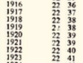

The ayanamsha based on the year 291 (No. 45), if calculated using
Newcomb precession, is about 54" arcsec higher than the one based on
Krishnamurti's tables (No. 5). (With a modern precession it is even
72-73" higher).

Senthilathiban in his book, p. 126ff., proposes a different
representation of the Krishnamurti table values, assuming that they are
referred to the 13/14 April of each year, i.e. the date of the ingress
of the Sun into sidereal Aries. While this assumption is possible, we
cannot be certain about it since Krishnamurti himself does not tell us.
In addition, the agreement of the two ayanamshas (Krishnamurti table
ayanamsha and Krishnamurti/Senthilathiban) becomes even worse, not
better.

Sources:

-   Burgess, E., *The Surya Siddanta*. A Text-book of Hindu Astronomy, Delhi, 2000 (MLBD).
    
-   Dikshit, S(ankara) B(alkrishna), *Bharatiya Jyotish Sastra (History of Indian Astronomy)* (Tr. from Marathi), Govt. of India, 1969,
    part I & II.
    
-   Kollerstrom, Nick, „The Star Zodiac of Antiquity", in: *Culture & Cosmos*, Vol. 1, No.2, 1997).
    
-   Lahiri, N. C., *Panchanga Darpan* (in Bengali), Calcutta, 1967 (Astro Research Bureau).
    
-   Lahiri, N. C., *Tables of the Sun*, Calcutta, 1952 (Astro Research Bureau).
    
-   Saha, M. N., and Lahiri, N. C., *Report of the Calendar Reform Committee*, C.S.I.R., New Delhi, 1955.
    
-   The *Indian Astronomical Ephemeris* for the year 1989, Delhi (Positional Astronomy Centre, India Meteorological Department)
    
-   P.V.R. Narasimha Rao, \"Introducing Pushya-paksha Ayanamsha\" (2013),
    
-   http://www.vedicastrologer.org/articles/pp_ayanamsha.pdf.

-   D. Senthilathiban, *Study of KP Ayanamsa with Modern Precession Theories*, Seoul, 2019.
    
    


### 2.8.7. The sidereal zodiac and the Galactic Center

The definition of the tropical zodiac is very simple and convincing. It
starts at one of the two intersection points of the ecliptic and the
celestial equator. Similarly, the definition for the house circle which
is said to be an analogy of the zodiac, is very simple. It starts at one
of the two intersection points of the ecliptic and the local horizon.
Unfortunately, sidereal traditions do not provide such a simple
definition for the sidereal zodiac. The sidereal zodiac is always fixed
at some anchor star such as Citra (Spica), Revati (zeta Piscium), or
Aldebaran and Antares.

Unfortunately, nobody can tell why any of these stars should be so
important that it could be used as an anchor point for the zodiac. In
addition, all these solutions are unattractive in that the fixed stars
actually are not fixed forever but have a small proper motion which over
a long period of time (such as several millennia) can result in a
considerable change in position. While it is possible to tie the zodiac
to the star Spica in a way that it remains at 0° Libra for all times,
all other stars would change their positions relative to Spica and
relative to this zodiac and would not be fixed at all. The appearance of
the sky changes over long periods of time. In 100.000 years, the
constellations will look very different from now, and the nakshatras
(lunar mansions) will get confused. For this reason, a zodiac defined by
positions of stars is unfortunately not able to provide an everlasting
reference frame.

For such or also other reasons, some astrologers (Raymond Mardyks, Ernst
Wilhelm, Rafael Gil Brand, Nick Anthony Fiorenza) have tried to define
the sidereal zodiac using either the galactic centre or the node of the
galactic equator with the ecliptic. It is obvious that this kind of
solution, which would not depend on the position of a single star
anymore, could provide a philosophically more convincing and very stable
definition of the zodiac. Fixed stars would be allowed to change their
positions over very long periods of time, but the zodiac could still be
considered fixed and "sidereal".

The Swiss astrologer Bruno Huber has pointed out that every time the
Galactic Center enters the next tropical sign, the vernal point enters
the previous sidereal sign. E.g., around the time the vernal point will
enter Aquarius (at the beginning of the so-called Age of Aquarius), the
Galactic Center will enter from Sagittarius into Capricorn. Huber also
notes that the ruler of the tropical sign of the Galactic Center is
always the same as the ruler of the sidereal sign of the vernal point
(at the moment it is Jupiter, but it will be Saturn in a few hundred
years).

**17\) Galactic Center at 0 Sagittarius (and the beginning of nakshatra**
**Mula)**

A correction of the Fagan ayanamsha by about 2 degrees or a correction
of the Lahiri ayanamsha by 3 degrees would place the Galactic Center at
0° Sagittarius. Philosophically, this would obviously make some sense.
Therefore, we added an ayanamsha fixed at the Galactic Center in 1999 in
Swiss Ephemeris 1.50, when we introduced sidereal ephemerides
(suggestion by D. Koch, without any astrological background).

**40\) Galactic Center at 0 Capricorn (Cochrane Ayanamsha)**

A modification of this ayanamsha was proposed by David Cochrane in 2017.
He believes that it makes more sense to put the Galactic Centre at 0°
Capricorn.

**36\) Dhruva Galactic Center Middle Mula Ayanamsha (Ernst Wilhelm)**

A different solution was proposed by the American astrologer Ernst
Wilhelm in 2004. He projects the galactic centre on the ecliptic in
polar projection, i.e. along a great circle that passes through the
celestial north pole (in Sanskrit dhruva) and the galactic centre. The
point at which this great circle cuts the ecliptic is defined as the
middle of the nakshatra Mula, which corresponds to sidereal 6°40'
Sagittarius.

For Hindu astrologers who follow a tradition oriented towards the star
Revati (ζ Piscium), this solution may be particularly interesting
because when the galactic centre is in the middle of Mula, then Revati
is almost exactly at the position it has in Suryasiddhanta, namely 29°50
Pisces. Also interesting in this context is the fact that the meaning of
the Sanskrit word mūlam is "root, origin". Mula may have been the first
of the 27 nakshatras in very ancient times, before the Vedic nakshatra
circle and the Hellenistic zodiac were conflated and Ashvini, which
begins at 0° Aries, became the first nakshatra.

Sources:

-   https://groups.yahoo.com/neo/groups/StudyingKala/conversations/topics/14656;

-   private communication with D. Koch.

**30\) Galactic Centre in the Golden Section Scorpio/Aquarius (Rafael Gil**
**Brand)**

Another ayanamsha based on the galactic centre was proposed by the
German-Spanish astrologer Rafael Gil Brand. Gil Brand places the
galactic centre at the golden section between 0° Scorpion and 0°
Aquarius. The axis between 0° Leo and 0° Aquarius is the axis of the
astrological ruler system.

This ayanamsha is very close to the ayanamsha of the important Hindu
astrologer B.V. Raman. (see below)

Sources:

-   Rafael Gil Brand, Himmlische Matrix. Die Bedeutung der Würden in der
    Astrologie, Mössingen (Chiron), 2014.

-   Rafael Gil Brand, \"Umrechnung von tropischen in siderische
    Positionen\",
    http://www.astrologie-zentrum.net/index.php/8-siderischer-tierkreis/5-umrechnung

### 2.8.8. The sidereal zodiac and the Galactic Equator

Another way to define the ayanamsha based on our galaxy would be to
start the sidereal ecliptic at the intersection point of the ecliptic
and the galactic plane (henceforth called the "galactic node"). At
present, this point is located near 0 Capricorn. This definition of the
ayanamsha would be analogous to the definitions of the tropical ecliptic
and the house circle, both of which are also based on intersections of
great circles. However, defining this galactic-ecliptic intersection
point or node as sidereal 0 Aries would mean to break completely with
the tradition, because it is far away from the traditional sidereal zero
points.

The following ayanamshas belong in this category:

**34\) Skydram Ayanamsha (Raymond Mardyks)**

(also known as Galactic Alignment Ayanamsha)

This ayanamsha was proposed in 1991 by the American astrologer Raymond
Mardyks. It had the value 30° on the autumn equinox 1998. Consequently,
the node (intersection point) of the galactic equator with the ecliptic
was very close to sidereal 0° Sagittarius on the same date, and there
was an interesting "cosmic alignment": The galactic pole pointed exactly
towards the autumnal equinoctial point, and the galactic-ecliptic node
coincided with the winter solstitial point (tropical 0° Capricorn).

Mardyks\' calculation is based on the galactic coordinate system that
was defined by the International Astronomical Union in 1958.

Source:

-   Raymond Mardyks, "When Stars Touch the Earth", in: The Mountain
    Astrologer Aug./Sept. 1991, pp. 1-4 and 47-48.

-   Private communication between R. Mardyks and D. Koch in April 2016.

**41\) Galactic Node at 5 Sagittarius (Fiorenza Ayanamsha)**

Another ayanamsha based on the galactic equator. It was invented by Nick
Anthony Fiorenza and published in his book "The Star Chart. Sidereal
Astrology and the Fixed Stars" in 2001. Fiorenza thinks that 1 Jan. 2000
should be taken as the date of the alignment of the solstitial points
with the galactic node. He assumes an ayanamsha value of exactly 25° on
this date. Thus, the vernal point fell on exactly 5° Pisces in 2000.

Source:

-   https://www.lunarplanner.com/siderealastrology.html

**31\) Ayanamsha based on the Galactic Equator IAU 1958**

This ayanamsha is based on galactic pole as defined by the IAU in 1958,
and it is assumed that the galactic equator intersects with the ecliptic
at sidereal 0° Sagittarius. This ayanamsha differs from the Skydram
ayanamsha by only 19 arc seconds, but from Fioreza's ayanamsha by
slightly more than 5°.

32\) Galactic Node at 0° Sagittarius

The galactic pole IAU 1958 is in fact outdated. According to more recent
observations and calculations from the year 2010, the galactic node with
the ecliptic must be corrected by 3\'11\", and the \"Galactic
Alignment\" preponed to 1994 (instead of 1998). With this ayanamsha, the
galactic node is fixed exactly at sidereal 0° Sagittarius.

Source:

-   Liu/Zhu/Zhang, „Reconsidering the galactic coordinate system",
    Astronomy & Astrophysics No. AA2010, Oct. 2010, p. 8.

**33\) Ardra Galactic Plane Ayanamsha**

(= Galactic equator cuts ecliptic in the middle of Mula and the
beginning of Ardra)

With this ayanamsha, the galactic equator cuts the ecliptic exactly in
the middle of the nakshatra Mula. This means that the Milky Way passes
through the middle of this lunar mansion. Here again, it is interesting
that the Sanskrit word mūlam means \"root, origin\", and it seems that
the circle of the lunar mansions originally began with this nakshatra.
On the opposite side, the galactic equator cuts the ecliptic exactly at
the beginning of the nakshatra Ārdrā (\"the moist, green, succulent
one\", feminine).

This ayanamsha was introduced by the American astrologer Ernst Wilhelm
in 2004. He used a calculation of the galactic node by D. Koch from the
year 2001, which had a small error of 2 arc seconds. The current
implementation of this ayanamsha is based on a new position of the
Galactic pole found by Chinese astronomers in 2010.

### 2.8.9. Other ayanamshas

**35\) True Mula Ayanamsha (K. Chandra Hari)**

With this ayanamsha, the star Mula (λ Scorpionis) is assumed at 0°
Sagittarius.

The Indian astrologer Chandra Hari is of the opinion that the lunar
mansion Mula corresponds to the Muladhara Chakra. He refers to the
doctrine of the Kalapurusha which assigns the 12 zodiac signs to parts
of the human body. The initial point of Aries is considered to
correspond to the crown and Pisces to the feet of the cosmic human
being. In addition, Chandra Hari notes that Mula has the advantage to be
located near the galactic centre and to have "no proper motion". This
ayanamsha is very close to the Fagan/Bradley ayanamsha. Chandra Hari
believes it defines the original Babylonian zodiac.

(In reality, however, the star Mula (λ Scorpionis) has a small proper
motion, too. As has been stated, the position of the galactic centre was
not known to the ancient peoples. However, they were aware of the fact
that the Milky Way crossed the ecliptic in this region of the sky.)

Sources:

-   K. Chandra Hari, \"On the Origin of Sidereal Zodiac and Astronomy\",
    in: Indian Journal of History of Science, 33(4) 1998.

-   Chandra Hari, \"Ayanāṃśa\",
    xa.yimg.com/kq/groups/26252194/1355927039/name/Ayanamsha.pdf.

-   http://www.indiadivine.org/content/topic/1229109-true-ayanamsha-views-of-chandra-hari/.

The following ayanamshas were provided by Graham Dawson ("Solar Fire"),
who had taken them over from Robert Hand's Program "Nova". Some were
also contributed by David Cochrane. Explanations by D. Koch:

**2\) De Luce Ayanamsha**

This ayanamsha was proposed by the American astrologer Robert DeLuce
(1877-1964). It is fixed at the birth of Jesus, theoretically at 1
January 1 CE. However, DeLuce de facto used an ayanamsha of 26°24\'47 in
the year 1900, which corresponds to 4 June 1 BCE as zero ayanamsha date.

DeLuce believes that this ayanamsha was also used in ancient India. He
draws this conclusion from the fact that the important ancient Indian
astrologer Varahamihira, who assumed the solstices on the ingress days
of the Sun into sidereal Cancer and Capricorn, allegedly lived in the
1st century BCE. This dating of Varahamihira has recently become popular
under the influence of Hindu nationalist ideology (Hindutva). However,
historically, it cannot be maintained. Varahamihira lived and wrote in
the 6th century CE.

Sources:

-   Robert DeLuce, Constellational Astrology According to the Hindu
    System, Los Angeles, 1963, p. 5.

**3\) Raman Ayanamsha**

This ayanamsha was used by the great Indian astrologer Bangalore Venkata
Raman (1912-1998). It is based on a statement by the medieval astronomer
Bhaskara II (1184-1185), who assumed an ayanamsha of 11° in the year
1183 (according to Information given by Chandra Hari, unfortunately
without giving his source). Raman himself mentioned the year 389 CE as
year of zero ayanamsha in his book Hindu Predictive Astrology, pp.
378-379.

Although this ayanamsha is very close to the galactic ayanamsha of Gil
Brand, Raman apparently did not think of the possibility to define the
zodiac using the galactic centre.

Sources:

-   Chandra Hari, \"Ayanāṃśa\",
    xa.yimg.com/kq/groups/26252194/1355927039/name/Ayanamsha.pdf.

-   B.V. Raman, Hindu Predictive Astrology, pp. 378-379.

**7\) Shri Yukteshwar Ayanamsha**

This ayanamsha was allegedly recommended by Swami Shri Yukteshwar Giri
(1855-1936). We have taken over its definition from Graham Dawson.
However, the definition given by Yukteshwar himself in the introduction
of his work The Holy Science is a confusing. According to his
"astronomical reference books", the ayanamsha on the spring equinox 1894
was 20°54'36". At the same time he believed that this was the distance
of the spring equinox from the star Revati, which he put at the initial
point of Aries. However, this is wrong, because on that date, Revati was
actually 18°24' away from the vernal point. The error is explained from
the fact that Yukteshwar used the zero ayanamsha year 499 CE and an
inaccurate Suryasiddhantic precession rate of 360°/24'000 years = 54
arcsec/year. Moreover, Yukteshwar is wrong in assigning the
above-mentioned ayanamsha value to the year 1894; in reality it applies
to 1893.

Since Yukteshwar's precession rate is wrong by 4" per year, astro.com
cannot reproduce his horoscopes accurately for epochs far from 1900. In
2000, the difference amounts to 6'40".

Although this ayanamsha differs only a few arc seconds from the galactic
ayanamsha of Gil Brand, Yukteshwar obviously did not intend to define
the zodiac using the galactic centre. He actually intended a
Revati-oriented ayanamsha, but committed the above-mentioned errors in
his calculation.

Source:

-   Swami Sri Yukteswar, The Holy Science, 1949, Yogoda Satsanga Society
    of India, p. xx.

**8\) JN Bhasin Ayanamsha**

This ayanamsha was used by the Indian astrologer J.N. Bhasin
(1908-1983).

**6\) Djwhal Khul Ayanamsha**

This ayanamsha is based on the assumption that the Age of Aquarius will
begin in the year 2117. This assumption is maintained by a theosophical
society called Ageless Wisdom, and bases itself on a channeled message
given in 1940 by a certain spiritual master called Djwhal Khul.

Graham Dawson commented it as follows (E-mail to Alois Treindl of 12
July 1999): "The \"Djwhal Khul\" ayanamsha originates from information
in an article in the Journal of Esoteric Psychology, Volume 12, No 2,
pp91-95, Fall 1998-1999 publ. Seven Ray Institute). It is based on an
inference that the Age of Aquarius starts in the year 2117. I decided to
use the 1st of July simply to minimize the possible error given that an
exact date is not given."

On 7 July 2020, Clifford Ribaudo sent us additional information in a
mail to Alois Treindl:\
"Also, I know the "real\" source of the 2117 date for the DK (= Djwhal
Khul) Ayanamsa and the original provenance of it. It was not Lindsay or
Robbins or the journal of Esoteric Psychology. My friend Keith Bailey,
inherited a whole bunch of papers from Marion Walter's who was one of
the members of the "DINA" group discussed in Alice Bailey's books. DK
answered a question from Roberto Assagioli and in the answer he
mentioned that "he would suggest the start of the Aquarian Age was 177
years from the date of writing.". A copy of that letter was given to
Robbins and then at some point he mentioned it in Journal of Esoteric
Psychology."

Sources:

-   Philipp Lindsay, "The Beginning of the Age of Aquarius: 2,117 A.D.",
    http://esotericastrologer.org/newsletters/the-age-of-aquarius-ray-and-zodiac-cycles/.

-   Esoteric Psychology, Volume 12, No 2, pp91-95, Fall 1998-1999 publ.
    Seven Ray Institute.

**39\) "Vedic Ayanamsha" according to Sunil Sheoran**

This ayanamsha is derived from ancient Indian time cycles and
astronomical information given in the Mahabharata. Its author, Mr. Sunil
Sheoran, therefore calls this ayanamsha \"Vedic\".

Essential in Sheoran\'s argumentation is the assumption that the two
Mahabharatan solar eclipses that were observed from Kurukshetra and
Dvaraka were 18 years apart, not 36 years as is taught by tradition and
the Mahabharata itself. Also essential to Sheoran\'s theory is his
assumption that the traditional lengths of the yugas are too high and
that in reality a period of four yugas (caturyuga/mahāyuga) should be
120 years rather than 12.000 divine years or 4.320.000 human years. From
the mentioned eclipse pair and historical considerations, he derives
that the Mahabharata war must have taken place in the year 827 BCE. Then
he dates the beginning of the last Manvantara on the winter solstice
4174 BCE. This is Sheoran\'s ayanamsha zero date, to which he assigns
the ayanamsha value -60°.

Moreover it must be mentioned that in Sheoran's opinion the nakshatra
circle does not begin at the initial point of the zodiac, but that 0°
Aries corresponds to 3°20' in Ashvini.

Unfortunately, there are serious problems at least in Sheoran linguistic
argumentation. As to the time distance between the two eclipses, the
Mahabharata itself states: ṣaṭtriṃśe varṣe, MBh 16.1.1 and 16.2.2. The
correct translation of this expression is \"in the 36th year\", whereas
Sheoran mistakenly attempts to read it as \"3 x 6 = 18 years\". In
addition, in texts to do with the durations of the yugas Sheoran reads
sahasrāṇi as \"10\" instead of \"1000\" and śatāni as \"1\" instead of
\"100\". Unfortunately, Sanskrit dictionaries and grammar do not allow
such translations.

Source:

-   Sunil Sheoran, \"The Science of Time and Timeline of World
    History\", 2017, http://goo.gl/av6vEH .

### 2.8.10. Conclusions

We have found that there are basically five definitions, not counting
the manifold variations:

1.  the Babylonian zodiac with Spica at 29 Virgo or Aldebaran at 15
    Taurus:

- a)  Fagan/Bradley;

- b)  refined with Aldebaran at 15 Tau;

- c)  P. Huber;

- d)  J.P. Britton.


2. the Greek-Hindu-Arabic zodiac with the zero point between 10 and 20'
   east of zeta Piscium:

- e)  Hipparchus;

- f)  Ushâshashî;

- g)  Sassanian;

- h)  true Revati ayanamsha


3. the Hindu astrological zodiac with Spica at 0 Libra:

- i)  Lahiri


4. ayanamshas based on the Kaliyuga year 3600 or the 23rd year of life
   of Aryabhata.

5. galactic ayanamshas based on the position of the galactic centre or
   the galactic nodes (= intersection points of the galactic equator
   with the ecliptic).

No. 1 is historically the oldest one, but we are not sure about its
precise astronomical definition. It could have been Aldebaran at 15
Taurus and Antares at 15 Scorpio.

### 2.8.11. Ayanamshas with different precession rates

Some Hindu astrologers use ayanamshas based on a special precession rate
which is different from the modern precession algorithm used by the
Swiss Ephemeris, usually the precession rate used by the inventor of
these particular ayanamshas. They should be aware, however, that this
approach makes only sense if the tropical ephemeris they use is based on
exactly the same precession model. It is wrong to assume that tropical
ephemerides are an absolute datum.

Modern ephemerides are generated relative to the *sidereal* reference
frame ICRF (International Celestial Reference Frame), which is close to
the mean equinox on 1 Jan. 2000, 12:00 TT. These *sidereal* "raw"
ephemerides are transformed into *tropical* ephemerides using a modern
precession model. There are several such models. Precession IAU 1976
(Lieske) is still used by JPL Horizons. The current standard model
recommended by the IAU is IAU 2006 (Capitaine). The Swiss Ephemeris
currently uses the precession model Vondrák (2011), which is
particularly good for very-long-term ephemerides. It follows that
tropical ephemerides will be different depending on the precession model
that is used to generate them. The differences will be extremely small
for planetary positions in current decades and centuries, but will grow
considerably for remote epochs. It also follows that *if sidereal
positions are calculated using a precession model different from the one
that was used to create the tropical ephemerides, this is an
inconsistent approach*. *In principle, the same precession model should
be used for ayanamsha as was used for the creation of the underlying
tropical ephemeris.*

Now, we have the following problem: Some ayanamshas were defined at a
time when a different precession model was in use, either the precession
model of Simon Newcomb (1895) or the precession model IAU 1976. Using
different precession models, we will have differences in all the three,
tropical planetary positions, sidereal ephemeris positions, and
ayanamsha values. Let us study these differences in a table that shows
all the three for an ayanamsha that has its zero date on the equinox of
the year 291 CE, on 21 March jul., 6:03 TT. (V stands for precession
Vondrák; N for precession Newcomb):

| *Year* | *diff. trop. long. Sun (prec V-N) in "* | *diff. ayanamsha (prec V-N) in "* | *diff. sid. long. Sun (prec V-N) in "* | *\~ minus 17.650216\"* |
| ------ | --------------------------------------- | --------------------------------- | -------------------------------------- | ---------------------- |
| -3000  | 81.648098                               | 64.059809                         | 17.588289                              | -0.061927              |
| -2500  | 77.891205                               | 60.280286                         | 17.610918                              | -0.039297              |
| -2000  | 67.756729                               | 50.128935                         | 17.627794                              | -0.022422              |
| -1500  | 55.131415                               | 37.492205                         | 17.639210                              | -0.011006              |
| -1000  | 42.521677                               | 24.875658                         | 17.646019                              | -0.004197              |
| -500   | 31.328666                               | 13.679394                         | 17.649271                              | -0.000944              |
| 0      | 22.109197                               | 4.458959                          | 17.650238                              | 0.000022               |
| equ.   | 291                                     | 17.650216                         | 0.000000                               | 17.650216              |
| 500    | 14.821773                               | -2.828337                         | 17.650110                              | -0.000106              |
| 1000   | 9.060393                                | -8.589402                         | 17.649795                              | -0.000421              |
| 1500   | 4.277578                                | -13.372189                        | 17.649767                              | -0.000449              |
| 1600   | 3.393108                                | -14.256697                        | 17.649806                              | -0.000410              |
| 1700   | 2.525093                                | -15.124766                        | 17.649859                              | -0.000357              |
| 1800   | 1.671280                                | -15.978645                        | 17.649925                              | -0.000291              |
| 1900   | 0.829937                                | -16.820066                        | 17.650003                              | -0.000213              |
| 2000   | 0.000011                                | -17.650081                        | 17.650093                              | -0.000123              |
| 2100   | -0.818850                               | -18.469044                        | 17.650194                              | -0.000022              |
| 2200   | -1.626143                               | -19.276451                        | 17.650307                              | 0.000091               |
| 2300   | -2.420577                               | -20.071012                        | 17.650435                              | 0.000219               |
| 2400   | -3.199913                               | -20.850493                        | 17.650580                              | 0.000364               |
| 2500   | -3.960945                               | -21.611692                        | 17.650747                              | 0.000531               |
| 3000   | -7.300452                               | -24.952670                        | 17.652218                              | 0.002002               |
| 3500   | -9.010479                               | -26.666760                        | 17.656281                              | 0.006065               |
| 4000   | -7.165941                               | -24.832623                        | 17.666682                              | 0.016466               |


As can be seen, the choice of precession model has a noticeable impact
on tropical ephemerides and the ayanamsha value. However, the difference
in sidereal ephemerides remains almost constant for the whole period
considered.

Now, let us assume this ayanamsha was introduced at a time when Newcomb
precession was used, but we use tropical positions based on the modern
precession model by Vondrak. *If we still want to keep the sidereal
ephemerides unchanged*, the above table shows that we need not
necessarily use the old precession model of Newcomb; instead, we can use
modern precession Vondrák instead, but have to subtract a constant value
of 17.65022\". The sidereal ephemeris will then remain identical, but
the tropical ephemeris and the ayanamsha will change. Here, we must
understand that the ayanamsha should not be taken as an absolute value,
it should only indicate the difference between our tropical and our
sidereal ephemeris. With a future update of the precession model in the
Swiss Ephemeris, the tropical ephemeris and ayanamsha will change, but
the sidereal ephemeris will not, because the ayanamsha value will be
adjusted automatically.

Let us also study an explicit comparison of tropical and sidereal
positions of the Sun based on both precession models Vondrák (V) and
Newcomb (N) and also using the above-mentioned correction to the
ayanamsha:

*epoch*|*tropical Sun*|*sidereal Sun*|*ayanamsha*
------|------------|------------|------------
-1000 V|271°14\'15.75001|289°05\'52.63883|342°08\'23.11118
-1000 N|271°14\'58.27229|289°05\'52.63457|342°09\'05.63773
eq291 V|359°59\'42.34978|0°00\'00.00000|359°59\'42.34978
eq291 N|0°00\'00.00000|0°00\'00.00000|0°00\'00.00000
1900 V|280°08\'54.75103|257°46\'10.69049|22°22\'44.06054
1900 N|280°08\'55.58096|257°46\'10.69027|22°22\'44.89070
2000 V|279°51\'44.39186|256°05\'12.79708|23°46\'31.59478
2000 N|279°51\'44.39187|256°05\'12.79695|23°46\'31.59492

As can be seen, the tropical positions of the Sun and the ayanamshas,
resulting from the two different precession models, are identical only
at the initial epoch of the JPL ephemeris, on 1 Jan. 2000, whereas at
other epochs they are different from each other. On the other hand, the
sidereal positions of the Sun are practically identical at all times,
independently of the precession model chosen.

Unfortunately, this makes the search for the "correct ayanamsha" even
more confused than many believe. Sidereal astrologers use to ask the
question whether Lahiri or Krishnamurti or whatever ayanamsha should be
used, and they believe that the ayanamsha can be defined by some fixed
value at some initial epoch. However, this is not correct. The start
value or start date of an ayanamsha, as well as its value on any other
date, depend on the precession model inherent in the tropical ephemeris
used. This fact is usually forgotten.

Note, however, that this correction method is not used with all
ayanamshas. The above example uses the equinox of the year 291 as zero
ayanamsha date, which is actually the initial date of the
Krishnamurti/Senthilathiban ayanamsha. In reality, the described
correction method is not applied here. The ayanamsha is calculated using
the current precession model of the Swiss Ephemeris (Vondrak 2011)
without any correction. Sidereal ephemerides will be allowed to change
whenever the precession model will be updated.

Nor should the correction be done with the definition of Lahiri
ayanamsha as given by Lahiri himself in the preface of the 1980 edition
of his "Indian ephemeris", where zero ayanamsha is defined as the mean
Sun on the equinox in the year 285. When the Swiss Ephemeris updates the
precession model, then the zero ayanamsha date will have to be
corrected, and the ayanamsha calculation will also be done using the new
precession model without any correction. This will have some impact on
sidereal ephemerides, however an unavoidable one.

Moreover, a correction is not required with True Chitra Paksha ayanamsha
and some other ayanamshas where the ayanamsha is based on the real
position of a fixed star. When the Swiss Ephemeris updates the
precession model, this will have practically no impact on the sidereal
ephemerides or ayanamsha.

On the other hand, with the other definition of Lahiri ayanamsha as used
by *Indian Astronomical Ephemeris*, a correction will be required
because the definition is not based on some astronomical object or
event, but on an arbitrary value at an arbitrary epoch, based on the
precession model IAU 1976. A small correction will therefore be required
to the ayanamsha in order to provide identical sidereal positions while
using our standard precession model Vondrák 2011.

For each ayanamsha, a decision has to be taken individually what kind of
approach is required.

We hope that the Swiss Ephemeris, from version 2.09 on, handles this
correctly, and the user should not have to worry about precession
models. One should be aware, however, that the values given for some
ayanamshas will be different from those given in older literature. The
reason is that the older literature defines the ayanamsha value based on
a different tropical ephemeris (and precession model) than the Swiss
Ephemeris.

The following ayanamshas have been corrected since version 2.09 by the
following values:

| *ayanamsha*      | *correction* | *prec. model*            |
| ---------------- | ------------ | ------------------------ |
| 0 Fagan-Bradley  | 0.41256"     | Newcomb                  |
| 1 Lahiri         | -0.13036"    | IAU 1976                 |
| 3 Raman          | 0.82800"     | Newcomb                  |
| 5 Krishnamurti   | 0.82800"     | Newcomb                  |
| 43 Lahiri (1967) | 0.82800"     | Newcomb (new ayanamsha!) |


### 2.8.12. On which ecliptic is the ayanamsha measured?

##### 1\. The traditional algorithm (implemented in Swiss Ephemeris as default mode)

As has been stated, sidereal planetary positions are computed from the
following equation:

sidereal_position = tropical_position -- ayanamsha,

The ayanamsha of a given date t is computed from an initial value of the
ayanamsha at some initial date (e.g. t0 = 1 Jan 1900) and the speed of
the vernal point, the so-called precession rate:

ayanamsha(t) = ayanamsha(t0) + precession(t-t0).

Unfortunately, this procedure is not really clean because the two
formulae do not operate on exactly the same plane. It may work
sufficiently well in an ordinary astrologer's practice. However, if very
high accuracy is wanted over a long period of time, then this approach
is too simplistic.

The precession of the equinox is not only a matter of ecliptical
longitude, but a more complex phenomenon. It has two components:

- a)  The soli-lunar precession: The combined gravitational pull of the
      > Sun and the Moon on the equatorial bulge of the Earth causes the
      > Earth axis to move very slowly, in the way of a spinning top. As a
      > result of this movement, the vernal point moves around the
      > ecliptic with a speed of about 50" per year. This cycle has a
      > period of roughly 26000 years.
- b)  The planetary precession: The Earth orbit itself is not fixed. The
      > gravitational influence from the planets causes it to slowly
      > change its orientation. As a result, the obliquity of the ecliptic
      > currently decreases by 47" per century. This change also has some
      > impact on the position of the vernal point. (Note, however, that
      > relative to the ecliptic of a fixed date, the equator keeps an
      > almost constant angle, with a change of only a couple of 0.06"
      > cty-2.)

Because the ecliptic plane is not fixed, it is not fully correct to
subtract an ayanamsha from the tropical position in order to get a
sidereal position. Let us take, e.g., the Fagan/Bradley ayanamsha, which
can be defined by:

ayanamsha = 24°02'31.36" + P(Je-Js),

where Js is the initial epoch or start date of the ayanamsha, in our
case 1 Jan. 1950, and Je is the "end date" for which the ayanamsha is to
be calculated.

24°02'31.36" is the value of the ayanamsha on the initial date Js = 1
Jan 1950. It is obviously measured on the ecliptic of Js itself.
P(Je-Js) is the distance of the vernal point at the end epoch Je from
the position of the vernal point on the start epoch Js = 1 Jan 1950.
Again, this distance is measured on the ecliptic of Js.

Now, the value of ayanamsha is subtracted from a planetary position
which is referred to the ecliptic of the epoch Je, (not Js!). This
approach is not really correct. The error may be very small, but the
ecliptic of Js and the ecliptic of Je are not exactly in the same plane.

Precession polynomials found in astronomical literature are also
relative to Js. E.g. Indian Astronomical Ephemeris 1989 (IAE 1989), p.
525, gives the following formula:

P~N~ = (5029.0966 + 2.22226 \* T-0.000042 \* T^2^) \* t + (1.11161 -
0.000127 \* T) \* t^2^ - 0.000113 \* t^3^\
t= (Je - Js) / 36525 ; T= (Js-2451545) / 36525

If the start date Js is J2000 (i.e. 1 Jan. 2000, 12:00 TT), then the
formula can also be written simpler:

P~N~ = 5029.0966 \* t + 1.11161 \* t^2^ - 0.000113\*t^3^

According to IAE 1989, the resulting value PN is "referred to the fixed
ecliptic and equinox of Js". Thus, in a really correct calculation this
value should not be applied to a planetary or star position relative to
the ecliptic and equinox of Je. However, this is exactly what is done
when sidereal ephemerides are calculated from tropical ones.

As a result, an object that does not move relative to a fixed sidereal
reference frame, still has an apparent motion relative a sidereal
zodiac. If we compute its precise tropical position for several dates
and then subtract the Fagan/Bradley or Lahiri ayanamsha for the same
dates in order to get its sidereal position, then these positions will
all be slightly different. This difference can be considerable over long
periods of time. Let us give two examples to illustrate this phenomenon.

Long-term ephemeris of some fictitious star near the ecliptic that has
no proper motion (small change in longitude):

|**Date**|**Longitude**|**Latitude**
|--------|-------------|--------------
|-12000|335°16\'55.2211|0°55\'48.9448
|-11000|335°16\'54.9139|0°47\'55.3635
|-10000|335°16\'46.5976|0°40\'31.4551
|-9000|335°16\'32.6822|0°33\'40.6511
|-8000|335°16\'16.2249|0°27\'23.8494
|-7000|335°16\'00.1841|0°21\'41.0200
|-6000|335°15\'46.8390|0°16\'32.9298
|-5000|335°15\'37.4554|0°12\'01.7396
|-4000|335°15\'32.2252|0°08\'10.3657
|-3000|335°15\'30.4535|0°05\'01.3407
|-2000|335°15\'30.9235|0°02\'35.9871
|-1000|335°15\'32.3268|0°00\'54.2786
|0|335°15\'33.6425|-0°00\'04.7450
|1000|335°15\'34.3645|-0°00\'22.4060
|2000|335°15\'34.5249|-0°00\'00.0196
|3000|335°15\'34.5216|0°01\'01.1573

Long-term ephemeris of some fictitious star with high ecliptic latitude
and no proper motion (bigger change in longitude value):

|**Date**|**Longitude**|**Latitude**
|--------|-------------|--------------
|-12000|25°48\'34.9812|58°55\'17.4484
|-11000|25°33\'30.5709|58°53\'56.6536
|-10000|25°18\'18.1058|58°53\'20.5302
|-9000|25°03\'09.2517|58°53\'26.8693
|-8000|24°48\'12.6320|58°54\'12.3747
|-7000|24°33\'33.6267|58°55\'34.7330
|-6000|24°19\'16.3325|58°57\'33.3978
|-5000|24°05\'25.4844|59°00\'08.8842
|-4000|23°52\'06.9457|59°03\'21.4346
|-3000|23°39\'26.8689|59°07\'10.0515
|-2000|23°27\'30.5098|59°11\'32.3495
|-1000|23°16\'21.6081|59°16\'25.0618
|0|23°06\'02.6324|59°21\'44.7241
|1000|22°56\'35.5649|59°27\'28.1195
|2000|22°48\'02.6254|59°33\'32.3371
|3000|22°40\'26.4786|59°39\'54.5816

Exactly the same kind of thing happens to sidereal planetary positions
if one calculates them in the traditional way. They are actually given
relative to a moving reference frame. The "fixed zodiac" is not really
fixed. When observed over long periods of time in quick motion, it seems
to wobble.

The wobbling of the ecliptic plane also influences ayanamshas that are
referred to the nodes of the galactic equator with the ecliptic.

##### 2\. Consistent ayanamsha relative to the ecliptic of date (implemented

in Swiss Ephemeris \>=2.09 as an option)

As described above, the traditional approach is to calculate the
ayanamsha relative to the ecliptic of Js and then apply this value to
tropical positions relative to the eclipitic of Je. This procedure is
obviously inconsistent.

A possible consistent solution would be to calculate the precession and
ayanamsha relative to the eclipitic of the end epoch Je rather than to
the ecliptic of the start epoch Js. Then this value would be subtracted
from tropical planetary or star positions on epoch Je. Although the
wobbling effect still remains, and positions of a fixed object will have
slightly different positions at different date, this procedure is at
least consistent in itself.

The following table shows the differences of solar positions gained in
this way from solar positions gained in the traditional (inconsistent)
way based on Lahiri ayanamsha. The solar positions are always calculated
form 1 January in the Gregorian year.

|*year*|*diff in \"*
|--------|--------------
|-3000|-9.633
|-2500|-8.472
|-2000|-7.049
|-1500|-5.528
|-1000|-4.052
|-500|-2.735
|0|-1.656
|500|-0.854
|1000|-0.334
|1500|-0.067
|1600|-0.040
|1700|-0.020
|1800|-0.007
|1900|-0.001
|1920|-0.000
|1940|0.000
|1960|0.000
|1980|0.000
|2000|-0.000
|2020|-0.001
|2040|-0.002
|2060|-0.003
|2080|-0.004
|2100|-0.005
|2200|-0.015
|2300|-0.029
|2400|-0.046
|2500|-0.066
|3000|-0.190
|3500|-0.304
|4000|-0.357

Note that the differences are around a millisecond of arc or below for
current decades, but greater than an arc second 2000 years ago.

However, if the reference epoch is in the remote past, e.g. when
ayanamsha is calculated from a zero ayanamsha epoch on the equinox 285
CE, then the differences are near zero only near that epoch, but amount
to 0.65" in 2020:

|*year*|*diff in \"*
|--------|--------------
|-3000|-4.209
|-2500|-3.250
|-2000|-2.279
|-1500|-1.408
|-1000|-0.720
|-500|-0.258
|0|-0.032
|500|-0.016
|1000|-0.161
|1500|-0.395
|1600|-0.446
|1700|-0.496
|1800|-0.546
|1900|-0.595
|1920|-0.604
|1940|-0.614
|1960|-0.623
|1980|-0.633
|2000|-0.642
|2020|-0.651
|2040|-0.660
|2060|-0.669
|2080|-0.677
|2100|-0.686
|2200|-0.727
|2300|-0.765
|2400|-0.799
|2500|-0.828
|3000|-0.895
|3500|-0.810
|4000|-0.572

##### 3\. Projection onto the ecliptic of t0 (implemented in Swiss Ephemeris

as an option)

The opposite solution, which would also be consistent, would be to
project the planetary positions of end date Je onto the ecliptic of the
start date of the ayanamsha JS using a correct coordinate
transformation. E.g., for the Fagan/Bradley ayanamsha, this would be the
mean ecliptic of 1950; for the Lahiri ayanamsha, the mean ecliptic of 21
March 1956.

If we follow this method, the wobbling effect described above under (1)
(traditional ayanamsha method) will not occur, and an object that has no
proper motion will keep its position forever.

The differences from the traditional method look quite similar to method
2 above, where the calculation is consistently done relative to the
ecliptic of date:

|*year*|*diff in \"*
|--------|--------------
|-3000|-9.522
|-2500|-9.089
|-2000|-7.970
|-1500|-6.402
|-1000|-4.763
|-500|-3.207
|0|-1.897
|500|-0.939
|1000|-0.337
|1500|-0.058
|1600|-0.033
|1700|-0.016
|1800|-0.005
|1900|-0.000
|1920|-0.000
|1940|0.000
|1960|0.000
|1980|0.000
|2000|-0.000
|2020|-0.001
|2040|-0.001
|2060|-0.002
|2080|-0.003
|2100|-0.004
|2200|-0.008
|2300|-0.014
|2400|-0.019
|2500|-0.024
|3000|0.030
|3500|0.318
|4000|0.967

A comparison of the two consistent methods 2 and 3 provides the
following differences, which are considerably smaller:

|*year*|*diff in \"*
|--------|--------------
|-3000|-0.111
|-2500|0.617
|-2000|0.921
|-1500|0.874
|-1000|0.711
|-500|0.472
|0|0.241
|500|0.084
|1000|0.003
|1500|-0.009
|1600|-0.006
|1700|-0.004
|1800|-0.002
|1900|-0.000
|1920|0.000
|1940|0.000
|1960|0.000
|1980|0.000
|2000|0.000
|2020|-0.000
|2040|-0.001
|2060|-0.001
|2080|-0.001
|2100|-0.002
|2200|-0.006
|2300|-0.015
|2400|-0.027
|2500|-0.042
|3000|-0.219
|3500|-0.621
|4000|-1.324

A philosophical side note: This method is geometrically more correct
than the traditional one, but still has a problem. For, if we want to
refer everything to the ecliptic of some initial date t0, we will have
to choose that date very carefully. Its ecliptic ought to be of "cosmic"
importance. The ecliptic of 1950 or the one of 1900 or 1956 (Lahiri) are
obviously meaningless and not suitable as a reference plane. So, how
about some historical date on which the tropical and the sidereal zero
point coincided? Although this may be considered as a kind of cosmic
anniversary (the ancient Indians and Sassanians did so), the ecliptic
plane of that time does not have an "eternal" value. E.g., it is
different from the ecliptic plane of the previous anniversary around the
year 26000 BCE, and it is also different from the ecliptic plane of the
next cosmic anniversary around the year 26000 CE.

Thus, it may be wiser to use method 2, i.e. a consistent ayanamsha
calculation on the ecliptic of date.

Method 3 can also be used for computations of the following kind:

c)  Astronomers may want to calculate positions referred to a standard
    > equinox like J2000, B1950, or B1900, or to any other equinox.

d)  Astrologers may be interested in the calculation of
    > precession-corrected transits. See explanations in the next
    > chapter.

e)  The algorithm can be applied to any user-defined sidereal mode, if
    > the ecliptic of its reference date is considered to be
    > astrologically significant.

f)  The algorithm makes the problems of the traditional method visible.
    > It shows the dimensions of the inherent inaccuracy of the
    > traditional method. (Calculate some star position using the
    > traditional method and compare it to the same star's position if
    > calculated using this method.)

For the planets and for centuries close to t0, the difference from the
traditional procedure will be only a few arc seconds in longitude. Note
that the Sun will have an ecliptical latitude of several arc minutes
after a few centuries.

For the lunar nodes, the procedure is as follows:

Because the lunar nodes have to do with eclipses, they are actually
points on the ecliptic of date, i.e. on the tropical zodiac. Therefore,
we first compute the nodes as points on the ecliptic of date and then
project them onto the sidereal zodiac. This procedure is very close to
the traditional method of computing sidereal positions (a matter of arc
seconds). However, the nodes will have a latitude of a couple of arc
minutes.

For the axes and houses, we compute the points where the horizon or the
house lines intersect with the sidereal plane of the zodiac, not with
the ecliptic of date. Here, there are greater deviations from the
traditional procedure. If t is 2000 years from t0, the difference
between the ascendant positions might well be 1/2 degree.

##### 4\. Fixed-star-bound ecliptic (implemented in Swiss Ephemeris for some selected stars)

One can use a stellar object as an anchor for the sidereal zodiac and
make sure that a particular stellar object is always at a certain
position on the ecliptic of date. E.g. one might want to have Spica
always at 0 Libra or the Galactic Center always at 0 Sagittarius. There
is nothing against this method from a geometrical point of view. But it
must be noted that this system is not really fixed either, because it is
still based on the true ecliptic of date, which is actually moving.
Moreover, the fixed stars that are used as anchor stars have a small
proper motion, as well. Thus, if Spica is assumed as a fixed point, then
its proper motion, its aberration, its gravitational deflection, and its
parallax will necessarily affect the position and motion of all other
stars (in addition to their own proper motion, aberration, etc.). Note,
the Galactic Centre (Sgr A\*) is not really fixed either, but has a
small apparent motion that reflects the motion of the Sun around it.

This solution has been implemented for the following stars and fixed
positions:

-   Spica/Citra at 180° ("True Chitra Paksha Ayanamsha")

-   Revati (zeta Piscium) at 359°50'

-   Pushya (Asellus Australis) at 106° (PVR Narasimha Rao)

-   Mula (lambda Scorpionis) at 240° (Chandra Hari)

-   Galactic centre at 0° Sagittarius

-   Galactic centre at 0° Capricorn (David Cochrane)

-   Galactic centre at golden section between 0° Sco and 0° Aqu (R. Gil
    
    > Brand)
    
-   Polar longitude of galactic centre in the middle of nakshatra Mula
    
    > (E. Wilhelm)

With Swiss Ephemeris versions before 2.05, the apparent position of the
star relative to the mean ecliptic plane of date was used as the
reference point of the zodiac. E.g. with the True Chitra ayanamsha, the
star Chitra/Spica had the apparent position 180° exactly. However, the
true position was slightly different. Since version 2.05, the star is
always exactly at 180°, not only its apparent, but also its true
position.

##### 5\. Galactic-equator-based ayanamshas (implemented in Swiss Ephemeris)

Some ayanamshas are based on the galactic node, i.e. the intersection of
the galactic equator with the mean ecliptic of date. These ayanamshas
include:

-   Galactic equator (IAU 1958)

-   Galactic equator true/modern

-   Galactic equator in middle of Mula

(Note, the Mardyks ayanamsha, although derived from the galactic
equator, does not work like this. It is calculated using the method
described above under 1).)

The galactic node is calculated from the true position of the galactic
pole, not the apparent one. As a result, if the position of the galactic
pole is calculated using the ayanamsha that has the galactic node at 0°
Sagittarius, then the true position of the pole is exactly at sidereal
150°, but its apparent position is slightly different from that.

Here again, it must be stated that the ecliptic plane used is the true
ecliptic of date, which is moving, with the only difference that the
initial point is defined by the intersection of the ecliptic with the
galactic equator.

##### 6\. The long-term mean Earth-Sun plane (not implemented in Swiss Ephemeris)

To avoid the problem of choice of a reference ecliptic, one could use a
kind of "average ecliptic". The mechanism of the planetary precession
mentioned above works in a similar way as the mechanism of the
luni-solar precession. The motion of the Earth orbit can be compared to
a spinning top, with the Earth mass equally distributed around the whole
orbit. The other planets, especially Venus and Jupiter, cause it to move
around an average position. But unfortunately, this "long-term mean
Earth-Sun plane" is not really stable either, and therefore not suitable
as a fixed reference frame.

The period of this cycle is about 75000 years. The angle between the
long-term mean plane and the ecliptic of date is currently about 1°33',
but it varies considerably. (This cycle must not be confused with the
period between two maxima of the ecliptic obliquity, which is about
40000 years and often mentioned in the context of planetary precession.
This is the time it takes the vernal point to return to the node of the
ecliptic (its rotation point), and therefore the oscillation period of
the ecliptic obliquity.)

##### 7\. The solar system rotation plane (implemented in Swiss Ephemeris as an option)

The solar system as a whole has a rotation axis, too, and its equator is
quite close to the ecliptic, with an inclination of 1°34'44" against the
ecliptic of the year 2000. This plane is extremely stable and perhaps
the only convincing candidate for a fixed zodiac plane.

This method avoids the problem of method 3). No particular ecliptic has
to be chosen as a reference plane. The only remaining problem is the
choice of the zero point.

It does not make much sense to use this algorithm for predefined
sidereal modes. One can use it for user-defined ayanamshas.

### 2.8.13. More benefits from our new sidereal algorithms: standard equinoxes and precession-corrected transits

Method no. 3, the transformation to the ecliptic of t0, opens two more
possibilities:

You can compute positions referred to any equinox, 2000, 1950, 1900, or
whatever you want. This is sometimes useful when Swiss Ephemeris data
ought to be compared with astronomical data, which are often referred to
a standard equinox.

There are predefined sidereal modes for these standard equinoxes:

18\) J2000

19\) J1900

20\) B1950

Moreover, it is possible to compute precession-corrected transits or
synastries with very high precision. An astrological transit is defined
as the passage of a planet over the position in your birth chart.
Usually, astrologers assume that tropical positions on the ecliptic of
the transit time has to be compared with the positions on the tropical
ecliptic of the birth date. But it has been argued by some people that a
transit would have to be referred to the ecliptic of the birth date.
With the new Swiss Ephemeris algorithm (method no. 3) it is possible to
compute the positions of the transit planets referred to the ecliptic of
the birth date, i.e. the so-called precession-corrected transits. This
is more precise than just correcting for the precession in longitude
(see details in the programmer\'s documentation swephprg.doc, Ch. 8.1).

# 3. Apparent versus true planetary positions

The Swiss ephemeris provides the calculation of *apparent* or *true*
planetary positions. Traditional astrology works with apparent
positions. "Apparent" means that the position where we see the planet is
used, not the one where it actually is. Because the light\'s speed is
finite, a planet is never seen exactly where it is. (see above, 2.1.3
"The details of coordinate transformation", light-time and aberration)
Astronomers therefore make a difference between apparent and true
positions. However, this effect is below 1 arc minute.

Most astrological ephemerides provide apparent positions. However, this
may be wrong. The use of apparent positions presupposes that
astrological effects can be derived from one of the four fundamental
forces of physics, which is impossible. Also, many astrologers think
that astrological "effects" are a synchronistic phenomenon (the ones
familiar with physics may refer to the Bell theorem). For such reasons,
it might be more convincing to work with true positions.

Moreover, the Swiss Ephemeris supports so-called astrometric positions,
which are used by astronomers when they measure positions of celestial
bodies with respect to fixed stars. These calculations are of no use for
astrology, though.

# 4. Geocentric, topocentric, heliocentric, barycentric, and planetocentric positions

More precisely speaking, common ephemerides tell us the position where
we would see a planet if we stood in the center of the Earth and could
see the sky. But it has often been argued that a planet's position ought
to be referred to the geographic position of the observer (or the birth
place). This can make a difference of several arc seconds with the
planets and even more than a degree with the Moon! Such a position
referred to the birth place is called the *topocentric* planetary
position. The observation of transits over the Moon might help to find
out whether or not this method works better.

For very precise topocentric calculations, the Swiss Ephemeris not only
requires the geographic position, but also its altitude above sea. An
altitude of 3000 m (e.g. Mexico City) may make a difference of more than
1 arc second with the Moon. With other bodies, this effect is of the
amount of a 0.01". The altitudes are referred to the approximate Earth
ellipsoid. Local irregularities of the geoid have been neglected.

Our topocentric lunar positions differ from the NASA positions (s. the
Horizons Online Ephemeris System http://ssd.jpl.nasa.gov) by 0.2 - 0.3
arc sec. This corresponds to a geographic displacement by a few 100 m
and is about the best accuracy possible. In the documentation of the
Horizons System, it is written that: \"The Earth is assumed to be a
rigid body. \... These Earth-model approximations result in topocentric
station location errors, with respect to the reference ellipsoid, of
less than 500 meters.\"

The Swiss ephemeris also allows the computation of *apparent* or *true
topocentric* positions.

With the lunar nodes and apogees, Swiss Ephemeris does not make a
difference between topocentric and geocentric positions. There are many
ways to define these points topocentrically. The simplest one is to
understand them as axes rather than points somewhere in space. In this
case, the geocentric and the topocentric positions are identical,
because an axis is an infinite line that always points to the same
direction, not depending on the observer\'s position.

Moreover, the Swiss Ephemeris supports the calculation of
*heliocentric*, *barycentric,* and *planetetocentric* positions of the
planets. *Heliocentric* positions are positions as seen from the center
of the Sun rather than from the center of the Earth. *Barycentric* ones
are positions as seen from the center of the solar system, which is
always close to but not identical to the center of the Sun. And
*planetocentric* positions are relative to the center of some other
object (planet, moon) of the solar system.

# 5. Heliacal Events, Eclipses, Occultations, and Other Planetary Phenomena

## 5.1. Heliacal Events of the Moon, Planets and Stars

### 5.1.1. Introduction

From Swiss Ephemeris version 1.76 on, heliacal events have been
included. The heliacal rising and setting of planets and stars was very
important for ancient Babylonian and Greek astronomy and astrology.
Also, first and last visibility of the Moon can be calculated, which are
important for many calendars, e.g. the Islamic, Babylonian and ancient
Jewish calendars.

The heliacal events that can be determined are:

-   **Inferior planets**

    -   Heliacal rising (morning first)

    -   Heliacal setting (evening last)

    -   Evening first

    -   Morning last

-   **Superior planets and stars**

    -   Heliacal rising

    -   Heliacal setting

-   **Moon**

    -   Evening first

    -   Morning last

The acronychal risings and settings (also called cosmical settings) of
superior planets are a different matter. They will be added in a future
version of the Swiss Ephemeris.

The principles behind the calculation are based on the visibility
criterion of Schaefer \[1993, 2000\], which includes dependencies on
aspects of:

-   **Position of celestial objects**

    like the position and magnitude of the Sun, Moon and the studied
    celestial object,

-   **Location and optical properties observer**

    like his/her location (longitude, latitude, height), age, acuity and
    possible magnification of optical instruments (like binoculars)

-   **Meteorological circumstances**

    mainly expressed in the astronomical extinction coefficient, which
    is determined by temperature, air pressure, humidity, visibility
    range (air quality).

-   **Contrast between studied object and sky background**

    The observer's eye can on detect a certain amount of contract and
    this contract threshold is the main body of the calculations

In the following sections above aspects will be discussed briefly and an
idea will be given what functions are available to calculate the
heliacal events. Lastly the future developments will be discussed.

### 5.1.2. Aspect determining visibility

The theory behind this visibility criterion is explained by Schaefer
\[1993, 2000\] and the implemented by Reijs \[2003\] and Koch \[2009\].
The general ideas behind this theory are explained in the following
subsections.

#### Position of celestial objects

To determine the visibility of a celestial object it is important to
know where the studied celestial object is and what other light sources
are in the sky. Thus beside determining the position of the studied
object and its magnitude, it also involves calculating the position of
the Sun (the main source of light) and the Moon. This is common
functions performed by Swiss Ephemeris.

#### Geographic location

The location of the observer determines the topocentric coordinates
(incl. influence of refraction) of the celestial object and his/her
height (and altitude of studied object) will have influence on the
amount of airmass that is in the path of celestial object's light.

#### Optical properties of observer

The observer's eyes will determine the resolution and the contrast
differences he/she can perceive (depending on age and acuity),
furthermore the observer might use optical instruments (like binocular
or telescope).

#### Meteorological circumstances

The meteorological circumstances are very important for determining the
visibility of the celestial object. These circumstances influence the
transparency of the airmass (due to Rayleigh & aerosol scattering and
ozone & water absorption) between the celestial object and the
observer's eye. This result in the astronomical extinction coefficient
(AEC: ktot). As this is a complex environment, it is sometimes 'easier'
to use a certain AEC, instead of calculating it from the meteorological
circumstances.

The parameters are stored in the datm (Pressure \[mbar\], Temperature
\[C\], Relative humidity \[%\], AEC \[-\]) array.

#### Contrast between object and sky background

All the above aspects influence the perceived brightness of the studied
celestial object and its background sky. The contrast threshold between
the studied object and the background will determine if the observer can
detect the studied object.

### 5.1.3. Functions to determine the heliacal events

Two functions are seen as the spill of calculating the heliacal events:

#### Determining the contrast threshold (swe_vis_limit_magn)

Based on all the aspects mentioned earlier, the contrast threshold is
determine which decides if the studied object is visible by the observer
or not.

#### Iterations to determine when the studied object is really visible (swe_heliacal_ut)

In general this procedure works in such a way that it finds (through
iterations) the day that conjunction/opposition between Sun and studied
object happens and then it determines, close to Sun's rise or set
(depending on the heliacal event), when the studied object is visible
(by using the **swe_vis_limit_magn** function).

#### Geographic limitations of swe_heliacal_ut() and strange behavior of planets in high geographic latitudes

This function is limited to geographic latitudes between 60S and 60N.
Beyond that the heliacal phenomena of the planets become erratic. We
found cases of strange planetary behavior even at 55N.

An example:

At 0E, 55N, with an extinction coefficient 0.2, Mars had a heliacal
rising on 25 Nov. 1957. But during the following weeks and months Mars
did not constantly increase its height above the horizon before Sunrise.
In contrary, it disappeared again, i.e. it did a "morning last" on 18
Feb. 1958. Three months later, on 14 May 1958, it did a second morning
first (heliacal rising). The heliacal setting or evening last took place
on 14 June 1959.

Currently, this special case is not handled by swe_heliacal_ut(). The
function cannot detect "morning lasts" of Mars and following "second
heliacal risings". The function only provides the heliacal rising of 25
Nov. 1957 and the next ordinary heliacal rising in its ordinary synodic
cycle which took place on 11 June 1960.

However, we may find a solution for such problems in future releases of
the Swiss Ephemeris and even extend the geographic range of
swe_heliacal_ut() to beyond +/- 60.

#### Visibility of Venus and the Moon during day

For the Moon, swe_heliacal_ut() calculates the evening first and the
morning last. For each event, the function returns the optimum
visibility and a time of visibility start and visibility end. Note, that
on the day of its morning last or evening first, the Moon is often
visible for almost the whole day. It even happens that the crescent
first becomes visible in the morning after its rising, then disappears,
and again reappears during culmination, because the observation
conditions are better as the Moon stands high above the horizon. The
function swe_heliacal_ut() does not handle this in detail. Even if the
Moon is visible after Sunrise, the function assumes that the end time of
observation is at Sunrise. The evening fist is handled in the same way.

With Venus, we have a similar situation. Venus is often accessible to
naked eye observation during day, and sometimes even during inferior
conjunction, but usually only at a high altitude above the horizon. This
means that it may be visible in the morning at its heliacal rising, then
disappear and reappear during culmination. (Whoever does not believe me,
please read the article by H.B. Curtis listed under "References".) The
function swe_heliacal_ut() does not handle this case. If binoculars or a
telescope is used, Venus may be even observable during most of the day
on which it first appears in the east.

### 5.1.4. Future developments

The section of the Swiss Ephemeris software is still under development.
The acronychal events of superior planets and stars will be added. And
comparing other visibility criterions will be included; like Schoch's
criterion \[1928\], Hoffman's overview \[2005\] and Caldwall & Laney
criterion \[2005\].

### 5.1.5. References

-   Caldwell, J.A.R., Laney, C.D., First visibility of the lunar
    crescent,
    http://www.saao.ac.za/public-info/Sun-Moon-stars/Moon-index/lunar-crescent-visibility/first-visibility-of-lunar-crescent/,
    2005, viewed March, 30th, 2009

-   H.B. Curtis, Venus Visible at inferior conjunction, in : Popular
    Astronomy vol. 18 (1936), p. 44; online at
    http://articles.adsabs.harvard.edu/cgi-bin/nph-iarticle_query?1936PA\.....44\...18C&data_type=PDF_HIGH&whole_paper=YES&type=PRINTER&filetype=.pdf

-   Hoffman, R.E., Rational design of lunar-visibility criteria, The
    observatory, Vol. 125, June 2005, No. 1186, pp 156-168.

-   Reijs, V.M.M., Extinction angle and heliacal events,
    http://www.iol.ie/\~geniet/eng/extinction.htm, 2003, viewed March,
    30th, 2009

-   Schaefer, B., Astronomy and the limit of vision, Vistas in
    astronomy, 36:311, 1993

-   Schaefer, B., New methods and techniques for historical astronomy
    and archeoastronomy, Archeoastronomy, Vol. XV, 2000, page 121-136

-   Schoch, K., Astronomical and calendrical tables in Langdon. S.,
    Fotheringham, K.J., The Venus tables of Amninzaduga: A solution of
    Babylonian chronology by means of Venus observations of the first
    dynasty, Oxford, 1928.

## 5.2. Eclipses, occultations, risings, settings, and other planetary phenomena

The Swiss Ephemeris also includes functions for many calculations
concerning solar and lunar eclipses. You can:

-   search for eclipses or occultations, globally or for a given
    geographical position;

-   compute global or local circumstances of eclipses or occultations;

-   compute the geographical position where an eclipse is central.

Moreover, you can compute for all planets and asteroids:

-   risings and settings (also for stars);

-   midheaven and lower heaven transits (also for stars);

-   height of a body above the horizon (refracted and true, also for
    stars);

-   phase angle;

-   phase (illumined fraction of disc);

-   elongation (angular distance between a planet and the Sun);

-   apparent diameter of a planetary disc;

-   apparent magnitude.


# 6. Sidereal Time, Ascendant, MC, Houses, Vertex

The Swiss Ephemeris package also includes a function that computes the
Ascendant, the MC, the houses, the Vertex, and the Equatorial Ascendant
(sometimes called \"East Point\").

## 6.1. Sidereal Time

Swiss Ephemeris versions until 1.80 used the IAU 1976 formula for
Sidereal time. Since version 2.00 it uses sidereal time based on the
IAU2006/2000 precession/nutation model.

As this solution is not good for the whole time range of JPL Ephemeris
DE431, we only use it between 1850 and 2050. Outside this period, we use
a solution based on the long term precession model Vondrak 2011,
nutation IAU2000 and the mean motion of the Earth according to Simon &
alii 1994. To make the function continuous we add some constant values
to our long-term function before 1850 and after 2050.

Vondrak/Capitaine/Wallace, \"New precession expressions, valid for long
time intervals\", in A&A 534, A22(2011).

Simon & alii, \"Precession formulae and mean elements for the Moon and
the Planets\", A&A 282 (1994), p. 675/678.

## 6.2. Astrological House Systems

The following house methods have been implemented so far:

### 6.2.1. Placidus

This system is named after the Italian monk Placidus de Titis
(1590-1668). The cusps are defined by divisions of semidiurnal and
seminocturnal arcs. The 11th cusp is the point on the ecliptic that has
completed 2/3 of its semidiurnal arc, the 12th cusp the point that has
completed 1/3 of it. The 2nd cusp has completed 2/3 of its seminocturnal
arc, and the 3rd cusp 1/3.

### 6.2.2. Koch/GOH

This system is called after the German astrologer Walter Koch
(1895-1970). Actually it was invented by Fiedrich Zanzinger and Heinz
Specht, but it was made known by Walter Koch. In German-speaking
countries, it is also called the \"Geburtsorthäusersystem\" (GOHS), i.e.
the \"Birth place house system\". Walter Koch thought that this system
was more related to the birth place than other systems, because all
house cusps are computed with the \"polar height of the birth place\",
which has the same value as the geographic latitude.

This argumentation shows actually a poor understanding of celestial
geometry. With the Koch system, the house cusps are actually defined by
horizon lines at different times. To calculate the cusps 11 and 12, one
can take the time it took the MC degree to move from the horizon to the
culmination, divide this time into three and see what ecliptic degree
was on the horizon at the thirds. There is no reason why this procedure
should be more related to the birth place than other house methods.

### 6.2.3. Regiomontanus

Named after the Johannes Müller (called \"Regiomontanus\", because he
stemmed from Königsberg) (1436-1476).

The equator is divided into 12 equal parts and great circles are drawn
through these divisions and the north and south points on the horizon.
The intersection points of these circles with the ecliptic are the house
cusps.

### 6.2.4. Campanus

Named after Giovanni di Campani (1233-1296).

The vertical great circle from east to west is divided into 12 equal
parts and great circles are drawn through these divisions and the north
and south points on the horizon. The intersection points of these
circles with the ecliptic are the house cusps.

### 6.2.5. Equal Systems

#### Equal houses from Ascendant

The zodiac is divided into 12 houses of 30 degrees each starting from
the Ascendant.

#### Equal houses from Midheaven

The zodiac is divided into 12 houses of 30 degrees each starting from MC
+ 90 degrees.

#### Vehlow-equal system

Equal houses with the Ascendant positioned in the middle of the first
house.

#### Whole Sign houses

The first house starts at the beginning of the zodiac sign in which the
ascendant is. Each house covers a complete sign. This method was used in
Hellenistic astrology and is still used in Hindu astrology.

#### Whole Sign houses starting at 0° Aries

The first house starts at the beginning of Aries.

### 6.2.6. Porphyry Houses and Related House Systems

#### Porphyry Houses

Each quadrants is trisected in three equal parts on the ecliptic.

#### Sripati Houses

This is a traditional Indian house system. In a first step, Porphyry
houses are calculated. The cusps of each new house will be the midpoint
between the last and the current. So house 1 will be equal to:

> H1\' = (H1 - H12) / 2 + H12
>
> H2\' = (H2 - H1) / 2 + H1

And so on.

#### Pullen SD (Sinusoidal Delta, also known as "Neo-Porphyry")

This house system was invented in 1994 by Walter Pullen, the author of
the astrology software Astrolog. Like the Porphyry house system, this
house system is based on the idea that the division of the houses must
be relative to the ecliptic sections of the quadrants only, not relative
to the equator or diurnal arcs. For this reason, Pullen originally
called it "Neo-Porphyry". However, the sizes of the houses of a quadrant
are not equal. Pullen describes it as follows:

"Like Porphyry except instead of simply trisecting quadrants, fit the
house widths to a sine wave such that the 2nd/5th/8th/11th houses are
expanded or compressed more based on the relative size of their
quadrants."

In practice, an ideal house size of 30° each is assumed, then half of
the deviation of the quadrant from 90° is added to the middle house of
the quadrant. The remaining half is bisected again into quarters, and a
quarter is added to each of the remaining houses. Pullen himself puts it
as follows:

> \"Sinusoidal Delta\" (formerly \"Neo-Porphyry\") houses
>
> Asc 12th 11th MC 9th 8th 7th
>
> \| \| \| \| \| \| \|
>
> +\-\-\-\-\-\-\-\-\--+\-\-\-\-\-\-\-\-\--+\-\-\-\-\-\-\-\-\--+\-\-\-\-\-\-\-\-\--+\-\-\-\-\-\-\-\-\--+\-\-\-\-\-\-\-\-\--+
>
> angle angle angle angle angle angle
>
> x+n x x+n x+3n x+4n x+3n

In January 2016, in a discussion in the Swiss Ephemeris Yahoo Group,
Alois Treindl criticized that Pullen's code only worked as long as the
quadrants were greater than 30°, whereas negative house sizes resulted
for the middle house of quadrants smaller than 30°. It was agreed upon
that in such cases the size of the house had to be set to 0.

-   https://groups.yahoo.com/neo/groups/swisseph/conversations/topics/5579

-   https://groups.yahoo.com/neo/groups/swisseph/conversations/topics/5606

#### Pullen SR (Sinusoidal Ratio)

On 24 Jan. 2016, during the above-mentioned discussion in the Swiss
Ephemeris Yahoo Group, Walter Pullen proposed a better solution of a
sinusoidal division of the quadrants, which does not suffer from the
same problem. He wrote:

"It\'s possible to do other than simply add sine wave offsets to houses
(the \"Sinusoidal Delta\" house system above). Instead, let\'s
proportion or ratio the entire house sizes themselves to each other
based on the sine wave constants, or multiply instead of add. That
results in using a \"sinusoidal ratio\" instead of a \"sinusoidal
delta\", so this alternate method could be called \"Sinusoidal Ratio
houses\". As before, let \"x\" be the smallest house in the compressed
quadrant. There\'s a ratio \"r\" multiplied by it to get the slightly
larger 10th and 12th houses. The value \"r\" starts out at 1.0 for 90
degree quadrants, and gradually increases as quadrant sizes differ.
Houses in the large quadrant have \"r\" multiplied to \"x\" 3 times (or
4 times for the largest quadrant). That results in the (0r, 1r, 3r, 4r)
distribution from the sine wave above. This is summarized in the chart
below:"

\"Sinusoidal Ratio\" houses

> Asc 12th 11th MC 9th 8th 7th
>
> \| \| \| \| \| \| \|
>
> +\-\-\-\-\-\-\-\-\--+\-\-\-\-\-\-\-\-\--+\-\-\-\-\-\-\-\-\--+\-\-\-\-\-\-\-\-\--+\-\-\-\-\-\-\-\-\--+\-\-\-\-\-\-\-\-\--+
>
> angle angle angle angle angle angle
>
> rx x rx r^3^x r^4^x r^3^x

"The unique values for \"r\" and \"x\" can be computed based on the
quadrant size \"q\", given the equations rx + x + rx = q, r^3^x + r^4^x
+ r^3^x = 180 - q."

-   https://groups.yahoo.com/neo/groups/swisseph/conversations/topics/5579

### 6.2.7. Axial rotation systems

#### Meridian system

The equator is partitioned into 12 equal parts starting from the ARMC.
Then the ecliptic points are computed that have these divisions as their
right ascension. Note: The ascendant is different from the 1st house
cusp.

#### Carter's poli-equatorial houses

The equator is partitioned into 12 equal parts starting from the right
ascension of the ascendant. Then the ecliptic points are computed that
have these divisions as their right ascension. Note: The MC is different
from the 10th house cusp.

The prefix "poli-" might stand for "polar". (Speculation by DK.)

Carter's own words:

"\...the houses are demarcated by circles passing through the celestial
poles and dividing the equator into twelve equal arcs, the cusp of the
1st house passing through the ascendant. This system, therefore, agrees
with the natural rotation of the heavens and also produces, as the
Ptolemaic (equal) does not, distinctive cusps for each house \..."

-   Charles Carter (1947, 2nd ed. 1978) Essays on the Foundations of
    Astrology. Theosophical Publishing House, London. p. 158-159.

-   http://www.exeterastrologygroup.org.uk/2014/12/charles-carters-forgotten-house-system.html

### 6.2.8. The Morinus system

The equator is divided into 12 equal parts starting from the ARMC. The
resulting 12 points on the equator are transformed into ecliptic
coordinates. Note: The Ascendant is different from the 1st cusp, and the
MC is different from the 10th cusp.

### 6.2.9. Horizontal system

The house cusps are defined by division of the horizon into 12
directions. The first house cusp is not identical with the Ascendant but
is located precisely in the east.

### 6.2.10. The Polich-Page ("topocentric") system

This system was introduced in 1961 by Wendel Polich and A.P. Nelson
Page. Its construction is rather abstract: The tangens of the polar
height of the 11th house is the tangens of the geo. latitude divided by
3. (2/3 of it are taken for the 12th house cusp.) The philosophical
reasons for this algorithm are obscure. Nor is this house system more
"topocentric" (i.e. birth-place-related) than any other house system.
(c.f. the misunderstanding with the "birth place system".) The
"topocentric" house cusps are close to Placidus house cusps except for
high geographical latitudes. It also works for latitudes beyond the
polar circles, wherefore some consider it to be an improvement of the
Placidus system. However, the striking philosophical idea behind
Placidus, i.e. the division of diurnal and nocturnal arcs of points of
the zodiac, is completely abandoned.

### 6.2.11. Alcabitus system

A method of house division which first appears with the Hellenistic
astrologer Rhetorius (500 A.D.) but is named after Alcabitius, an Arabic
astrologer, who lived in the 10th century A.D. This is the system used
in a few remaining examples of ancient Greek horoscopes.

The MC and ASC are the 10th- and 1st- house cusps. The remaining cusps
are determined by the trisection of the semidiurnal and seminocturnal
arcs of the ascendant, measured on the celestial equator. The houses are
formed by great circles that pass through these trisection points and
the celestial north and south poles.

### 6.2.12. Gauquelin sectors

This is the "house" system used by the Gauquelin and their epigones and
critics in statistical investigations in Astrology. Basically, it is
identical with the Placidus house system, i.e. diurnal and nocturnal
arcs of ecliptic points or planets are subdivided. There are a couple of
differences, though.

-   Up to 36 "sectors" (or house cusps) are used instead of 12 houses.

-   The sectors are counted in clockwise direction.

-   There are so-called plus (+) and minus (--) zones. The plus zones
    are the sectors that turned out to be significant in statistical
    investigations, e.g. many top sportsmen turned out to have their
    Mars in a plus zone. The plus sectors are the sectors 36 -- 3, 9 --
    12, 19 -- 21, 28 -- 30.

-   More sophisticated algorithms are used to calculate the exact house
    position of a planet (see chapters 6.4 and 6.5 on house positions
    and Gauquelin sector positions of planets).

### 6.2.13. Krusinski/Pisa/Goelzer system

This house system was first published in 1994/1995 by three different
authors independently of each other:

-   by Bogdan Krusinski (Poland).

-   by Milan Pisa (Czech Republic) under the name "Amphora house
    system".

-   by Georg Goelzer (Switzerland) under the name
    "Ich-Kreis-Häusersystem" ("I-Circle house system").

Krusinski defines the house system as "... based on the great circle
passing through ascendant and zenith. This circle is divided into 12
equal parts (1st cusp is ascendant, 10th cusp is zenith), then the
resulting points are projected onto the ecliptic through meridian
circles. The house cusps in space are half-circles perpendicular to the
equator and running from the north to the south celestial pole through
the resulting cusp points on the house circle. The points where they
cross the ecliptic mark the ecliptic house cusps." (Krusinski, e-mail to
Dieter Koch)

It may seem hard to believe that three persons could have discovered the
same house system at almost the same time. But apparently this is what
happened. Some more details are given here, in order to refute wrong
accusations from the Czech side against Krusinski of having "stolen" the
house system.

Out of the documents that Milan Pisa sent to Dieter Koch, the following
are to be mentioned: Private correspondence from 1994 and 1995 on the
house system between Pisa and German astrologers Böer and
Schubert-Weller, two type-written (apparently unpublished) treatises in
German on the house system dated from 1994. A printed booklet of 16
pages in Czech from 1997 on the theory of the house system ("Algoritmy
noveho systemu astrologickych domu"). House tables computed by Michael
Cifka for the geographical latitude of Prague, copyrighted from 1996.
The house system was included in the Czech astrology software Astrolog
v. 3.2 (APAS) in 1998. Pisa's first publication on the house system
happened in spring 1997 in "Konstelace" No. 22, the periodical of the
Czech Astrological Society.

Bogdan Krusinski first published the house system at an astrological
congress in Poland, the "\"XIV Szkola Astrologii Humanistycznej\" held
by Dr Leszek Weres, which took place between 15.08.1995 and 28.08.1995
in Pogorzelica at cost of the Baltic Sea." Since then Krusinski has
distributed printed house tables for the Polish geographical latitudes
49-55° and floppy disks with house tables for latitudes 0-90°. In 1996,
he offered his program code to Astrodienst for implementation of this
house system into Astrodienst's then astronomical software Placalc. (At
that time, however, Astrodienst was not interested in it.) In May 1997,
Krusinski put the data on the web at

http://www.ci.uw.edu.pl/\~bogdan/astrol.htm (now at
http://www.astrologia.pl/main/domy.html).

In February 2006 he sent Swiss-Ephemeris-compatible program code in C
for this house system to Astrodienst. This code was included into Swiss
Ephemeris Version 1.70 and released on 8 March 2006.

Georg Goelzer describes the same house system in his book "Der
Ich-Kosmos", which appeared in July 1995 at Dornach, Switzerland
(Goetheanum). The book has a second volume with house tables according
to the house method under discussion. The house tables were created by
Ulrich Leyde. Goelzer also uses a house calculation programme which has
the time stamp "9 April 1993" and produces the same house cusps.

By March 2006, when the house system was included in the Swiss Ephemeris
under the name of "Krusinski houses", neither Krusinski nor Astrodienst
knew about the works of Pisa and Goelzer. Goelzer heard of his
co-discoverers only in 2012 and then contacted Astrodienst.

**Conclusion**: It seems that the house system was first "discovered"
and published by Goelzer, but that Pisa and Krusinski also "discovered"
it independently. We do not consider this a great miracle because the
number of possible house constructions is quite limited.

### 6.2.14. APC house system

This house system was introduced by the Dutch astrologer L. Knegt and is
used by the Dutch Werkgemeenschap van Astrologen (WvA, also known as
"Ram school").

The parallel of declination that goes through the ascendant is divided
in six equal parts both above and below the horizon. Position circles
through the north and the south point on the horizon are drawn through
the division points. The house cusps are where the position circles
intersect the ecliptic.

**Note**, the house cusps 11, 12, 2, and 3 are not exactly opposite the
cusps 5, 6, 8, and 9.

### 6.2.15. Sunshine house system

This house system was invented by Bob Makransky and published in 1988 in
his book Primary Directions. A Primer of Calculation (free download:
http://www.dearbrutus.com/buyprimarydirections.html).

The diurnal and nocturnal arcs of the Sun are trisected, and great
circles are drawn through these trisection points and the north and the
south point on the horizon. The intersection points of these great
circles with the ecliptic are the house cusps. Note that the cusps 11,
12, 2, and 3 are not in exact opposition to the cusps 5, 6, 8, and 9.

For the polar region and during times where the Sun does not rise or
set, the diurnal and nocturnal arc are assumed to be either 180° or 0°.
If the diurnal arc is 0°, the house cusps 8 -- 12 coincide with the
meridian. If the nocturnal arc is 0°, the cusps 2 -- 6 coincide with the
meridian. As with the closely related Regiomontanus system, an MC below
the horizon and IC above the horizon are exchanged.

### 6.2.16. Savard A house system


## 6.3. Vertex, Antivertex, East Point and Equatorial Ascendant etc.

The *Vertex* is the point of the ecliptic that is located precisely in
western direction. The *Antivertex* is the opposition point and
indicates the precise east in the horoscope. It is identical to the 1st
house cusp in the horizon house system.

There is a lot of confusion about this, because there is also another
point which is called the \"East Point\" but is usually not located in
the east. In celestial geometry, the expression \"East Point\" means the
point on the horizon which is in precise eastern direction. The equator
goes through this point as well, at a right ascension which is equal to
ARMC + 90 degrees. On the other hand, what some astrologers call the
\"East Point\" is the point on the ecliptic whose right ascension is
equal to ARMC + 90 (i.e. the right ascension of the horizontal East
Point). This point can deviate from eastern direction by 23.45 degrees,
the amount of the ecliptic obliquity. For this reason, the term \"East
Point\" is not very well-chosen for this ecliptic point, and some
astrologers (M. Munkasey) prefer to call it the *Equatorial Ascendant*,
because it is identical to the Ascendant at a geographical latitude 0.

The Equatorial Ascendant is identical to the first house cusp of the
*axial rotation system*.

**Note**: If a projection of the horizontal East Point on the ecliptic
is wanted, it might seem more reasonable to use a projection rectangular
to the ecliptic, not rectangular to the equator as is done by the users
of the \"East Point\". The planets, as well, are not projected on the
ecliptic in a right angle to the ecliptic.

The Swiss Ephemeris supports three more points connected with the house
and angle calculation. They are part of Michael Munkasey\'s system of
the *8 Personal Sensitive Points* (PSP). The PSP include the
*Ascendant*, the *MC*, the *Vertex*, the *Equatorial Ascendant*, the
*Aries Point*, the *Lunar Node*, and the *\"Co-Ascendant\"* and the
*\"Polar Ascendant\"*.

The term *\"Co-Ascendant\"* seems to have been **invented twice** by two
different people, and it **can mean two different things**. The one
\"Co-Ascendant\" was invented by Walter Koch. To calculate it, one has
to take the ARIC as an ARMC and compute the corresponding Ascendant for
the birth place. The \"Co-Ascendant\" is then the opposition to this
point.

The second \"Co-Ascendant\" stems from Michael Munkasey. It is the
Ascendant computed for the natal ARMC and a latitude which has the value
90° - birth_latitude.

The \"Polar Ascendant\" finally was introduced by Michael Munkasey. It
is the opposition point of Walter Koch\'s version of the
\"Co-Ascendant\". However, the \"Polar Ascendant\" is not the same as an
Ascendant computed for the birth time and one of the geographic poles of
the Earth. At the geographic poles, the Ascendant is always 0 Aries or 0
Libra. This is not the case for Munkasey\'s \"Polar Ascendant\".

## 6.4. House cusps beyond the polar circle

Beyond the polar circle, we proceed as follows:

1. We make sure that the ascendant is always in the eastern hemisphere.
2. Placidus and Koch house cusps sometimes can, sometimes cannot be
   computed beyond the polar circles. Even the MC doesn\'t exist
   always, if one defines it in the Placidus manner. Our function
   therefore automatically switches to Porphyry houses (each quadrant
   is divided into three equal parts) and returns a warning.
3. Beyond the polar circles, the MC is sometimes below the horizon. The
   geometrical definition of the Campanus and Regiomontanus systems
   requires in such cases that the MC and the IC are swapped. The whole
   house system is then oriented in clockwise direction.

There are similar problems with the Vertex and the horizon house system
for birth places in the tropics. The Vertex is defined as the point on
the ecliptic that is located in precise western direction. The ecliptic
east point is the opposition point and is called the Antivertex. Our
program code makes sure that the Vertex (and the cusps 11, 12, 1, 2, 3
of the horizon house system) is always located in the western
hemisphere. Note that for birthplaces on the equator the Vertex is
always 0 Aries or 0 Libra.

Of course, there are no problems in the calculation of the Equatorial
Ascendant for any place on Earth.

### 6.4.1. Implementation in other calculation modules:

#### PLACALC

Placalc is the predecessor of Swiss Ephemeris; it is a calculation
module created by Astrodienst in 1988 and distributed as C source code.
Beyond the polar circles, Placalc's house calculation did switch to
Porphyry houses for all unequal house systems. Swiss Ephemeris still
does so with the Placidus and Koch method, which are not defined in such
cases. However, the computation of the MC and Ascendant was replaced by
a different model in some cases: Swiss Ephemeris gives priority to the
Ascendant, choosing it always as the eastern rising point of the
ecliptic and accepting an MC below the horizon, whereas Placalc gave
priority to the MC. The MC was always chosen as the intersection of the
meridian with the ecliptic above the horizon. To keep the quadrants in
the correct order, i.e. have an Ascendant in the left side of the chart,
the Ascendant was switched by 180 degrees if necessary.

In the discussions between Alois Treindl and Dieter Koch during the
development of the Swiss Ephemeris it was recognized that this model is
more unnatural than the new model implemented in Swiss Ephemeris.

Placalc also made no difference between Placidus/Koch on one hand and
Regiomontanus/Campanus on the other as Swiss Ephemeris does. In Swiss
Ephemeris, the geometrical definition of Regiomontanus/Campanus is
strictly followed, even for the price of getting the houses in "wrong"
order. (see above, Chapter 4.1.)

#### ASTROLOG program as written by Walter Pullen

While the freeware program Astrolog contains the planetary routines of
Placalc, it uses its own house calculation module by Walter Pullen.
Various releases of Astrolog contain different approaches to this
problem.


## 6.5. House position of a planet

The Swiss Ephemeris DLL also provides a function to compute the house
position of a given body, i.e. in which house it is. This function can
be used either to determine the house number of a planet or to compute
its position in a *house horoscope*. (A house horoscope is a chart in
which all houses are stretched or shortened to a size of 30 degrees. For
unequal house systems, the zodiac is distorted so that one sign of the
zodiac does not measure 30 house degrees)

Note that the actual house position of a planet is not always the one
that it seems to be in an ordinary chart drawing. Because the planets
are not always exactly located on the ecliptic but have a latitude, they
can seemingly be located in the first house, but are actually visible
above the horizon. In such a case, our program function will place the
body in the 12th (or 11th or 10th) house, whatever celestial geometry
requires. However, it is possible to get a house position in the
"traditional" way, if one sets the ecliptic latitude to zero.

Although it is not possible to compute Placidus house cusps beyond the
polar circle, this function will also provide Placidus house positions
for polar regions. The situation is as follows:

The Placidus method works with the semidiurnal and seminocturnal arcs of
the planets. Because in higher geographic latitudes some celestial
bodies (the ones within the circumpolar circle) never rise or set, such
arcs do not exist. To avoid this problem it has been proposed in such
cases to start the diurnal motion of a circumpolar body at its
"midnight" culmination and its nocturnal motion at its midday
culmination. This procedure seems to have been proposed by Otto Ludwig
in 1930. It allows to define a planet\'s house position even if it is
within the circumpolar region, and even if you are born in the
northernmost settlement of Greenland. However, this does not mean that
it be possible to compute ecliptical house cusps for such locations. If
one tried that, it would turn out that e.g. an 11th house cusp did not
exist, but there were two 12th house cusps.

Note however, that circumpolar bodies may jump from the 7th house
directly into the 12th one or from the 1st one directly into the 6th
one.

The Koch method, on the other hand, cannot be helped even with this
method. For some bodies it may work even beyond the polar circle, but
for some it may fail even for latitudes beyond 60 degrees. With fixed
stars, it may even fail in central Europe or USA. (Dieter Koch regrets
the connection of his name with such a badly defined house system)

Note that Koch planets do strange jumps when they cross the meridian.
This is not a computation error but an effect of the awkward definition
of this house system. A planet can be east of the meridian but be
located in the 9th house, or west of the meridian and in the 10th house.
It is possible to avoid this problem or to make Koch house positions
agree better with the Huber "hand calculation" method, if one sets the
ecliptic latitude of the planets to zero. But this is not more correct
from a geometrical point of view.

## 6.6. Gauquelin sector position of a planet

The calculation of the Gauquelin sector position of a planet is based on
the same idea as the Placidus house system, i.e. diurnal and nocturnal
arcs of ecliptic points or planets are subdivided.

Three different algorithms have been used by Gauquelin and others to
determine the sector position of a planet.

-  We can take the ecliptic point of the planet (ecliptical latitude
ignored) and calculate the fraction of its diurnal or nocturnal arc
it has completed

-  We can take the true planetary position (taking into account
ecliptical latitude) for the same calculation.

- We can use the exact times for rise and set of the planet to
determine the ratio between the time the planet has already spent
above (or below) the horizon and its diurnal (or nocturnal) arc.
Times of rise and set are defined by the appearance or disappearance
of the center of the planet's disks.

All three methods are supported by the Swiss Ephemeris.

Methods 1 and 2 also work for polar regions. The Placidus algorithm is
used, and the Otto Ludwig method applied with circumpolar bodies. I.e.
if a planet does not have a rise and set, the "midnight" and "midday"
culminations are used to define its semidiurnal and seminocturnal arcs.

With method 3, we don't try to do similar. Because planets do not
culminate exactly in the north or south, a planet can actually rise on
the western part of the horizon in high geographic latitudes. Therefore,
it does not seem appropriate to use meridian transits as culmination
times. On the other hand, true culmination times are not always
available. E.g. close to the geographic poles, the Sun culminates only
twice a year.

## 6.7. Improvement of the Placidus house calculation in SE 2.09

Before Swiss Ephemeris 2.09, our calculation of Placidus house positions
did not provide greatest possible precision with high geographic
latitudes (noticed by D. Senthilathiban). The Placidus house cusps were
calculated with only two iterations. This resulted in an accuracy of 1
arcsec until about the geographic latitude 56°. On higher latitudes, the
error was greater for some cusps and for some time of the day. For
latitudes extremely close to the polar circle the error could even
become greater than a degree.

This problem has been fixed by using a variable number of iterations,
which stops when the cusp converges, with n = 100 as maximum number of
iterations. If the iteration does not converge with this maximum of
iterations, we switch to Porphyry cusps and return a warning.

Example:

Old calculation with SE 2.08:

sweph2.08/swetest -b26.1.2000 -ut8:08 -house30,66.562,P -p

date (dmy) 26.1.2000 greg. 8:08:00 UT version 2.08

UT: 2451569.838888889 delta t: 63.849300 sec

TT: 2451569.839627885

geo. long 30.000000, lat 66.562000, alt 0.000000

Epsilon (t/m) 23°26\'16.2121 23°26\'21.3741

house 1 93°10\'50.7734

house 2 93°35\'32.4962

house 3 94°45\' 1.3614

house 4 96°22\'19.2129

house 5 99°30\'38.8122

house 6 107°41\'47.9654

New calculation with SE 2.09:

swetest -b26.1.2000 -ut8:08 -house30,66.562,P -p

date (dmy) 26.1.2000 greg. 8:08:00 UT version 2.08.00a

UT: 2451569.838888889 delta t: 63.849300 sec

TT: 2451569.839627885

geo. long 30.000000, lat 66.562000, alt 0.000000

Epsilon (t/m) 23°26\'16.2121 23°26\'21.3741

Nutation -0° 0\'13.1306 -0° 0\' 5.1621

Houses system P (Placidus) for long= 30° 0\' 0.0000, lat= 66°33\'43.2000

house 1 93°10\'50.7734

house 2 93°35\'32.4962

house 3 94°45\' 1.3614

house 4 96°22\'19.2129

house 5 99°34\' 5.9429

house 6 109°14\' 4.4696


# 7. ΔT (Delta T)

Ephemerides of planets are calculated using so called *Terrestrial Time*
(which replaces former *Ephemeris Time* (ET)). Terrestrial time is a
perfectly uniform time measure based on atomic clocks (SI seconds).
Computations of sidereal time and houses, on the other hand, are
calculated using *Universal Time* (UT). Universal Time is based on the
rotational period of the Earth (the day), which is not perfectly
uniform. The difference between TT (ET) and UT is called ΔT ("Delta T"),
and is defined as ΔT = TT -- UT.

The Earth\'s rotation decreases slowly, currently at the rate of roughly
0.5 -- 1 second per year, but in an irregular and unpredictable way. The
value of ΔT cannot be calculated with accuracy for the future or the
remote past. Future values of ΔT can only be determined in hindsight
from astronomical observations. Observations of solar and lunar eclipses
made by ancient Babylonians, Chinese, Greeks, Arabs, and scholars of the
European Renaissance and early Modern Era can be used to determine the
approximate value of ΔT for historical epochs after 720 BCE. For the
remoter past or the future, estimations must be made. Numerous
occultations of stars by the Moon have provided more exact values for ΔT
for epochs after 1700. Since 1962, ΔT has been determined from extremely
accurate measurements of the Earth rotation by the *International Earth
Rotation and Reference Systems Service* (IERS).

Swiss Ephemeris Version 2.06 and later use the ΔT algorithms published
in:

-   Stephenson, F.R., Morrison, L.V., and Hohenkerk, C.Y., \"Measurement
    of the Earth\'s Rotation: 720 BCE to CE 2015\", Royal Society
    Proceedings A, 7 Dec 2016,

    http://rspa.royalsocietypublishing.org/lookup/doi/10.1098/rspa.2016.0404

These algorithms are used for epochs before 1 January 1955. From 1955 on
we use the values provided by the Astronomical Almanac, pp. K8-9 (since
AA 1986). From 1974 on we use values calculated from data of the Earth
Orientation Department of the US Naval Observatory:

-   (TAI-UTC) from: ftp://maia.usno.navy.mil/ser7/tai-utc.dat;

-   (UT1-UTC) from:
    ftp://ftp.iers.org/products/eop/rapid/standard/finals.data; or

-   ftp://maia.usno.navy.mil/ser7/finals.all;

    file description in: ftp://maia.usno.navy.mil/ser7/readme.finals.

Delta T = TAI-UT1 + 32.184 sec = (TAI-UTC) - (UT1-UTC) + 32.184 sec

For epochs before 1955, the ΔT function adjusts for a value of secular
tidal acceleration ndot that is consistent with the ephemeris used
(LE431 has ndot = -25.80 arcsec/cty^2^, LE405/406 has ndot = -25.826
arcsec/cty^2^, ELP2000 and DE200 ndot = -23.8946 arcsec/cty^2^). The ΔT
values of Astronomical Almanac are consistent with ndot = -26
arcsec/cty^2^, those of Stephenson & alii 2016 with ndot = -25.85
arcsec/cty^2^.

For the time after the last tabulated value, we use the formula of
Stephenson (1997; p. 507), with a modification that avoids a
discontinuity at the end of the tabulated period. A linear term is added
that makes a slow transition from the table to the formula over a period
of 100 years.

The ΔT algorithms have been changed with the Swiss Ephemeris releases
1.64 (Stephenson 1997), 1.72 (Morrison/Stephenson 2004), 1.77 (Espenak &
Meeus) and 2.06 (Stephenson/Morrison/Hohenkerk). These updates have
caused changes in ephemerides that are based on Universal Time.

Until version 2.05.01, the Swiss Ephemeris has used the ΔT values
provided by Astronomical Almanac K8-9 starting from the year 1633.
Before 1600, polynomials published by Espenak and Meeus (2006, see
further below) were used. These formulae include the long-term formula
by Morrison/Stephenson (2004, p. 332), which is used for epochs before
-500. Between the value of 1600 and the value of 1633, a linear
interpolation was made.

Differences in ΔT, SE 2.06 -- SE 2.05 (new -- old)

(with resulting differences for lunar and solar ephemerides calculated
in UT)

**Year**|**ΔT sec**|**Difference in ΔT (new-old)**|**L (Moon)**|**L (Sun)**
|--------|---------|---------------------------|------------|-----------
-3000|75051|1174|644\"|48\"
-2500|60203|865|475\"|36\"
-2000|46979|588|323\"|24\"
-1500|35377|342|188\"|14\"
-1000|25398|129|71\"|5\"
-900|23596|90|49\"|4\"
-800|21860|52|29\"|2\"
-700|20142|-31|-17\"|-1\"
-600|18373|-229|-126\"|-9\"
-500|16769|-325|-179\"|-13\"
-400|15311|-119|-65\"|-5\"
-300|13981|-5|-3\"|-0\"
-200|12758|50|27\"|2\"
-100|11623|62|34\"|3\"
0|10557|43|24\"|2\"
100|9540|6|3\"|0\"
200|8554|-31|-17\"|-1\"
300|7578|-53|-29\"|-2\"
400|6593|-62|-34\"|-3\"
500|5590|-81|-45\"|-3\"
600|4596|-110|-60\"|-5\"
700|3649|-135|-74\"|-6\"
800|2786|-145|-80\"|-6\"
900|2045|-135|-74\"|-6\"
1000|1464|-94|-52\"|-4\"
1100|1063|-13|-7\"|-1\"
1200|802|76|42\"|3\"
1300|625|141|77\"|6\"
1400|473|157|86\"|6\"
1500|292|97|53\"|4\"
1600|89|-29|-16\"|-1.2\"
1700|14|6.5|3.6\"|0.27\"
1800|19|5.3|2.9\"|0.22\"
1900|-2.0|0.78|0.43\"|0.03\"
1920|22|0.47|0.26\"|0.02\"
1940|24|0.10|0.05\"|0.00\"
1960|33|0.00|0.00\"|0.00\"
1970|40|0.00|0.00\"|0.00\"
1980|51|0.00|0.00\"|0.00\"
1990|57|0.00|0.00\"|0.00\"
2000|64|0.00|0.00\"|0.00\"
2010|66|0.00|0.00\"|0.00\"
2020|70|0.00|0.00\"|0.00\"
2030|74|-5.9|-3.3\"|-0.24\"
2040|76|-21|-12\"|-0.87\"
2050|78|-37|-20\"|-1.5\"
2100|94|-119|-65\"|-4.9\"
2200|163|-265|-145\"|-11\"
2300|297|-397|-218\"|-16\"
2400|520|-503|-276\"|-21\"
2500|855|-558|-307\"|-23\"
3000|3292|-1004|-551\"|-41\"

Differences in ΔT, SE 1.77 -- SE 1.76

|**Year**|**Difference in seconds  (new - old)** 
|--------|--------------
|-3000|3                        
|-2000|2                        
|-1100|1                        
|-1001|29                       
|-900|-45                      
|-800|-57                      
|-700|-696                     (is a maximum!)
|-500|-14                      
|until|-200         3 \> diff \> -25         
|until|100          3 \> diff \> -15         
|until|500          3 \> diff \> -03         
|until|1600         4 \> diff \> -16         
|until|1630         1 \> diff \> -30         
|until|1700         0.1                      \| diff \|
|until|1900         0.01                     
|until|2100         0.001                    

The differences for --1000 to +1630 are explained as follows:

Espenak & Meeus ignore Morrison & Stephenson\'s values for -700 and
-600, whereas the former Swiss Ephemeris versions used them. For -500 to
+1600 Espenak & Meeus use polynomials whereas the former Swiss Ephemeris
versions used a linear interpolation between Morrison / Stephenson\'s
tabulated values.

Differences in ΔT, SE 1.72 -- SE 1.71

|**Year**|**Difference in seconds (new - old)**
|--------|--------------
|-3000|-4127
|-2000|-2130
|-1000|-760
|0|-20
|1000|-30
|1600|10
|1619|0.5
|1620|0

Differences in ΔT, SE 1.64 -- SE 1.63

|**Year**|**Difference in seconds (new - old)**
|--------|--------------
|-3000|2900
|0|1200
|1600|29
|1619|60
|1620|-0.6
|1700|-0.4
|1800|-0.1
|1900|-0.02
|1940|-0.001
|1950|0
|2000|0
|2020|2
|2100|23
|3000|-400

In 1620, where the ΔT table of the Astronomical Almanac starts, there
was a discontinuity of a whole minute in the old algorithms. This has
been fixed with SE 1.64.

The smaller differences for the period 1620-1955 are due to a correction
in the tidal acceleration of the Moon, which now has the same value as
is also used by JPL for their T calculations.

References

-   Borkowski, K. M., \"ELP2000-85 and the Dynamical Time - Universal
    Time relation,\" Astronomy and Astrophysics 205, L8-L10 (1988)

-   Chapront-Touze, Michelle, and Jean Chapront, Lunar Tables and
    Programs from 4000 B.C. to A.D. 8000, Willmann-Bell 1991

-   Espenak, Fred, and Jean Meeus, "Five-millennium Catalog of Lunar
    Eclipses --1900 to +3000", 2009, p. 18ff.,

    http://eclipse.gsfc.nasa.gov/5MCSE/TP2009-214174.pdf.

-   Explanatory Supplement of the Astronomical Almanac, University
    Science Books, 1992, Mill Valley, CA, p. 265ff.

-   Morrison, L. V. and F. R. Stephenson, Sun and Planetary System, vol
    96,73 eds. W. Fricke, G. Teleki, Reidel, Dordrecht (1982)

-   Morrison, L. V., and F.R. Stephenson, "Historical Values of the
    Earth's Clock Error T and the Calculation of Eclipses", JHA xxxv
    (2004), pp.327-336

-   Stephenson, F. R., and L. V. Morrison, \"Long-term changes in the
    rotation of the Earth: 700 BCE to CE 1980\", Philosophical
    Transactions of the Royal Society of London, Series A 313,
    47-70 (1984)

-   Stephenson, F. R., and M. A. Houlden, Atlas of Historical Eclipse
    Maps, Cambridge U. Press (1986)

-   Stephenson, F.R. & Morrison, L.V., \"Long-Term Fluctuations in the
    Earth\'s Rotation: 700 BCE to CE 1990\", in: Philosophical
    Transactions of the Royal Society of London, Ser. A, 351 (1995),
    165-202.

-   Stephenson, F. Richard, Historical Eclipses and Earth\'s Rotation,
    Cambridge U. Press (1997)

-   Stephenson, F.R., Morrison, L.V., and Hohenkerk, C.Y., \"Measurement
    of the Earth\'s Rotation: 720 BCE to CE 2015\", Royal Society
    Proceedings A, 7 Dec 2016,

    http://rspa.royalsocietypublishing.org/lookup/doi/10.1098/rspa.2016.0404

-   For a comprehensive collection of publications and formulae, see
    R.H. van Gent at\
    http://www.phys.uu.nl/\~vgent/astro/deltatime.htm.

#  8. Programming Environment

Swiss Ephemeris is written in portable C and the same code is used for
creation of the 32-bit Windows DLL and the link library. All data files
are fully portable between different hardware architectures.

To build the DLLs, we use Microsoft Visual C++ version 5.0 (for 32-bit).

The DLL has been successfully used in the following programming
environments:

-   Visual C++ 5.0 (sample code included in the distribution);

-   Visual Basic 5.0 (sample code and VB declaration file included);

-   Delphi 2 and Delphi 3 (32-bit, declaration file included).

As the number of users grows, our knowledge base about the interface
details between programming environments and the DLL grows. All such
information is added to the distributed Swiss Ephemeris and registered
users are informed via an email mailing list.

Earlier version up to version 1.61 supported 16-bit Windows programming.
Since then, 16-bit support has been dropped.


#  9. Swiss Ephemeris Functions

## 9.1. Swiss Ephemeris API

We give a short overview of the most important functions contained in
the Swiss Ephemeris DLL. The detailed description of the programming
interface is contained in the document swephprg.doc which is distributed
together with the file you are reading.

### 9.1.1. Calculation of planets and stars

/\* planets, Moon, asteroids, lunar nodes, apogees, fictitious bodies;

\* input time must be ET/TT \*/

**swe_calc()**;

/\* same, but input time must be UT \*/

**swe_calc_ut()**;

/\* fixed stars; input time must be ET/TT \*/

**swe_fixstar()**;

/\* fixed stars; input time must be UT \*/

**swe_fixstar_ut()**;

### 9.1.2. Date and time conversion

/\* delta t from Julian day number

\* Ephemeris time (ET) = Universal time (UT) + **swe_deltat**(UT)\*/

**swe_deltat()**;

/\* Julian day number from year, month, day, hour, \*/

**swe_date_conversion()**;

/\* Julian day number from year, month, day, hour \*/

**swe_julday()**;

/\* year, month, day, hour from Julian day number \*/

**swe_revjul()**;

/\* UTC to Julian day number \*/

**swe_utc_to_jd()**;

/\* Julian day number TT to UTC \*/

**swe_jdet_to_utc()**;

/\* Julian day number UT1 to UTC \*/

**swe_jdut1_to_utc()**;

/\* utc to time zone or time zone to utc\*/

**swe_utc_time_zone()**;

/\* get tidal acceleration used in **swe_deltat()** \*/

**swe_get_tid_acc()**;

/\* set tidal acceleration to be used in **swe_deltat()** \*/

**swe_set_tid_acc()**;

### 9.1.3. Initialization, setup, and closing functions

/\* set directory path of ephemeris files \*/

**swe_set_ephe_path()**;

/\* set name of JPL ephemeris file \*/

**swe_set_jpl_file()**;

/\* close Swiss Ephemeris \*/

**swe_close()**;

### 9.1.4. House calculation

/\* sidereal time \*/

**swe_sidtime()**;

/\* house cusps, ascendant, MC, armc, vertex \*/

**swe_houses()**;

### 9.1.5. Auxiliary functions

/\* coordinate transformation, from ecliptic to equator or vice-versa.
\*/

**swe_cotrans()**;

/\* coordinate transformation of position and speed,

\* from ecliptic to equator or vice-versa\*/

**swe_cotrans_sp()**;

/\* get the name of a planet \*/

**swe_get_planet_name()**;

/\* normalization of any degree number to the range 0 \... 360 \*/

**swe_degnorm()**;

### 9.1.6. Other functions that may be useful

PLACALC, the predecessor of SWISSEPH, included several functions that we
do not need for SWISSEPH anymore. Nevertheless we include them again in
our DLL, because some users of our software may have taken them over and
use them in their applications. However, we gave them new names that
were more consistent with SWISSEPH.

PLACALC used angular measurements in centiseconds a lot; a centisecond
is 1/100 of an arc second. The C type CSEC or centisec is a 32-bit
integer. CSEC was used because calculation with integer variables was
considerably faster than floating point calculation on most CPUs in
1988, when PLACALC was written.

In the Swiss Ephemeris we have dropped the use of centiseconds and use
double (64-bit floating point) for all angular measurements.

/\* normalize argument into interval \[0..DEG360\]

\* former function name: csnorm() \*/

**swe_csnorm();**

/\* distance in centisecs p1 - p2 normalized to \[0..360\]

\* former function name: difcsn() \*/

**swe_difcsn();**

/\* distance in degrees \* former function name: difdegn() \*/

**swe_difdegn();**

/\* distance in centisecs p1 - p2 normalized to \[-180..180\[

\* former function name: difcs2n() \*/

**swe_difcs2n();**

/\* distance in degrees

\* former function name: difdeg2n() \*/

**swe_difdeg2n();**

/\* round second, but at 29.5959 always down

\* former function name: roundsec() \*/

**swe_csroundsec();**

/\* double to long with rounding, no overflow check

\* former function name: d2l() \*/

**swe_d2l();**

/\* Monday = 0, \... Sunday = 6

\* former function name: day_of_week() \*/

**swe_day_of_week();**

/\* centiseconds -\> time string

\* former function name: TimeString() \*/

**swe_cs2timestr();**

/\* centiseconds -\> longitude or latitude string

\* former function name: LonLatString() \*/

**swe_cs2lonlatstr();**

/\* centiseconds -\> degrees string

\* former function name: DegreeString() \*/

**swe_cs2degstr();**


#  Appendices 

## Appendix A.
## The gravity deflection for a planet passing behind the Sun

The calculation of the apparent position of a planet involves a
relativistic effect, which is the curvature of space by the gravity
field of the Sun. This can also be described by a semi-classical
algorithm, where the photon travelling from the planet to the observer
is deflected in the Newtonian gravity field of the Sun, where the photon
has a non-zero mass arising from its energy. To get the correct
relativistic result, a correction factor 2.0 must be included in the
calculation.

A problem arises when a planet disappears behind the solar disk, as seen
from the Earth. Over the whole 6000 year time span of the Swiss
Ephemeris, it happens often.

> **Planet Number of passes behind the Sun**
>
> Mercury 1723
>
> Venus 456
>
> Mars 412
>
> Jupiter 793
>
> Saturn 428
>
> Uranus 1376
>
> Neptune 543
>
> Pluto 57

A typical occultation of a planet by the Solar disk, which has a
diameter of approx. \_ degree, has a duration of about 12 hours. For the
outer planets it is mostly the speed of the Earth\'s movement which
determines this duration.

Strictly speaking, there is no apparent position of a planet when it is
eclipsed by the Sun. No photon from the planet reaches the observer\'s
eye on Earth. Should one drop gravitational deflection, but keep
aberration and light-time correction, or should one switch completely
from apparent positions to true positions for occulted planets? In both
cases, one would come up with an ephemeris which contains
discontinuities, when at the moment of occultation at the Solar limb
suddenly an effect is switched off.

Discontinuities in the ephemeris need to be avoided for several reasons.
On the level of physics, there cannot be a discontinuity. The planet
cannot jump from one position to another. On the level of mathematics, a
non-steady function is a nightmare for computing any derived phenomena
from this function, e.g. the time and duration of an astrological
transit over a natal body, or an aspect of the planet.

Nobody seems to have handled this problem before in astronomical
literature. To solve this problem, we have used the following approach:
We replace the Sun, which is totally opaque for electromagnetic waves
and not transparent for the photons coming from a planet behind it, by a
transparent gravity field. This gravity field has the same strength and
spatial distribution as the gravity field of the Sun. For photons from
occulted planets, we compute their path and deflection in this gravity
field, and from this calculation we get reasonable apparent positions
also for occulted planets.

The calculation has been carried out with a semi-classical Newtonian
model, which can be expected to give the correct relativistic result
when it is multiplied with a correction factor 2. The mass of the Sun is
mostly concentrated near its center; the outer regions of the Solar
sphere have a low mass density. We used the a mass density distribution
from the Solar standard model, assuming it to have spherical symmetry
(our Sun mass distribution m® is from Michael Stix, The Sun, p. 47). The
path of photons through this gravity field was computed by numerical
integration. The application of this model in the actual ephemeris could
then be greatly simplified by deriving an effective Solar mass which a
photon "sees" when it passes close by or "through" the Sun. This
effective mass depends only from the closest distance to the Solar
center which a photon reaches when it travels from the occulted planet
to the observer. The dependence of the effective mass from the occulted
planet\'s distance is so small that it can be neglected for our target
precision of 0.001 arc seconds.

For a remote planet just at the edge of the Solar disk the gravity
deflection is about 1.8", always pointing away from the center of the
Sun. This means that the planet is already slightly behind the Solar
disk (with a diameter of 1800") when it appears to be at the limb,
because the light bends around the Sun. When the planet now passes on a
central path behind the Solar disk, the virtual gravity deflection we
compute increases to 2.57 times the deflection at the limb, and this
maximum is reached at \_ of the Solar radius. Closer to the Solar
center, the deflection drops and reaches zero for photons passing
centrally through the Sun\'s gravity field.

We have discussed our approach with Dr. Myles Standish from JPL and here
is his comment (private email to Alois Treindl, 12-Sep-1997):

> *"\... it seems that your approach is entirely reasonable and can be
> easily justified as long as you choose a reasonable model for the
> density of the Sun. The solution may become more difficult if an
> ellipsoidal Sun is considered, but certainly that is an additional
> refinement which cannot be crucial."*

## Appendix B. 

## A list of asteroids 

```sh
# At the same time a brief introduction into asteroids
# ====================================================
#
# Literature:
# Lutz D. Schmadel, Dictionary of Minor Planet Names,
# Springer, Berlin, Heidelberg, New York
# Charles T. Kowal, Asteroids. Their Nature and Utilization,
# Whiley & Sons, 1996, Chichester, England
#
# What is an asteroid?
# --------------------
# Asteroids are small planets. Because there are too many
# of them and because most of them are quite small,
# astronomers did not like to call them "planets", but
# invented names like "asteroid" (Greek "star-like",
# because through telescopes they did not appear as planetary
# discs but as star like points) or "planetoid" (Greek
# "something like a planet"). However they are also often
# called minor planets.
# The minor planets can roughly be divided into two groups.
# There are the inner asteroids, the majority of which
# circles in the space between Mars and Jupiter, and
# there are the outer asteroids, which have their realm
# beyond Neptune. The first group consists of rather
# dense, Earth-like material, whereas the Transneptunians
# mainly consist of water ice and frozen gases. Many comets
# are descendants of the "asteroids" (or should one say
# "comets"?) belt beyond Neptune. The first Transneptunian
# objects (except Pluto) were discovered only after 1992
# and none of them has been given a name as yet.
#
# The largest asteroids
# ---------------------
# Most asteroids are actually only debris of collisions
# of small planets that formed in the beginning of the
# solar system. Only the largest ones are still more
# or less complete and round planets.
1 Ceres # 913 km goddess of corn and harvest
2 Pallas # 523 km goddess of wisdom, war and liberal arts
4 Vesta # 501 km goddess of the hEarth fire
10 Hygiea # 429 km goddess of health
511 Davida # 324 km after an astronomer David P. Todd
704 Interamnia # 338 km "between rivers", ancient name of
# its discovery place Teramo
65 Cybele # 308 km Phrygian Goddess, = Rhea, wife of Kronos-Saturn
52 Europa # 292 km beautiful mortal woman, mother of Minos by Zeus
87 Sylvia # 282 km
451 Patientia # 280 km patience
31 Euphrosyne # 270 km one of the three Graces, benevolence
15 Eunomia # 260 km one of the Hours, order and law
324 Bamberga # 252 km after a city in Bavaria
3 Juno # 248 km wife of Zeus
16 Psyche # 248 km "soul", name of a nymph
#
# Asteroid families
# -----------------
# Most asteroids live in families. There are several kinds
# of families.
# - There are families that are separated from each other
# by orbital resonances with Jupiter or other major planets.
# - Other families, the so-called Hirayama families, are the
# relics of asteroids that broke apart long ago when they
# collided with other asteroids.
# - Third, there are the Trojan asteroids that are caught
# in regions 60 degrees ahead or behind a major planet
# (Jupiter or Mars) by the combined gravitational forces
# of this planet and the Sun.
#
# Near Earth groups:
# ------------------
# Aten family: they cross Earth; mean distance from Sun is less than Earth
2062 Aten # an Egyptian Sun god
2100 Ra-Shalom # Ra is an Egyptian Sun god, Shalom is Hebrew "peace"
# was discovered during Camp David mid-east peace conference
#
# Apollo family: they cross Earth; mean distance is greater than Earth
1862 Apollo # Greek Sun god
1566 Icarus # wanted to fly to the sky, fell into the ocean
# Icarus crosses Mercury, Venus, Earth, and Mars
# and has his perihelion very close to the Sun
3200 Phaethon # wanted to drive the solar chariot, crashed in flames
# Phaethon crosses Mercury, Venus, Earth, and Mars
# and has his perihelion very close to the Sun
#
# Amor family: they cross Mars, approach Earth
1221 Amor # Roman love god
433 Eros # Greek love god
#
# Mars Trojans:
# -------------
5261 Eureka # a mars Trojan
#
# Main belt families:
# -------------------
# Hungarias: asteroid group at 1.95 AU
434 Hungaria # after Hungary
# Floras: Hirayama family at 2.2 AU
8 Flora # goddess of flowers
# Phocaeas: asteroid group at 2.36 AU
25 Phocaea # maritime town in Ionia
# Koronis family: Hirayama family at 2.88 AU
158 Koronis # mother of Asklepios by Apollo
# Eos family: Hirayama family at 3.02 AU
221 Eos # goddess of dawn
# Themis family: Hirayama family at 3.13 AU
24 Themis # goddess of justice
#
# Hildas: asteroid belt at 4.0 AU, in 3:2 resonance with Jupiter
--------------------------------------------------------------
# The Hildas have fairly eccentric orbits and, at their
# aphelion, are very close to the orbit of Jupiter. However,
# at those times, Jupiter is ALWAYS somewhere else. As
# Jupiter approaches, the Hilda asteroids move towards
# their perihelion points.
153 Hilda # female first name, means "heroine"
# a single asteroid at 4.26 AU, in 4:3 resonance with Jupiter
279 Thule # mythical center of Magic in the uttermost north
#
# Jupiter Trojans:
# ----------------
# Only the Trojans behind Jupiter are actually named after Trojan heroes,
# whereas the "Trojans" ahead of Jupiter are named after Greek heroes that
# participated in the Trojan war. However there have been made some mistakes,
# i.e. there are some Trojan "spies" in the Greek army and some Greek "spies"
# in the Trojan army.
# Greeks ahead of Jupiter:
624 Hector # Trojan "spy" in the Greek army, by far the greatest
# Trojan hero and the greatest Trojan asteroid
588 Achilles # slayer of Hector
1143 Odysseus
# Trojans behind Jupiter:
1172 Äneas
3317 Paris
884 Priamus
#
# Jupiter-crossing asteroids:
# ---------------------------
3552 Don Quixote # perihelion near Mars, aphelion beyond Jupiter;
# you know Don Quixote, don't you?
944 Hidalgo # perihelion near Mars, aphelion near Saturn;
# after a Mexican national hero
5335 Damocles # perihelion near Mars, aphelion near Uranus;
# the man sitting below a sword suspended by a thread
#
# Centaurs:
# ---------
2060 Chiron # perihelion near Saturn, aphelion near Uranus
# educator of heros, specialist in healing and war arts
5145 Pholus # perihelion near Saturn, aphelion near Neptune
# seer of the gods, keeper of the wine of the Centaurs
7066 Nessus # perihelion near Saturn, aphelion in Pluto's mean distance
# ferryman, killed by Hercules, kills Hercules
#
# Plutinos:
# ---------
# These are objects with periods similar to Pluto, i.e. objects
# that resonate with the Neptune period in a 3:2 ratio.
# There are no Plutinos included in Swiss Ephemeris so far, but
# PLUTO himself is considered to be a Plutino type asteroid!
#
# Cubewanos:
# ----------
# These are non-Plutiono objects with periods greater than Pluto.
# The word "Cubewano" is derived from the preliminary designation
# of the first-discovered Cubewano: 1992 QB1
20001 1992 QB1 # will be given the name of a creation deity
# (fictitious catalogue number 20001!)
# Other Transplutonians:
20001 1996 TL66 # mean solar distance 85 AU, period 780 years
# Asteroids that challenge hypothetical planets astrology
------------------------------------------------------------------------------
42 Isis # not identical with "Isis-Transpluto"
# Egyptian lunar goddess
763 Cupido # different from Witte's Cupido
# Roman god of sexual desire
4341 Poseidon # not identical with Witte's Poseidon
# Greek name of Neptune
4464 Vulcano # compare Witte's Vulkanus
# and intramercurian hypothetical Vulcanus
# Roman fire god
5731 Zeus # different from Witte's Zeus
# Greek name of Jupiter
1862 Apollo # different from Witte's Apollon
# Greek god of the Sun
398 Admete # compare Witte's Admetos
# "the untamed one", daughter of Eurystheus
#
# Asteroids that challenge Dark Moon astrology
--------------------------------------------
1181 Lilith # not identical with Dark Moon 'Lilith'
# first evil wife of Adam
3753 Cruithne # often called the "second Moon" of Earth;
# actually not a Moon, but an asteroid that
# orbits around the Sun in a certain resonance
# with the Earth.
# After the first Celtic group to come to the British Isles.
# Also try the two points 60 degrees in front of and behind the
# Moon, the so called Lagrange points, where the combined
# gravitational forces of the Earth and the Moon might imprison
# rocks and stones. There have been some photographic hints
# that there are clouds of such material around these points.
# They are called the Kordylewski clouds.
#
# Other asteroids
# ---------------
5 Astraea # a goddess of justice
6 Hebe # goddess of youth
7 Iris # rainbow goddess, messenger of the gods
8 Flora # goddess of flowers and gardens
9 Metis # goddess of prudence
10 Hygiea # goddess of health
14 Irene # goddess of peace
16 Psyche # "soul", a nymph
19 Fortuna # goddess of fortune
#
# Some frequent names:
# --------------------
# There are thousands of female first names in the asteroids list.
# Very interesting for relationship charts!
78 Diana
170 Maria
234 Barbara
375 Ursula
412 Elisabetha
542 Susanna
#
# Wisdom asteroids:
# -----------------
134 Sophrosyne # equanimity, healthy mind and impartiality
197 Arete # virtue
227 Philosophia
251 Sophia # wisdom (Greek)
259 Aletheia # truth
275 Sapientia # wisdom (Latin)
#
# Love asteroids:
# ---------------
344 Desiderata
433 Eros
499 Venusia
763 Cupido
1221 Amor
1387 Kama # Indian god of sexual desire
1388 Aphrodite # Greek love Goddess
1389 Onnie # what is this, after 1387 and 1388 ?
1390 Abastumani # and this?
#
# The Nine Muses
# --------------
18 Melpomene # Muse of tragedy
22 Kalliope # Muse of heroic poetry
23 Thalia # Muse of comedy
27 Euterpe # Muse of music and lyric poetry
30 Urania # Muse of astronomy and astrology
33 Polyhymnia # Muse of singing and rhetoric
62 Erato # Muse of song and dance
81 Terpsichore # Muse of choral dance and song
84 Klio # Muse of history
#
# Money and big busyness asteroids
# --------------------------------
19 Fortuna # goddess of fortune
904 Rockefellia
1338 Duponta
3652 Soros
#
# Beatles asteroids:
# ------------------
4147 Lennon
4148 McCartney
4149 Harrison
4150 Starr
#
# Composer Asteroids:
# -------------------
2055 Dvorak
1814 Bach
1815 Beethoven
1034 Mozartia
3941 Haydn
And there are many more...
#
# Astrodienst asteroids:
# ----------------------
# Programmers group:
3045 Alois
2396 Kochi
2968 Iliya # Alois' dog
# artists group:
412 Elisabetha
# Production family:
612 Veronika
1376 Michelle
1343 Nicole
1716 Peter
# Children group
105 Artemis
1181 Lilith
# Special interest group
564 Dudu
349 Dembowska
484 Pittsburghia
#
# By the year 1997, the statistics of asteroid names looked as follows:
# Men (mostly family names) 2551
# Astronomers 1147
# Women (mostly first names) 684
# Mythological terms 542
# Cities, harbours buildings 497
# Scientists (no astronomers) 493
# Relatives of asteroid discoverers 277
# Writers 249
# Countries, provinces, islands 246
# Amateur astronomers 209
# Historical, political figures 176
# Composers, musicians, dancers 157
# Figures from literature, operas 145
# Rivers, seas, mountains 135
# Institutes, observatories 116
# Painters, sculptors 101
# Plants, trees, animals 63
```


##  Appendix C. 

##  How to Compare the Swiss Ephemeris with Ephemerides of the JPL Horizons System 

Time and again people complain that they find serious differences
between the Swiss Ephemeris and JPL Horizons.

Comparing the Swiss Ephemeris with output from the JPL Horizons web
interface is unfortunately not trivial. In the following, examples are
given how you could proceed to arrive at \"identical\" positions.

First, if you use the Swiss Ephemeris test program swetest on your
personal computer, please make sure you are using the most recent
version of it. It can be downloaded from

-   http://www.astro.com/ftp/swisseph/programs/.

Alternatively, you could use the online Swiss Ephemeris test page at

-   http://www.astro.com/swisseph/swetest.htm .

Note that if you are using an old version of the Swiss Ephemeris, then
your test results could be less satisfying.

If you choose to use swetest on your own computer, you must install the
JPL data file de431.eph.

If the file is too big, then you can download the files sepl_18.se1 and
semo_18.se1 from here:

-   http://www.astro.com/ftp/swisseph/ephe/

Note, however, that our implementation of JPL algorithms works only with
an original JPL file!

If the sepl\* and semo\* files are used, the algorithms of Astronomical
Almanac will be used.

Using the online test page will be easier, because you need not worry
about correct installation, and you will have the JPL data file
available.

### Test 1: Astrometric Positions ICRF/J2000

In your Internet browser call the following URL:

-   http://ssd.jpl.nasa.gov/horizons.cgi

The following default settings appear:

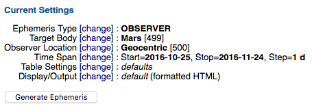

This means, JPL proposes to calculate a geocentric ephemeris of Mars in
one-day steps from today for a whole month.

If you click on the button \"Generate Ephemeris\", the following output
will appear:

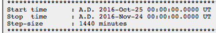

...

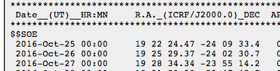

To reproduce this using the Swiss Ephemeris, one must call swetest with
the following parameters:

swetest -b25.10.2016 -ut0 -p4 -j2000 -icrs -fTPAD -n3 -ejplde431.eph
-noaberr -nodefl

date (dmy) 25.10.2016 greg. 0:00:00 UT version 2.05.02b04

UT: 2457686.500000000 delta t: 68.423889 sec

TT: 2457686.500791943

Epsilon (true) 23°26\'13.53062930

Nutation 0° 0\' 0.00000000 0° 0\' 0.00000000

25.10.2016 Mars 19h22\'24.4737 -24° 9\'33.4190

26.10.2016 Mars 19h25\'29.3663 -24° 2\'30.7408

27.10.2016 Mars 19h28\'34.3430 -23°55\'14.1576

If you are using the Swiss Ephemeris online test page, then you can
enter the whole parameter string

-b25.10.2016 -ut0 -p4 -j2000 -icrs -fTPAD -n3 -ejplde431.eph -noaberr
-nodefl

in the field \"other options\". You can ignore the other fields and
leave them as they are.

The parameters \"-j2000 -icrs -fTPAD\" tell swetest to provide the
positions in right ascension and declination relative to the reference
frame ICRF/J2000.

The parameters \"-noaberr -nodefl\" tell the program to ignore
aberration of light and gravitational light deflection, but include
light-time in the calculation. These are so-called astrometric
positions.

The parameter \"-ejplde431.eph\" tells swetest to use the newest JPL
ephemeris DE431. Note this will only work if you have installed the
DE431 data file on your computer or if you use the Swiss Ephemeris
online test page.

The above comparison may be satisfying but it is not optimal. Please
scroll up to \"Current Settings\" and click on \[change\] in the
following line:

Table Settings \[change\] : defaults

In the lower table, activate the checkbox \"extra precision\", scroll
down and click on \"use settings above\".


Scroll down, click on the button "Use Settings Above".

Then click on the button \"Generate Ephemeris" again.

Now JPL provides four more digits.

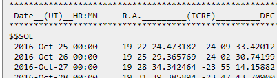

The comparison is still not optimal, because it is made in Universal
Time (UT), and UT is understood as UTC, whereas the Swiss Ephemeris
defines the parameter -ut as UT1. Since the current version of the Swiss
Ephemeris (2.05.01) does not know a parameter for UTC, comparisons
should be made in Terrestrial Time (TT). If the input date is in the
current or a future year, there also may be considerable differences in
Delta T values used by JPL and Swiss Ephemeris.

To create an ephemeris for TT using JPL Horizons, scroll up to \"Current
Settings\" and click on \[change\] in the following line:

Time Span \[change\] : Start=2016-10-25, Stop=2016-11-24, Step=1 d

In the Start Time field add \"TT\" behind the date.


Then click on the button \"Use Specified Times\". After that click on
\"Generate Ephemeris\" again.

The new output shows:

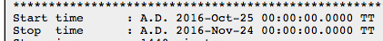

\...

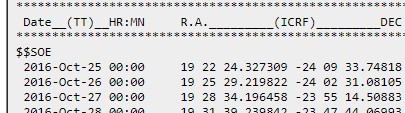

\...

Then call swetest as follows:

swetest -b25.10.2016 -p4 -j2000 -icrs -fTPAD -n3 -ejplde431.eph -noaberr
-nodefl

date (dmy) 25.10.2016 greg. 0:00:00 ET version 2.05.02b04

TT: 2457686.500000000

Epsilon (true) 23°26\'13.5306

Nutation 0° 0\' 0.0000 0° 0\' 0.0000

25.10.2016 Mars 19h22\'24.3273 -24° 9\'33.7482

26.10.2016 Mars 19h25\'29.2198 -24° 2\'31.0810

27.10.2016 Mars 19h28\'34.1965 -23°55\'14.5088

Now the agreement is perfect, the precision thus better than 1 mas.

### Test 2: Inertial Apparent Positions, RA and DE, in ICRF 

Now we are going to test apparent positions relative to the
International Celestial Reference Frame (ICRF). This option was
introduced in JPL Horizons version 4.70 in June 2020.

In the current settings of JPL Horizons click on \[change\] in the
following line:

Table Settings \[change\] : extra precision=YES

In the upper options table uncheck all checkboxes.

After that activate

checkbox 45: \"Apparent RA & DE\".

The table now looks as follows:

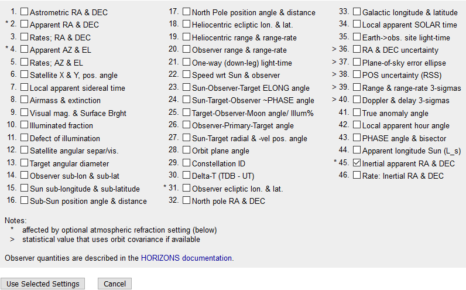

Below the table click on \"Use Selected Settings\".

After that click on \"Generate Ephemeris\" again. The output will show:

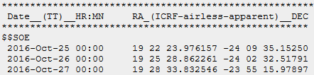

Then call swetest as follows:

swetest -b25.10.2016 -p4 -j2000 -icrs -fTPAD -n3 -ejplde431.eph

date (dmy) 25.10.2016 greg. 0:00:00 TT version 2.08.00a

UT: 2457686.499207094 delta t: 68.507111 sec

TT: 2457686.500000000

Epsilon (t/m) 23°26\'13.53063031 23°26\'13.53063031

Nutation 0° 0\' 0.00000000 0° 0\' 0.00000000

25.10.2016 Mars 19h22\'23.9762 -24° 9\'35.1525

26.10.2016 Mars 19h25\'28.8623 -24° 2\'32.5179

27.10.2016 Mars 19h28\'33.8325 -23°55\'15.9790

This matches very well again, the differences being smaller than 0.001
arc second.

### Test 3: Apparent Positions, True Equinox of Date, RA, DE, Ecliptic Longitude and Latitude

Now we are going to test apparent positions relative to the true equinox
of date.

In the current settings of JPL Horizons click on \[change\] in the
following line:

Table Settings \[change\] : extra precision=YES

In the upper options table uncheck all checkboxes.

After that activate

checkbox 2. \"Inertial Apparent RA & DE\" and

checkbox 31. \"observer ecliptic lon. & lat.\"

The table now looks as follows:

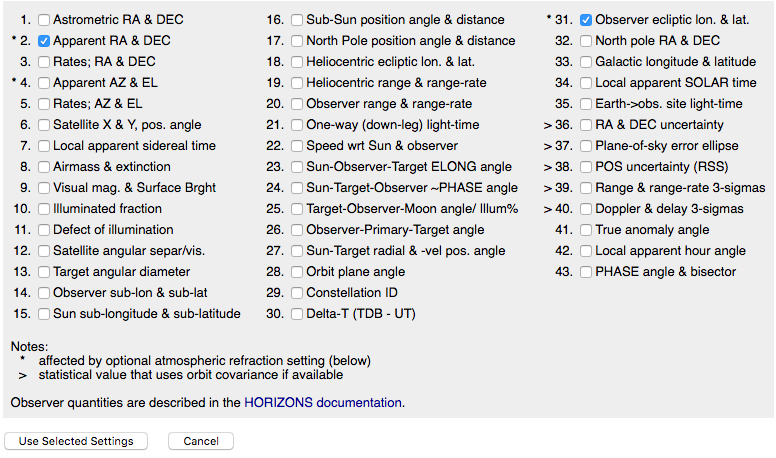

Below the table click on \"Use Selected Settings\".

After that click on \"Generate Ephemeris\" again. The output will show:

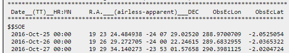

Then call swetest as follows:

swetest -b25.10.2016 -p4 -fTPADlb -n3 -ejplde431.eph -jplhora

date (dmy) 25.10.2016 greg. 0:00:00 ET version 2.05.02b04

TT: 2457686.500000000

Epsilon (true) 23°26\' 5.1372

Nutation -0° 0\' 7.1942 -0° 0\' 8.4288

25.10.2016 Mars 19h23\'24.4849 -24° 7\'29.0250 288.9700710 -2.0525051

26.10.2016 Mars 19h26\'29.2727 -24° 0\'22.2459 289.6832956 -2.0365320

27.10.2016 Mars 19h29\'34.1403 -23°53\' 1.5764 290.3981125 -2.0204721

This matches very well again, the differences being smaller than 0.001
arc second.

The parameter -jplhora tells the program to emulate the methods of JPL
horizons.

Better precision for current or recent dates would require daily updates
for unpredictable motions of the celestial pole (free core nutation) and
other micro-improvements. We are not freaky enough to do that.

### Test 4: Heliocentric Apparent Positions, Ecliptic Longitude and Latitude 

Now, let us do the same calculations heliocentrically by changing the
observer location to "\@sun".

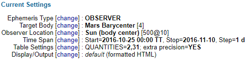

Now the resulting ephemeris looks as follows:

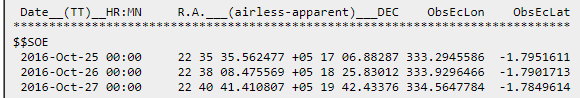

And we just add the parameter -hel to the swetest command we have used
above:

swetest -b25.10.2016 -p4 -fTPADlb -n3 -ejplde431.eph -jplhora -hel

25.10.2016 Mars 22h24\'25.8882 -11°53\' 6.8990 333.5274937 -1.7959670

26.10.2016 Mars 22h26\'50.3458 -11°38\'56.8013 334.1625958 -1.7909547

27.10.2016 Mars 22h29\'14.5668 -11°24\'42.1490 334.7977357 -1.7857221

Here, we have a considerable difference between Horizons and swetest.
Why?

The answer is found when we scroll down in the Horizons output. There we
read:

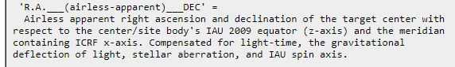

So, they are using the 2009 equator of the Sun, whereas swetest uses the
true Earth equator of date. There is nothing wrong with either
calculation, just Horizons does something different than swetest.
Horizons's positions cannot be reproduced using swetest, and the swetest
data cannot be reproduced using Horizons.

As for the other two values (ObsEcLon and ObsEcLat), Horizons states:


This means that in order to reproduce these values, we have to add the
following parameters "-j2000 -icrs" to swetest:

swetest -b25.10.2016 -p4 -fTPADlb -n3 -ejplde431.eph -jplhora -hel
-j2000 -icrs

25.10.2016 Mars 22h23\'32.8216 -11°58\'15.5314 333.2945511 -1.7951619

26.10.2016 Mars 22h25\'57.3574 -11°44\' 6.7775 333.9296388 -1.7901721

27.10.2016 Mars 22h28\'21.6564 -11°29\'53.4295 334.5647705 -1.7849622

These values (the red ones) again match very well with Horizons's data
ObsEcLon and ObsEcLat.

### Test 5: Ephemerides before 1962

The swetest call of Test 3 can reproduce JPL Horizons positions very
well for its whole time range. For dates in the year 1800, Horizons
provides the following data:

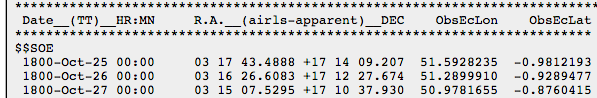

Using the above swetest parameters, we get the following values from SE
2.07 on:

swetest -b25.10.1800 -p4 -fTPADlb -n3 -ejplde431.eph -jplhora

date (dmy) 25.10.1800 greg. 0:00:00 TT version 2.06.01b03

TT: 2378793.500000000

Epsilon (true) 23°28\' 3.5798

Nutation -0° 0\' 5.9992 0° 0\' 8.9010

25.10.1800 Mars 3h17\'43.4887 17°14\' 9.2071 51.5928231 -0.9812193

26.10.1800 Mars 3h16\'26.6082 17°12\'27.6742 51.2899907 -0.9289476

27.10.1800 Mars 3h15\' 7.5294 17°10\'37.9300 50.9781652 -0.8760415

This is better than 2 milliarcsec.

If comparing BCE dates, please note that the Swiss Ephemeris uses
astronomical year numbering whereas JPL Horizons uses historical year
numbering. The latter omits the year 0 so that the astronomical year 0
corresponds to the historical year 1 BCE.

E.g. you can set the date parameters in Horizons as follows:

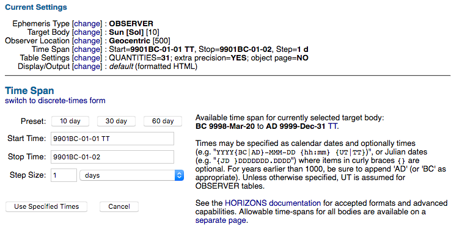

The output is:

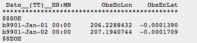

This can be reproduced using the Swiss Ephemeris only **if the year is
entered as -9900 (not 9901!)**:

swetest -b1.1.-9900 -p0 -fTPlb -ejplde431.eph -jplhora -n2

date (dmy) 1.1.-9900 jul. 0:00:00 TT version 2.06.01b03

TT: -1894917.500000000

Epsilon (true) 24° 9\'53.63485083

Nutation 0° 0\'14.26577554 0° 0\' 0.69489094

01.01.-9900 Sun 206.2288423 -0.0001386

02.01.-9900 Sun 207.1940735 -0.0001706

The deviation amounts to only 3 milliarcsec.

### Test 6: Jupiter versus Jupiter Barycentre

There is another problem with planets that have a system of satellites,
e.g. Jupiter.

Scroll up and click on \[change\] in the following line:

Target Body \[change\] : Mars \[499\]

Then enter Jupiter in the field "Lookup the specified body" and click on
the button "Search":

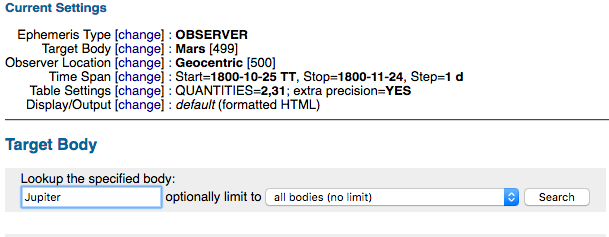

Then select "Jupiter" from the droplist and click on the button "Select
Indicated Body":

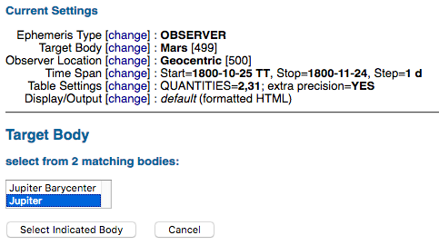

After that, click on the button "Generate Ephemeris" again.

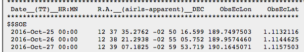

Then call swetest using the same parameters that have been used for
Mars:

swetest -b25.10.2016 -p5 -fTPADlb -n1 -ejplde431.eph -jplhora

date (dmy) 25.10.2016 greg. 0:00:00 ET version 2.05.02b04

TT: 2457686.500000000

Epsilon (true) 23°26\' 5.1372

Nutation -0° 0\' 7.1942 -0° 0\' 8.4288

25.10.2016 Jupiter 12h37\'35.2750 -2°50\'16.5904 189.7497445 1.1132117

26.10.2016 Jupiter 12h38\'21.2913 -2°55\' 5.7347 189.9574345 1.1144628

27.10.2016 Jupiter 12h39\' 7.1802 -2°59\'53.7050 190.1644967 1.1157502

Here we find a difference that did not appear with Mars. It amounts to
0.02 arcsec.

This is explained by the fact that the Swiss Ephemeris provides the
position of the barycentre of the system of Jupiter with his Moons,
whereas JPL provides the position of the planet itself.

If we had selected "Jupiter Barycenter" in the drop list instead of
"Jupiter", then we would have arrived at the following positions.

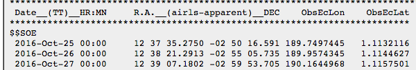

This is very close to the value provided by the Swiss Ephemeris.

A similar effect could be observed with other planets that have Moons.
In fact, it also appears with Mars, however his Moons are so extremely
small that the effect did not appear in our comparison further above.

The fundamental JPL ephemeris DE431 does not provide the position of the
centre of the disk of a planet, but only the centre of gravity of the
planet's satellite system.

### Test 7: Jupiter's Center of Body

Since Swiss Ephemeris version 2.10 (Nov. 2020), the center of Jupiter's
body can also be calculated as follows:

swetest -b25.10.2016 -p5 -cob -fTPADlb -n3 -ejplde431.eph -jplhora (note
-cob)

date (dmy) 25.10.2016 greg. 0:00:00 ET version 2.05.02b04

TT: 2457686.500000000

Epsilon (true) 23°26\' 5.1372

Nutation -0° 0\' 7.1942 -0° 0\' 8.4288

25.10.2016 Jupiter 12h37\'35.2762 -2°50\'16.5997 189.7497501 1.1132113

26.10.2016 Jupiter 12h38\'21.2937 -2°55\' 5.7523 189.9574457 1.1144622

27.10.2016 Jupiter 12h39\' 7.1824 -2°59\'53.7197 190.1645068 1.1157500

The same output can also be generated using this command:

swetest -b25.10.2016 -pv -xv9599 -fTPADlb -n3 -ejplde431.eph -jplhora
(note -pv -xv9599)

Horizons provides the following data:


Again, we have an accuracy of 1 mas.

Important: All hitherto ephemerides and astrology softwares provide only
the barycenter of the Jupiter system, i.e. the center of mass of Jupiter
together with all his moons, not the center of Jupiter's body or the
real planet.

Software developers who want to implement centers of body have to know
that the performance of this calculation is not as good as with the
barycenters. Moreover, the time range is currently limited to the years
1900 to 2047.

### Test 8: Geocentric Position of a Planetary Moon

This test requires Swiss Ephemeris version 2.10 and the ephemeris files
sepm\* of directory sat.

We initialise Horizons to calculate geocentric apparent positions of
Jupiter Moon Io:

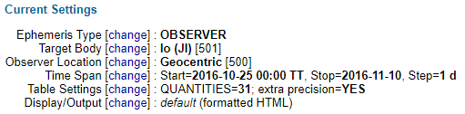

The output is as follows:

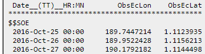

To reproduce this, swetest requires the parameters "-pv -xv9501". (For
the numbering of the planetary Moons, we use Horizons's number + 9000,
thus for Io 9000+501.)

swetest -b25.10.2016 -pv -xv9501 -fTPlb -n3 -ejplde431.eph -jplhora

25.10.2016 Io/Jupiter 189.7447220 1.1123951

26.10.2016 Io/Jupiter 189.9522434 1.1156229

27.10.2016 Io/Jupiter 190.1792187 1.1144514

### Test 9: Planetocentric Position of a Planetary Moon

Now, we try the same choosing Jupiter himself as the observer location.

Depending on the selected moon, accuracy will usually be better than 1
arcsec, but not always. With some very-fast-moving, such as Phobos and
Deimos, we cannot reach that.

Moreover, it must be noted that the current comparisons were made with
Io's ephemeris of 11 September 2020. This date is given on the output
page of Horizons:

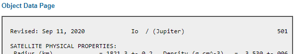

Before a comparison is made, it should be made sure that Horizons has
not updated its ephemeris.

The date of our Swiss Ephemeris file is seen in its header:

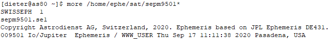

If the "Revised" date in Horizons is younger than the one in the Swiss
Ephemeris file, then it is likely that the latter is outdated and has
lost accuracy.

Now, to do the comparison, in the field "Specify Origin: Named Body or
Site", we enter "\@599" for Jupiter, center of body.

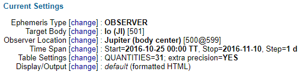

The resulting output is:

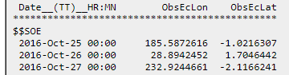

The swetest command to reproduce these data is:\
swetest -b25.10.2016 -pv -xv9501 -pc9599 -fTPlb -n3 -ejplde431.eph
-j2000 -icrs -jplhora

25.10.2016 Io/Jupiter 185.5872647 -1.0216308

26.10.2016 Io/Jupiter 28.8942489 1.7046449

27.10.2016 Io/Jupiter 232.9244695 -2.1166255

This demonstrates the high accuracy of the planetary moons in the Swiss
Ephemeris very well. The difference is about 0.01".

If you want to compare other quantities in planetocentric mode, you will
have to proceed as follows:

\- choose the quantities in the Horizons interface

\- click on "Generate Ephemeris"

\- in the output, scroll down to the explanations at the bottom of the
page

\- read und try to understand what exactly Horizons does

\- find out if swetest can do the same

In case it does not work, you are welcome to ask for help in the Swiss
Ephemeris mailing list.

Please note that for quantity 2 (R.A. and Dec airless apparent),
agreement between Horizons and swetest is not possible because Horizons
uses the 2009 equator of the planet (e.g. Jupiter) whereas swetest
always uses the true equator of date of the Earth.

For quantity 45, please use this command:

swetest -b25.10.2016 -pv -xv9501 -pc9599 -fTPAD -n3 -ejplde431.eph
-j2000 -icrs

For quantity 1, this one:

swetest -b25.10.2016 -pv -xv9501 -pc9599 -fTPAD -n3 -ejplde431.eph
-j2000 -icrs -noaberr -nodefl

### Test 10: Topocentric Position of a Planet 

To calculate the topocentric position of a planet proceed as follows:

Scroll up to "Current Settings", change Target Body and select Venus.

After clicking on "Select Indicated Body", change Time Span, edit

"Start Time" to "2015-09-01 05:00 TT" and

"Stop Time" to "2015-09-03".

We choose a date near the heliacal rising of Venus, where the parallax
effect is greater.

Then change Table Settings, activate only the checkboxes

> 2\. Apparent RA & DEC and
>
> 31\. Observer ecliptic lon. & lat.

and uncheck all other options.

In the lower options table activate the option "extra precision".

Scroll down and click on the button "Use Settings Above".

Finally change Observer Location. In the field "Lookup Named Location"
enter "Jerusalem" and click on the Button "Search".

Now the current settings should look as follows:

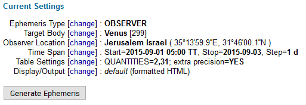

Please check carefully if you have exactly these data and otherwise
correct them.

Then click on "Generate Ephemeris". The output is as follows:

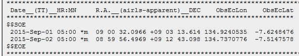

In the current settings you see the geographic coordinates of Jerusalem
as used by Horizons. You have to transform them into decimal values in
order to use them with swetest.

Now call swetest as follows:

swetest -b01.09.2015 -t5 -p3 -fTPADlb -n2 -ejplde431.eph -jplhora
-topo35.233305,31.766694,0

date (dmy) 1.9.2015 greg. 5:00:00 ET version 2.05.02b04

TT: 2457266.708333333

geo. long 35.233305, lat 31.766694, alt 0.000000

Epsilon (true) 23°26\' 5.3157

Nutation 0° 0\' 1.3321 -0° 0\' 8.7886

01.09.2015 5:00:00 ET Venus 9h 0\'32.0966 9° 3\'13.6147 134.9240534
-7.6248475

02.09.2015 5:00:00 ET Venus 8h59\'56.4969 9°12\'43.0988 134.7370775
-7.5147577

This is very precise again. The geocentric positions would be:

swetest -b01.09.2015 -t5 -p3 -fTPADlb -n2 -ejplde431.eph -jplhora

date (dmy) 1.9.2015 greg. 5:00:00 ET version 2.05.02b04

TT: 2457266.708333333

Epsilon (true) 23°26\' 5.3157

Nutation 0° 0\' 1.3321 -0° 0\' 8.7886

01.09.2015 5:00:00 ET Venus 9h 0\'30.9799 9° 3\'25.0943 134.9186940
-7.6230971

02.09.2015 5:00:00 ET Venus 8h59\'55.4154 9°12\'54.3289 134.7318831
-7.5130275

Note, if you specify the time as UT and call the Swiss Ephemeris with
-ut5 (instead of -t5), then the deviation is slightly greater, because
Horizons uses UTC, whereas the Swiss Ephemeris uses UT1. If the input
date is in the current or a future year, there also may be differences
in Delta T values used by JPL and the Swiss Ephemeris.

Significant deviations from Horizons only appear with the topocentric
Moon, where our error can amount to 0.2 arcsec. We have not studied this
difference so far, so do not know its exact cause.

##  Appendix D. 

##  How to compare the Swiss Ephemeris with Ephemerides of the Astronomical Almanac (apparent positions)

### Test 1: Astronomical Almanac online

Get a recent \"Astronomical Almanac\" from the library or your
bookshelf. If you are too lazy to do that, go on the following page:

-   http://asa.usno.navy.mil/SecE/Section_E.html

and click on \"Geocentric equatorial coordinates\".

The position of Mars for today (25 Oct 2016), 0:00 TT, is given as:

Mars 19 23 24.488 -24 07 29.03 1.2088279

Then call swetest using the following parameters:

swetest -b25.10.2016 -p4 -fTPADR -ejplde431.eph

date (dmy) 25.10.2016 greg. 0:00:00 ET version 2.05.02b04

TT: 2457686.500000000

Epsilon (true) 23°26\' 5.1018

Nutation -0° 0\' 7.1942 -0° 0\' 8.4288

25.10.2016 Mars 19h23\'24.4884 -24° 7\'29.0249 1.208903220

There is a difference in the distance value R. The reason is that AA
combines apparent RA and DE with true distance.

To arrive at the same distance value, call swetest as follows:

swetest -b25.10.2016 -p4 -fTPR -ejplde431.eph -true

date (dmy) 25.10.2016 greg. 0:00:00 ET version 2.05.02b04

TT: 2457686.500000000

Epsilon (true) 23°26\' 5.1018

Nutation -0° 0\' 7.1942 -0° 0\' 8.4288

25.10.2016 Mars 1.208827910

which is identical to AA, but has more digits.

### Test 2: Astronomical Almanac printed

If you are not too lazy to get a printed AA of a recent year or manage
to get pages B68-B70 from AA 2016 in google books, there you will find
an additional digit both in right ascension and declination.

Page B68 gives an example how to calculate the apparent position of
Venus for 17 April 2016 12:00 UT1, assuming Delta T as 68s.

On p. B69, the corresponding TT is given as JD 2457496.000787.

On p. B70, the result is given as RA = 0h55m33s.8912, DE =
4°23\'25\".333.

The Swiss Ephemeris provides the same result if called with the
following parameters:

swetest -bj2457496.000787 -p3 -fTPAD -ejplde431.eph

date (dmy) 17.4.2016 greg. 12:01:08 ET version 2.05.02b04

TT: 2457496.000787000

Epsilon (true) 23°26\' 5.0046

Nutation -0° 0\' 3.8526 -0° 0\' 8.7703

17.04.2016 12:01:08 ET Venus 0h55\'53.8912 4°23\'25.3326

You may find that there is a difference of about 0.052 arcsec between
JPL Horizons and Astronomical Almanac. For more information on this,
please read the following paragraph in the general documentation of the
Swiss Ephemeris:

-   http://www.astro.com/swisseph/swisseph.htm?lang=g#\_Toc443485363

(2.1.2.2 Swiss Ephemeris and JPL Horizons System)

## Appendix E. 

## How to compare the Swiss Ephemeris Lahiri Ayanamsha with *Indian Astronomical Ephemeris* (IAE) 

*Problems*

The ayanamsha values and explanations given in *Indian Astronomical
Ephemeris* are unfortunately confusing. Clarification is difficult to
achieve because older issues of IAE are difficult to get hold of, even
for Indian members of the Swiss Ephemeris mailing list. In May 2020, I
(D.K.) contacted the *Positional Astronomy Centre (PAC)* in Kolkata, the
publisher of IAE, for precise information. On 29 June, I received a
reply from L.M. Jyoti of PAC. My questions were not answered in detail,
but Mr. Jyoti confirmed the correctness of my findings and said they
would be important for "further modification of calculation of Indian
Astronomical Ephemeris".

As to the precession model used, we know from IAE 1989, p. 525, that
"Use of the Newcomb\'s value for general precession has been
discontinued in this publication with effect from 1985\". In what
follows, a new precession formula is given which is taken Lieske's
publication for the IAU1976 system.

In IAE 2019, p. 445, the following information is given:

\"The algorithms for precession were based on the IAU (1976) value for
the rate of general precession in ecliptic longitude. Nutation was given
by the 1980 IAU Theory of Nutation. However, IAU (1976) rate of
precession had been overestimated by approximately 3 milliarcseconds per
year. Further observations also revealed periodic errors of a few
milliarcseconds in the 1980 IAU Theory of Nutation.\"\
\"As part of the 2000 IAU resolutions, the IAU 2000A precession-nutation
model was introduced, based on an updated value for the rate of
precession and a completely new nutation theory.\"

So, which of the two precession models is used in IAE2019? Model IAU
1976 or IAU 2000A?

And there is more confusion:

In its original definition, "Lahiri" ayanamsha had the value 23°15\'00\"
on the 21 March 1956, 0:00 Ephemeris Time. The definition was corrected
by 0.658" in Indian Astronomical Ephemeris 1989, page 556, footnote:

\"According to new determination of the location of equinox this initial
value has been revised to 23°15\'00\".658 and used in computing the mean
ayanamsha with effect from 1985\'.\"

Thus, the mean (!) value of ayanamsha on the said date should be
23°15\'00\".658.

Again, in IAE 2019, p. 385, it says that the ayanamsha on this date was
23°15\'00\" exactly!

So, which initial value is actually used? Could the former be mean and
the later true? This can be ruled out because nutation on that date was
over 16\".

More information is unfortunately not given or is hard to get hold of.

*How to reproduce true ayanamshas given in IAE*

IAE 2019, p. 427, gives a table of true ayanamsha values for the year
2019 and part of 2020. The values are given with a precision of 0.1
arcsec. They can be reproduced very precisely using the following
assumptions:

\- The initial value 23°15\' 00\".658 is true, not mean (!) ayanamsha.

\- The precession model used is Lieske 1976 (IAU1976) and the nutation
model is Wahr 1980.

The swetest command to be used is:

**swetest -b1.1.2019 -ut0 -pb -sid1 -sidbit8192 -fTL -s3 -n130 (SE 2.09
required!)**

This program call works from SE 2.09 on. The parameter -sidbit8192
causes the program to use this ayanamsha's original precession model,
which is IAU1976. Please understand that this is only a test option. If
you use it for horoscopes, the accuracy of the ephemeris will be
reduced.

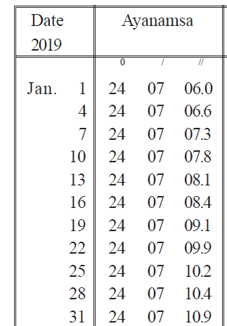{width="2.325in"
height="3.338888888888889in"}swetest -b1.1.2019 -ut0 -pb -sid1
-sidbit8192 -fTL -s3 -n11 (SE 2.09 required!)

01.01.2019 24° 7\' 5.9864

04.01.2019 24° 7\' 6.5976

07.01.2019 24° 7\' 7.3284

10.01.2019 24° 7\' 7.8480

13.01.2019 24° 7\' 8.1073

16.01.2019 24° 7\' 8.3970

19.01.2019 24° 7\' 9.0676

22.01.2019 24° 7\' 9.8815

25.01.2019 24° 7\'10.2273

28.01.2019 24° 7\'10.4251

31.01.2019 24° 7\'10.9122

This looks like perfect agreement. Only some very few values, outside
the above list, differ by 0.1\", which seems to be due to a systematic
difference smaller than 0.001" (apparently in precession, not nutation!)
which can show up in a different rounding.

However, the tabe in IAE 2020 gives greater differences. The rounded
value often differs by 0.1". Something seems to have been changed,
whatever that may be.

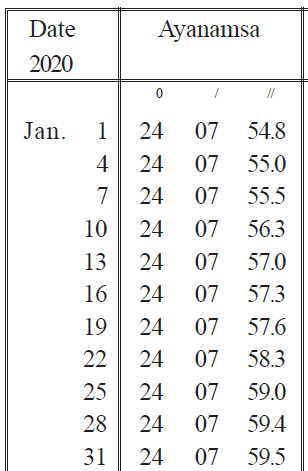{width="2.1944444444444446in"
height="3.35625in"}swetest -b1.1.2020 -ut0 -pb -sid1 -sidbit8192 -fTL
-s3 -n11 (SE 2.09 required!)

01.01.2020 24° 7\'54.8411

04.01.2020 24° 7\'55.0918

07.01.2020 24° 7\'55.5135

10.01.2020 24° 7\'56.2988

13.01.2020 24° 7\'57.0629

16.01.2020 24° 7\'57.3750

19.01.2020 24° 7\'57.6643

22.01.2020 24° 7\'58.3258

25.01.2020 24° 7\'59.0403

28.01.2020 24° 7\'59.4289

31.01.2020 24° 7\'59.5804

This is very strange. Is it bad manual rounding?

The table in IAE 1989, p. 512, can be reproduced with high accuracy
again, except that it seems there are some typos. E.g., for 10 May 1989,
we get the value 23°42\'37.4128, whereas IAE has 23°42\'37.0, which must
be a typo because almost all other values are very accurate.

*How to reproduce mean ayanamshas given in IAE*

The mean ayanamshas given in IAE are more difficult to reproduce. This
is strange, since the only difference between the true and the mean
ayanamsha should be the nutation, as is also stated on the same page:
\"True Ayanamsa = Mean Ayanamsa + Nutation in Longitude\". Since we can
reproduce true ayanamshas so well, mean ayanamshas should not cause any
problem. Unfortunately also, it is not clear what is meant by epoch
\"1989.0\". Is it 1 Jan. 0:00 TT or 12:00 TT or is it the Besselian
epoch?

Using precession IAU 1976 and interpreting \"1989.0\" as 0:00 TT of 1
Jan., our results compare as follows with the mean ayanamshas in IAE
1989, p. 512 (Swiss Ephemeris version 2.09 is required for all these
calculations):

swetest -b1.1.1950 -nonut -fPZ -p -sid1 -sidbit8192 \|grep ayanamsa\
TT:  2433282.500000000   ayanamsa =   23°09\'31.2539 (Lahiri) (IAE 1989:
23°09\'30.79\") diff = 0.46\"

swetest -b1.1.1989 -nonut -fPZ -p -sid1 -sidbit8192 \|grep ayanamsa\
TT:  2447527.500000000   ayanamsa =   23°42\'12.3717 (Lahiri) (IAE 1989:
23°42\'12.34\") diff = 0.03\"

swetest -b1.1.1990 -nonut -fPZ -p -sid1 -sidbit8192 \|grep ayanamsa\
TT:  2447892.500000000   ayanamsa =   23°43\'02.6259 (Lahiri) (IAE 1989:
23°43\'02.62\") diff = 0.01\"

The 1950 value has a considerably greater difference. This is explained
by the fact that exactly the same value is given in \"Indian Ephemeris
and Nautical Almanac\" (IENA) 1965, thus in a publication from a time
before precession IAU 1976 existed. (IENA is the predecessor of IAE,
which started in 1978.) It therefore seems that this value was taken
over from an older publication, not calculated anew.

This obvious inconsistency of data is unfortunately not documented.

For IAE 2019, p. 429, we find the following differences in mean
ayanamshas, if the time assumed is 12:00 TT on 1 Jan.(!):

swetest -b1.1.2000 -t12 -p -sid1 -fTL -nonut -sidbit8192

TT: 2451545.000000000 ayanamsa = 23°51\'25.5324 (Lahiri) (IAE 2019:
23°51'25\".53) diff = 0.00\"

swetest -b1.1.2019 -t12 -p -sid1 -fTL -nonut -sidbit8192

TT: 2458485.000000000 ayanamsa = 24° 7\'21.1353 (Lahiri) (IAE 2019:
23°07'21\".20) diff = 0.06\"

swetest -b1.1.2020 -t12 -p -sid1 -fTL -nonut -sidbit8192

TT: 2458850.000000000 ayanamsa = 24° 8\'11.3962 (Lahiri) (IAE 2019:
23°08'11\".46) diff = 0.06\"

With no other precession model can we arrive at a better agreement with
the mean ayanamsha. Perhaps they used some simplified precession
algorithm, starting from an accurate value in 2000.

*How to reproduce mean ayanamshas in Indian Ephemeris and Nautical
Almanac (IENA)*

IENA is the predecessor of IAE by which it was replaced in 1978. Its
ayanamsha tables have exactly the same layout as IAE. Since ayanamsha
was still based on the original ICRC definition (exactly 23°15' on 21
March 1956, its values must be compared with Swiss Ephemeris ayanamsha
No. 46 (SE_SIDM_LAHIRI_ICRC).

The edition of 1973 explains the calculation of ayanamsha as follows:

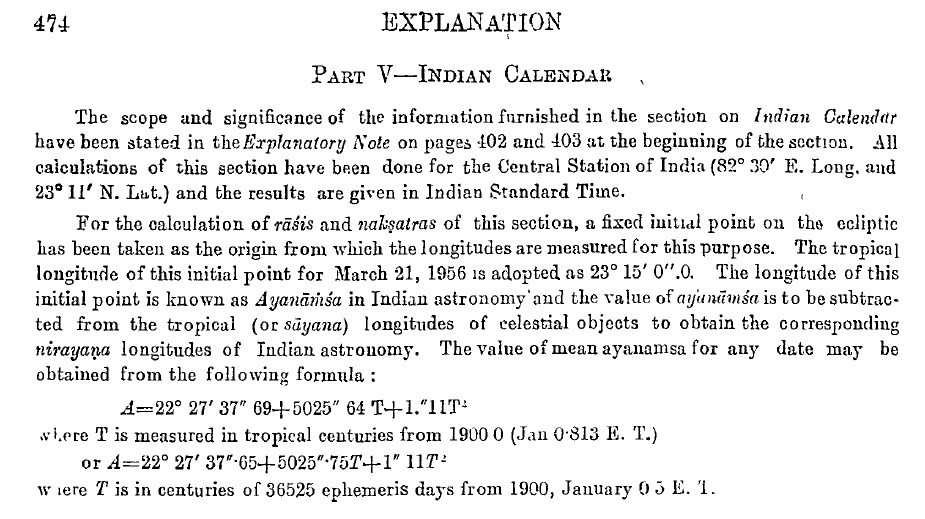

Unfortunately, we are not informed, that the value adopted in 1956 is
true ayanamsha, what nutation value was subtracted, and how they arrived
ath the given formulae.

On p. 445, it provides the following mean ayanamshas:

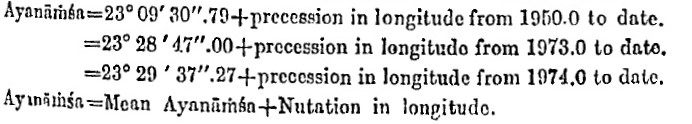

Using the above formula and the Besselian epoch, we get:

1950.0 tjd=2433282.42345905 23.1585533205 23°09\'30.79195

1973.0 tjd=2441682.99403101 23.4797232708 23°28\'47.00377

1974.0 tjd=2442048.23622979 23.4936879217 23°29\'37.27652

This is pretty accurate. Now, the Swiss Ephemeris does not use the above
formula but a rigorous precession calculation using the Kinoshita (1975)
formulation of Newcomb precession. The mean ayanamshas for the same
dates are:

(Swiss Ephemeris version 2.09 is required for all these calculations)

swetest -pb -fTL -bj2433282.42345905 -nonut -sid46 -sidbit8192 -s3 -n1

31.12.1949 22:09:47 TT 23° 9\'30.72050620 (diff = 0.07\")

swetest -pb -fTL -bj2441682.99403101 -nonut -sid46 -sidbit8192 -s3 -n1

31.12.1972 11:51:24 TT 23°28\'46.93310 (diff = 0.07\")

swetest -pb -fTL -bj2442048.23622979 -nonut -sid46 -sidbit8192 -s3 -n1

31.12.1973 17:40:10 TT 23°29\'37.20587 (diff = 0.07\")

The initital date for the above formula, i.e. 1900, Jan 0.5 ET = 31 Dec.
1899, 12 ET provides:

swetest -pb -fTL -bj2415020.0 -nonut -sid1 -sidbit8192 -s3 -n1

31.12.1899 12:00:00 TT 22°27\'37.54705 (diff 0.1\")

The reason for the constant difference of 0.07\" from 1950 to 1973 could
be that we chose the wrong initial ayanamsha value. True ayanamsha on 21
March 1956 was 23°15'. For mean aynamasha, we have to subtract nutation.
We chose to subtract Woolard nutation, which was published 1953, however
used by IENA/IAE only from 1960 on. Thus, a small correction of our
initial value by 0.07\" could help to reproduce the mean ayanamshas.
With true ayanamshas, as given in IENA, however, an error of about 0.1
arcsec will remain, for unknown reasons.

Thus, there is currently no way to reproduce these values precisely
using the Swiss Ephemeris because we do not have accurate information
about what algorithms exactly were used. Another problem may be that the
Swiss Ephemeris does its calculations in full precision, whereas IENA
used some simplified algorithms.

*How to reproduce true ayanamsha values given in the Report of the
Calendar Reform Committee and in Rashtriya Panchang*

The *Report of the ICRC* gives the ayanamsha value 23°15' 0" for the
1^st^ of Caitra = 21 March 1956 (there are no page numbers).

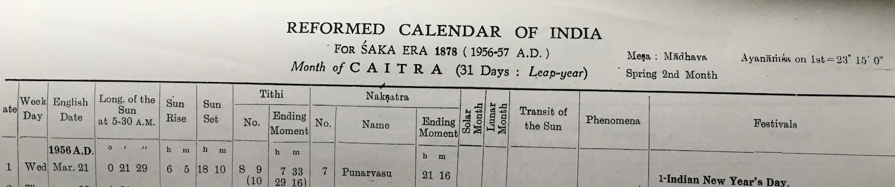

This can be reproduced as follows:

swetest -b21.3.1956 -p -sid46 -sidbit8192

date (dmy) 21.3.1956 greg. 0:00:00 TT version 2.08.00b

UT: 2435553.499636440 delta t: 31.411589 sec

TT: 2435553.500000000 ayanamsa = 23°15\' 0.0000 (Lahiri ICRC)

For the 1st of Phalguna = 20 February 1959, it gives the ayanamsha value
23°17'16". Using swetest, this is reproduced as follows:

swetest -b20.2.1959 -p -sid46 -sidbit8192

date (dmy) 20.2.1959 greg. 0:00:00 TT version 2.08.00b

UT: 2436619.499620988 delta t: 32.746598 sec

TT: 2436619.500000000 ayanamsa = 23°17\'15.9648 (Lahiri ICRC)

*Rashtriya Panchang* of *1961*, using the same ayanamsha, provides
ayanamsha 23°18'47" on 1^st^ of Caitra = 22 March 1961:


Using sweetest, we get:

swetest -b22.3.1961 -p -sid46 -sidbit8192

date (dmy) 22.3.1961 greg. 0:00:00 TT version 2.08.00b

UT: 2437380.499610181 delta t: 33.680306 sec

TT: 2437380.500000000 ayanamsa = 23°18\'47.3511 (Lahiri ICRC)

*Rashtriya Panchang* of 2019 has the following value for the 1^st^ of
Caitra or 22 March 2019:

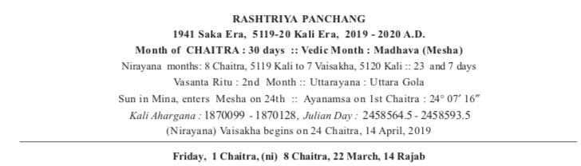

swetest -b22.3.2019 -p -sid1 -sidbit8192

date (dmy) 22.3.2019 greg. 0:00:00 TT version 2.08.00b

UT: 2458564.499198334 delta t: 69.263905 sec

TT: 2458564.500000000 ayanamsa = 24° 7\'16.2053 (Lahiri)

In a nutshell: Publications of IENA and IAE provide confusing and
incomplete explanations for their calculation of ayanamsha. Due to the
lack of reliable information, possibly also due to manual rounding
errors and typos, it is difficult to accurately reproduce all data of
IAE. Nevertheless, there is agreement to a second of arc or better.

It seems that precession IAU 1976 and nutation 1980 (Wahr) have been
used since 1985 for true ayanamshas, and the Swiss Ephemeris can
reproduce them accurately using ayanamsha No. 1 (SE_SIDM_LAHIRI), with
some exceptions which are difficult to explain (IAE 2020). In editions
of IAE/IENA before 1985, Newcomb precession and Woolard nutation was
used, and their true ayanamshas can be reproduced with an accuracy of
0.1\" using ayanamsha No. 46 (SE_SIDM_LAHIRI_ICRC). The reason for the
remaining small error is unknown.

**Important:** In your software, *you should **not** use the option
-sidbit8192 or the SE_SIDBIT*... that corresponds to it. It really only
serves the purpose to test IAE values of ayanamsha, i.e. whether they
are theoretically consistent with the Swiss Ephemeris. *Nor should you
aim at exact agreement of Swiss Ephemeris ayanamsha values with IAE
values* (up to 2020 at least), because the latter are based on outdated
precession and nutation models. Also note that the option has
practically no effect for planetary positions. E.g. let us calculate the
position of the Sun for 3000 BCE with and without the option:

swetest -b21.3.-3000 -ut0 -p0 -sid1 -fTPL -s3 -n1 -nonut -sidbit8192

date (dmy) 21.3.-3000 jul. 0:00:00 UT version 2.09.01

UT: 625387.500000000 delta t: 75045.869961 sec

TT: 625388.368586458 ayanamsa = 314°45\'13.0909 (Lahiri)

Epsilon (m) 24° 1\'34.0132

21.03.-3000 Sun 21°24\' 5.8667

swetest -b21.3.-3000 -ut0 -p0 -sid1 -fTPL -s3 -n1 -nonut

date (dmy) 21.3.-3000 jul. 0:00:00 UT version 2.09.01

UT: 625387.500000000 delta t: 75045.869961 sec

TT: 625388.368586458 ayanamsa = 314°44\'30.0027 (Lahiri)

Epsilon (m) 24° 1\'16.5231

21.03.-3000 Sun 21°24\' 5.9904

As can be seen, the position of the Sun is practically identical in both
calculations, only the value of ayanamsha differs considerably. The
reason is that the one calculation gives the ayanamsha relative to a
tropical ephemeris which is based on the precession model IAU 1976
whereas the other provides a value relative to a tropical ephemeris
which is based on the more modern precession model Vondrák 2011. Of
course, the latter is desirable, not the former. For an in-depth
understanding of this phenomenon, please study chapter 2.7.11
*Ayanamshas with different precession rates*.

##  Appendix F. Discussion of Differences between Versions

#### Differences between Swiss Ephemeris 1.70 and older versions

With version 1.70, the standard algorithms recommended by the IAU
resolutions up to 2005 were implemented. The following calculations have
been added or changed with Swiss Ephemeris version 1.70:

-   \"Frame Bias\" transformation from ICRS to J2000;

-   Nutation IAU 2000B (could be switched to 2000A by the user);

-   Precession model P03 (Capitaine/Wallace/Chapront 2003), including
    improvements in ecliptic obliquity and sidereal time that were
    achieved by this model.

The differences between the old and new planetary positions in ecliptic
longitude (arc seconds) are:

|**Year**|**New -- Old**
|--------|--------------
|2000|-0.00108
|1995|0.02448
|1980|0.05868
|1970|0.10224
|1950|0.15768
|1900|0.30852
|1800|0.58428
|1799|-0.04644
|1700|-0.07524
|1500|-0.12636
|1000|-0.25344
|0|-0.53316
|-1000|-0.85824
|-2000|-1.40796
|-3000|-3.33684
|-4000|-10.64808
|-5000|-32.68944
|-5400|-49.15188

The discontinuity of the curve between 1800 and 1799 is explained by the
fact that old versions of the Swiss Ephemeris used different precession
models for different time ranges: the model IAU 1976 by Lieske for
1800-2200, and the precession model by Williams 1994 outside that time
range.

**Note**: Precession model P03 is said to be accurate to 0.00005 arc
second for CE 1000-3000.

The differences between version 1.70 and older versions for the future
are as follows:

|**Year**|**Difference**
|--------|--------------
|2000|-0.00108
|2010|-0.01620
|2050|-0.14004
|2100|-0.29448
|2200|-0.61452
|2201|0.05940
|3000|0.27252
|4000|0.48708
|5000|0.47592
|5400|0.40032

The discontinuity in 2200 has the same explanation as the one in 1800.

##### Jyotish / sidereal ephemerides

The ephemeris changes by a constant value of about +0.3 arc second. This
is because all our ayanamshas have the start epoch 1900, for which epoch
precession was corrected by the same amount.

##### Fictitious planets / bodies from the orbital elements file seorbel.txt

There are changes of several 0.1 arcsec, depending on the epoch of the
orbital elements and the correction of precession as can be seen in the
tables above.

##### The differences for ecliptic obliquity in arc seconds (new - old) are:

|**Year**|**Difference**
|--------|--------------
|5400|-1.71468
|5000|-1.25244
|4000|-0.63612
|3000|-0.31788
|2100|-0.06336
|2000|-0.04212
|1900|-0.02016
|1800|0.01296
|1700|0.04032
|1600|0.06696
|1500|0.09432
|1000|0.22716
|0|0.51444
|-1000|1.07064
|-2000|2.62908
|-3000|6.68016
|-4000|15.73272
|-5000|33.54480
|-5400|44.22924

##### The differences for sidereal time in seconds (new - old) are:

|**Year**|**Difference**
|--------|--------------
|5400|-2.544
|5000|-1.461
|4000|-0.122
|3000|0.126
|2100|0.019
|2000|0.001
|1900|0.019
|1000|0.126
|0|-0.122
|-500|-0.594
|-1000|-1.461
|-2000|-5.029
|-3000|-12.355
|-4000|-25.330
|-5000|-46.175
|-5400|-57.273

#### Differences between Swiss Ephemeris 1.78 and 1.77

Former versions of the Swiss Ephemeris had used the precession model by
Capitaine, Wallace, and Chapront of 2003 for the time range -5500 until
9500 and the precession model Laskar 1986 for epochs outside this time
range. (Since planetary ephemerides are restricted to -5400 to +5400,
Laskar precession is only relevant for calculations of fixed stars.)

Version 1.78 calculates precession and ecliptic obliquity according to
Vondrák, Capitaine, and Wallace, "New precession expressions, valid for
long time intervals", A&A 534, A22 (2011), which is good for +- 200
millennia.

This change has almost no ramifications for historical epochs. Planetary
positions and the obliquity of the ecliptic change by less than an arc
minute in 5400 BCE. However, for research concerning the prehistoric
cave paintings (Lascaux, Altamira, etc., some of which may represent
celestial constellations), fixed star positions are required for 15.000
BCE or even earlier (the Chauvet cave was painted in 33.000 BCE). Such
calculations are now possible using the Swiss Ephemeris version 1.78 or
higher. However, the Sun, Moon, and the planets remain restricted to the
time range 5400 BCE to 5400 CE.

Differences (in arc sec) in precession (v. 1.78 -- v. 1.77, test star
was Aldebaran)

Only differences between -5500 and +9500 are differences Vondrák -- P03.
Those outside this time range are actually differences Vondrák -- Laskar
1986.

|**Year**|**Difference**
|--------|--------------
|-20000|-26716\"
|-15000|-2691\"
|-10000|-256\"
|-5000|-3.95352\"
|-4000|-9.77940\"
|-3000|-7.00524\"
|-2000|-3.40524\"
|-1000|-1.23732\"
|0|-0.33948\"
|1000|-0.05400\"
|1800|-0.00108\"
|1900|-0.00036\"
|2000|0.00000\"
|2100|-0.00036\"
|2200|-0.00072\"
|3000|0.03528\"
|4000|0.59904\"
|5000|2.90160\"
|10000|77\"
|15000|228\"
|19000|2839\"
|20000|5218\"

##### Differences (in arc sec) in ecliptic obliquity:

|**Year**|**Difference**
|--------|--------------
|-20000|11074.43664\"
|-15000|3321.50652\"
|-10000|632.60532\"
|-5000|-33.42636\"
|0|0.01008\"
|1000|0.00972\"
|2000|0.00000\"
|3000|-0.01008\"
|4000|-0.05868\"
|10000|-72.91980\"
|15000|-772.91712\"
|20000|-3521.23488"

#### Differences between Swiss Ephemeris 2.00 and 1.80

These differences are explained by the fact that the Swiss Ephemeris is
now based on JPL Ephemeris DE431, whereas before release 2.00 it was
based on DE406. The differences are listed above in Ch. 2.1.1.3, see
paragraph on "Comparison of JPL ephemerides DE406 (1998) with DE431
(2013)".

#### Differences between Swiss Ephemeris 2.05.01 and 2.06

Swiss Ephemeris 2.06 has a new Delta T algorithm based on:

-   Stephenson, F.R., Morrison, L.V., and Hohenkerk, C.Y., \"Measurement
    of the Earth\'s Rotation: 720 BCE to CE 2015\", Royal Society
    Proceedings A, 7 Dec 2016,

http://rspa.royalsocietypublishing.org/lookup/doi/10.1098/rspa.2016.0404

The Swiss Ephemeris uses it for calculations before 1948.

Differences resulting from this update are shown in Chapter 7 on Delta
T.

## Appendix G. 

## Editing history

Date         | what
-------------|--------------------------------------------------------------------
14-sep-1997  | Appendix A by Alois
15-sep-1997  | split docu, swephprg.doc now separate (programming interface)
16-sep-1997  | Dieter: absolute precision of JPL, position and speed transformations
24-sep-1997  | Dieter: main asteroids
27-sep-1997  | Alois: restructured for better HTML conversion, added public function list
8-oct-1997   | Dieter: Chapter 4 (houses) added
28-nov-1997  | Dieter: Chapter 5 (delta t) added
20-jan-1998  | Dieter: Chapter 3 (more than\...) added, Chapter 4 (houses) enlarged
14-jul-1998  | Dieter: more about the precision of our asteroids
21-jul-1998  | Alois: houses in PLACALC and ASTROLOG
27-jul-1998  | Dieter: True node Chapter improved
2-sep-1998   | Dieter: updated asteroid Chapter
29-nov-1998  | Alois: added info on Public License and source code availability
4-dec-1998   | Alois: updated asteroid file information
17-dec-1998  | Alois: Section 2.1.5 added: extended time range to 10.800 years
17-dec-1998  | Dieter: paragraphs on Chiron and Pholus ephemerides updated
12-jan-1999  | Dieter: paragraph on eclipses
19-apr-1999  | Dieter: paragraph on eclipses and planetary phenomena
21-jun-1999  | Dieter: Chapter 2.27 on sidereal ephemerides
27-jul-1999  | Dieter: Chapter 2.27 on sidereal ephemerides completed
15-feb-2000  | Dieter: many things for Version 1.52
11-sep-2000  | Dieter: a few additions for version 1.61
24-jul-2001  | Dieter: a few additions for version 1.62
5-jan-2002   | Alois: house calculation added to swetest for version 1.63
26-feb-2002  | Dieter: Gauquelin sectors for version 1.64
12-jun-2003  | Alois: code revisions for compatibility with 64-bit compilers, version 1.65
10-jul-2003  | Dieter: Morinus houses for Version 1.66
12-jul-2004  | Dieter: documentation of Delta T algorithms implemented with version 1.64
7-feb-2005   | Alois: added note about mean lunar elements, section 2.2.1
22-feb-2006  | Dieter: added documentation for version 1.70, see section 2.1.2.1-3
17-jul-2007  | Dieter: updated documentation of Krusinski-Pisa house system.
28-nov-2007 | Dieter: documentation of new Delta T calculation for version 1.72, see section 7
17-jun-2008  | Alois: license change to dual license, GNU GPL or Professional License
31-mar-2009  | Dieter: heliacal events
26-feb-2010  | Alois: manual update, deleted references to CDROM
25-jan-2011  | Dieter: Delta T updated, v. 1.77.
2-aug-2012   | Dieter: new precession, v. 1.78.
23-apr-2013  | Dieter: new ayanamshas
11-feb-2014  | Dieter: many additions for v. 2.00
18-mar-2015  | Dieter: documentation of APC house system and Pushya ayanamsha
21-oct-2015  | Dieter: small correction in documentation of Lahiri ayanamsha
3-feb-2016   | Dieter: documentation of house systems updated (equal, Porphyry, Pullen, Sripati)
22-apr-2016  | Dieter: documentation of ayanamsha revised
10-jan-2017  | Dieter: new Delta T
29-nov-2017  | Dieter: update for comparison SwissEph - JPL Horizons using SE2.07; Ch. 2.1.6 added
4-jan-2018   | Dieter: "Vedic"/Sheoran ayanamsha added
13-jun-2019   | Dieter: small corrections for version 2.08
11-sep-2019  | Simon Hren, documentation reformatted, merged with a recent unpublished update by Dieter
6-jan-2020   | A few corrections by Simon Hren and updates by Dieter
24-jun-2020  | Dieter: Chapters on ayanamsha improved; appendix E on Swiss Ephemeris versus IAE, IENA, RP
24-jun-2020  | Dieter: Appendix C: added Test 2a concerning inertial apparent positions with JPL Horizons
27-jun-2020  | Dieter: small corrections in chapter 7 on Delta T
29-jun-2020  | Dieter: small changes in Appendix E
1-dec-2020   | Dieter: several Additions in Appendix E, concerning the centers of body of the planets, planetary moons, comets and 99942 Apophis
9-dec-2020   | Dieter: "AD" replaced by "CE" and "BC" replaced by "BCE".
15-dec-2020  | Alois: minor corrections
6-apr-2021   | Dieter: Improved chapter 2.1.2.2. "Swiss Ephemeris and JPL Horizons System of Nasa" 
11-aug-2021 | Alois: converted from docx (Word) to md (Markdown) format as base format 

## Appendix H.  

## Swiss Ephemeris release history

1.00    |30-sept-1997   | what       
--------|---------------|--------------------------------------------------------
1.01	|9-oct-1997	|simplified houses() and sidtime() functions, Vertex added.
1.02	|16-oct-1997	|houses() changed again
1.03	|28-oct-1997	|minor fixes
1.04	|8-dec-1997	|minor fixes
1.10	|9-jan-1998	|bug fix, pushed to all licensees
1.11	|12-jan-1998	|minor fixes
1.20	|21-jan-1998	|NEW: topocentric planets and house positions
1.21	|28-jan-1998	|Delphi declarations and sample for Delphi 1.0
1.22	|2-feb-1998	|asteroids moved to subdirectory. Swe_calc() finds them there.
1.23	|11-feb-1998	|two minor bug fixes.
1.24	|7-mar-1998	|documentation for Borland C++ Builder added
1.25	|4-june-1998	|sample for Borland Delphi-2 added
1.26	|29-nov-1998	|source added, Placalc API added
1.30	|17-dec-1998	|NEW: Time range extended to 10.800 years
1.31	|12-jan-1999	|NEW: Eclipses
1.40	|19-apr-1999	|NEW: planetary phenomena
1.50	|27-jul-1999	|NEW: sidereal ephemerides
1.52	|15-feb-2000	|several NEW features, minor bug fixes
1.60	|15-feb-2000	|major release with many new features and some minor bug fixes
1.61	|11-sep-2000	|minor release, additions to se_rise_trans(), swe_houses(), fictitious planets
1.62	|23-jul-2001	|minor release, fictitious Earth satellites, asteroid numbers \> 55535 possible
1.63	|5-jan-2002	|minor release, house calculation added to swetest.c and swetest.exe
1.64	|7-apr-2002	|NEW: occultations of planets, minor bug fixes, new Delta T algorithms
1.65	|12-jun-2003	|minor release, small code renovations for 64-bit compilation
1.66	|10-jul-2003	|NEW: Morinus houses
1.67	|31-mar-2005	|minor release: Delta-T updated, minor bug fixes
1.70	|2-mar-2006	|IAU resolutions up to 2005 implemented; \"interpolated\" lunar apsides
1.72	|28-nov-2007	|Delta T calculation according to Morrison/Stephenson 2004
1.74	|17-jun-2008	|license model changed to dual license, GNU GPL or Professional License
1.76	|31-mar-2009	|NEW: Heliacal events
1.77	|25-jan-2011	|Delta T calculation updated acc. to Espenak/Meeus 2006, new fixed stars file
1.78	|2-aug-2012	|precession calculation updated acc. to Vondrák et alii 2012
1.79	|23-apr-2013	|new ayanamshas, improved precision of eclipse functions, minor bug fixes
1.80	|3-sep-2013	|security update and bugfixes
2.00	|11-feb-2014	|Swiss Ephemeris now based on JPL ephemeris DE431
2.01	|18-mar-2015	|bug fixes for version 2.00
2.02	|11-aug-2015	|new functions swe_deltat_ex() and swe_get_ayanamsa_ex(); bug fixes.
2.03	|16-oct-2015	|Swiss Ephemeris thread safe; minor bug fixes
2.04	|21-oct-2015	|V. 2.03 had DLL with calling convention \_\_cdecl; we return to \_stdcall
2.05	|22-apr-2015	|new house methods, new ayanamshas, minor bug fixes
2.06	|10-jan-2017	|new Delta T, minor bug fixes
2.07	|10-jan-2018	|better performance of swe_fixstar() and swe_rise_trans()
2.08	|13-jun-2019	|update of Delta T and minor bug fixes
2.09	|22-jul-2020	|Improved Placidus houses, sidereal ephemerides, planetary magnitudes; minor bug fixes
2.10	|10-dec-2020	|NEW: planetary moons
2.10.01 |5-may-2021	|DE441 added to the list of usable JPL ephemerides
2.10.02 |4-aug-2021	|Added new functions swe_solcross etc.
2.10.03 |27-aug-2022	|bugfix release

#

[^1]: 9--11 = Swiss Ephemeris ayanamsha numbers

[^2]: 5'24"
